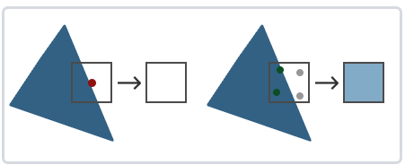
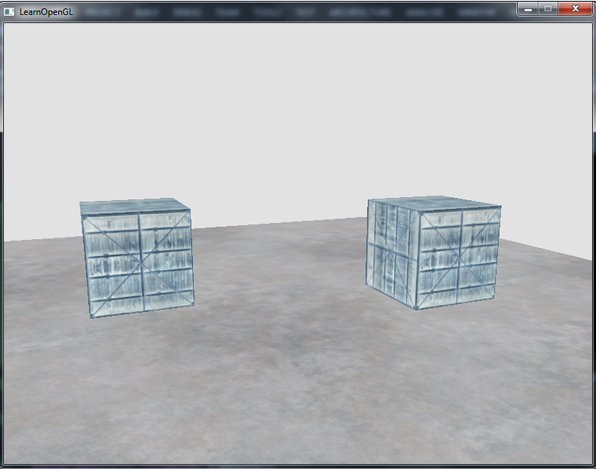

# 一、C++模块

## 1.1 C++基础

### 1.1.1 public/private/protected

#### 1.1.1.1 三种标号的访问范围

- private声明的属性，只能被以下情况访问：
  - 所属类中的函数
  - 其友元函数访问
- protected声明的属性，只能被下列情况访问：
  - 所属类中的函数
  - 子类的函数
  - 其友元函数
- public 声明的属性，只能被下列情况访问：
  - 所属类中的函数
  - 子类的函数
  - 其友元函数
  - 该类的对象

#### 1.1.1.2 三种标号的继承

**private属性(成员变量和成员函数)不能被继承。**

- private继承：父类的protected和public属性(成员变量和成员函数)在子类中都会变为private。
- protected继承：父类的protected和public属性(成员变量和成员函数)在子类中都会变为protected。
- public继承：父类的protected和public属性(成员变量和成员函数)不发生变化。

### 1.1.2 函数指针

函数指针本质上是一个指针，不过这个指针比较特殊，其指向的是函数的地址，该指针可以看做是函数名。

另外，不同类型的函数指针之间不能转换。

#### 1.1.2.1 **函数指针声明**

格式为：```返回值类型 (*函数指针名称)(参数列表)```

例如：

```
int (*pFunc)(int a,int b);
```

- pFunc是一个指针，指向一个函数，该函数有两个int型形参，返回值类型为Int。
- pFunc两边的括号不能省略，括号的优先级要比```*```高。

区分这两种情况：

```
int (*pFunc)(int a,int b);//pFunc是个指向函数的指针，返回值为int
int  *pFunc(int a,int b);//pFunc是个函数，返回值为int*
```

#### 1.1.2.2. 函数指针赋值与调用

给函数指针赋值时，只需给出函数名，不必给出参数。

```C++
int (*pFunc)(int val1,int val2);
int getSum(int n1,int n2)
{
    return n1 + n2;
}

pFunc = getSum;//赋值
int res = pFunc(3,5);
printf("res:%d \n",res);//结果为res:8 
```

#### 1.1.2.3 typedef简化函数指针

函数指针可以作为函数形参、函数返回值使用，如果其本身定义的非常复杂，可通过```typedef```简化。

```C++
typedef int (*FuncCall1)(int n, int m);//定义函数指针类型
int compareNum(int a,int b)
{
    if (a > b) return 1;
    if (a < b) return -1;
    return 0;
}
FuncCall1 cf;//声明一个函数指针
cf = compareNum;//赋值
int res = cf(4,3);//调用
printf("res:%d \n",res);//1
```

#### 1.1.2.4 函数指针作为形参

函数指针作为形参：

```C++
//第三个参数为函数指针
int funcTemp(int a, int b,int(*Func)(const int a, const int b))
{
    return Func(a,b);
}

int res = funcTemp(4,5,getSum);
printf("res:%d \n",res);//res: 9

int res2 = funcTemp(4,5,compareNum);
printf("res:%d \n",res2);//res: -1
```

也可以将形参通过```typedef```简化：

```C++
int funcTemp2(int a, int b,FuncCall1 fc)
{
    return fc(a,b);
}

int res2 = funcTemp2(4,7,getSum);
printf("res:%d \n",res2);//res: 11
```

#### 1.1.2.5 函数指针作为返回值

函数指针作为返回值时，理解稍微复杂，举例说明：

```
int (*ff(int))(int*,int);
```

此函数的返回值为：

```
int (*)(int* int)
```

函数名定义：

```ff(int)
ff(int)
```

简化为：

```
typedef int(*PF)(int*,int);
PF ff(int);
```

#### 1.1.2.6 指向类成员函数的指针

指向类成员函数的指针比普通的函数指针相比，多了一个类的限定。

声明：

```C++
class A
{
public:
    void Speak(){
        printf("A::Speak.....\n");
    }
};

//声明指向类成员函数的指针
void (A::*pFunc1)();
```

赋值：

```
pFunc1 = &A::Speak;
```

调用：

```
A a1;
(a1.*pFunc1)();//A::Speak.....
```

**也可以通过```typedef```简化声明**:

```
typedef void (A::*Func2)();//声明函数指针类型
Func2 ptr2 = &A::Speak;//声明变量并赋值
A a2;
(a2.*ptr2)();//调用
```

### 1.1.3 重载函数

#### 1.1.3.1 重载函数定义

出现在相同作用域内的函数，如果其函数名相同，而形参列表不同，则称之为重载函数。

**形参列表不同的含义为：**形参个数不同或形参类型不同，函数不能基于返回值类型不同实现重载。

**函数重载与重复声明的区别：**

- 如果两个函数返回值类型和形参列表相同，则第二个函数视为重复声明。
- 如果两个函数的形参列表完全相同，而返回值不同，则第二个函数声明是错误的。

#### 1.1.3.2 函数重载与const 形参

函数重载是基于形参列表的不同而实现的，但是```const```形参与非```const```形参有些情况下不能实现函数重载。

看以下代码：

```C++
void lookup(Phone tm);
void lookup(const Phone tm);//重定义

void lookup2(Phone& ph);
void lookup2(const Phone& ph);//重载

void lookup3(Phone* ptr);
void lookup3(const Phone* ptr);//重载

void lookup4(Phone* ptr);
void lookup4(Phone* const ptr);//重定义
```

形参与const形参的等价性仅适用于非引用形参，也就说对于引用和指针来讲，const形参与非const形参可用于实现函数重载。

- 有const引用形参的函数与有非const引用形参的函数是不同的。
- 有指向const类型的指针形参的函数，与带有指向相同类型的非const对象的指针形参的函数不同。
- 不能基于指针本身是否为const来实现函数重载。因为const修饰指针本身，而不是修饰指针所指向的类型。

注意区分**指针常量和常量指针**的区别。

```
const int* ptr;//常量指针
int const* ptr2;//常量指针
int* const ptr3 = NULL;//指针常量
```

- 常量指针：指针所指向的对象为常量，不允许修改。
- 指针常量：指针本身为常量，指针的值不允许修改。

### 1.1.4 多态与析构函数

为了防止内存泄漏，含有虚函数的类应该将其析构函数设为虚函数。

例如：

```C++
class Base1
{
public:
    Base1(){}
    virtual ~Base1(){printf("Base1::~Base1  \n");}
};
class Derived:public Base1
{
public:
    Derived(){}
    virtual ~Derived(){printf("Derived::~Derived  \n");}
};

int main()
{
    Base1* ptr = new Derived();
    delete ptr;
    return 0;
}
```

如果基类```Base1```的析构函数为非虚函数时，打印的日志为：

```
Base1::~Base1  
```

丢掉了派生类析构函数的调用，可能会产生泄漏。如果将父类的析构函数改为虚函数，则结果为：

```
Derived::~Derived  
Base1::~Base1
```


### 1.1.5 继承与友元

#### 1.1.5.1 友元类

一个类A可以将类B声明为自己的友元，则类B中所有的成员函数都可以访问类A的```private```和```protected```成员。

```C++
class CCar
{
private:
    int price;
    friend class CDriver;  //声明 CDriver 为友元类
};
class CDriver
{
public:
    void ModifyCar(CCar myCar) 
    {
        myCar.price += 1000;  //因CDriver是CCar的友元类，故此处可以访问其私有成员
    }
};
```

#### 1.1.5.2 友元函数

在类中，可以将**全局函数或其他类的非私有成员函数**声明为友元函数，在友元函数内部可以访问类的私有成员。

**将全部函数函数声明为友元函数的格式：**

```
friend 返回值类型 函数名(参数列表)
```

**将其他类的非私有函数声明为友元函数的格式：**

```
friend 返回值类型 类名::函数名(参数列表)
```

```C++
class CDriver;  //前向声明：提前声明CDriver类
class CCar
{
private:
    int price;
    friend void CDriver::ModifyCar(CCar myCar);  //声明友元函数
    friend int  GetExpensiveCar(CCar cars[], int total);//声明友元函数
};

class CDriver
{
public:
    void ModifyCar(CCar myCar)  //改装汽车
    {
        myCar.price += 1000;  //因CDriver是CCar的友元类，故此处可以访问其私有成员
    }
};

int GetExpensiveCar(CCar cars[], int total)
{
    int tmpMax = -1;
    for (int i = 0; i<total; ++i)
        if (cars[i].price > tmpMax)
            tmpMax = cars[i].price;
    return tmpMax;
}
```

#### 1.1.5.3 继承与友元

友元关系不能被继承。

- 基类中的友元类、友元函数不能被子类继承，即友元类对派生类的成员没有特殊访问权限。
- 基类被授予友元关系，

```C++
class CCar
{
private:
    int price;
    friend class CDriver;  //声明 CDriver 为友元类
};
class CMinCar:public CCar
{
private:
	int num;
};

class CDriver
{
public:
    virtual void ModifyCar(CCar myCar) {
        myCar.price += 1000;  //ok
    }
    virtual void ModifyCar(CMinCar myMinCar){
        myMinCar.num += 1;//error
    }
};

class CDriver2:public CDriver
{
public:
    virtual void ModifyCar(CCar myCar)  {
        myCar.price += 1000;  //error
    }
    virtual void ModifyCar(CMinCar myMinCar) {
        myMinCar.num += 1;//error
    }
};

```

### 1.1.6 static函数

- static 成员函数没有this指针。
- static 成员函数不能声明为 const。
- static 成员函数不能被声明为虚函数。
- static数据成员不同于普通数据成员，不是通过类的构造函数初始化，而是应该在定义时初始化。
- 如果基类中定义了static成员，则整个继承体系中就只有一个这样的成员。

### 1.1.7 C++模板

#### 1.1.7.1 模板函数

先看如下代码：

```C++
template <class T>
int compare(const T& v1, const T& v2)
{
    if (v1 > v2)
        return 1;
    if (v1 < v2)
        return -1;
    return 0;
}
```

模板函数的声明要点：

- 模板函数是一个特殊的函数，以关键词```template```开头。
- ```template```之后紧跟模板形参表，模板形参表由一个或多个模板形参组成，模板形参之间以逗号分隔。
- 模板形参跟在```class```或```typename```关键词之后定义，声明模板形参类型时，这两个关键词作用完全相同。
- 模板形参列表不能为空。
- 模板形参的名称没有本质含义，可以随意命名。

使用模板函数的目的是为了抽象出一套通用的函数的模板，根据模板形参的类型，**实例化**不同的函数实例。

比如下面函数的调用：

```
int res = compare(1,2);
```

编译器会实例化出形参表为```int,int```的函数：

```
int compare(const int& v1, const int& v2);
```

#### 1.1.7.2 inline函数模板

模板函数跟普通函数一样，可以通过```inline```关键词声明为内联函数。

**声明内联函数模板的要点：inline关键词必须在模板形参列表之后，函数返回值之前 ，不能在template关键词之前。**

举例说明：

```C++
template<class T>
inline int min(const T& v1, const T& v2)
{
    if(v1 < v2)
        return v1;
    return v2;
}
```

#### 1.1.7.3 模板类

模板类与模板函数一样，都是以·```template```开始，紧跟模板形参列表。

```C++
template <class T>
class Queue
{
public:
    void Push(const T& val);
    const T& Front();
};
```

#### 1.1.7.4 在模板内部定义类型

**在模板中定义内部类型时，必须使用typename关键词。**例如：

```
template<class Parm, class U>
void fcn(Parm* array,U val)
{
    typename Parm::size_type* ptr;
}
```

此时```size_type```就是模板类型```Parm```的一个内部成员类型，而不是成员变量，也不是成员函数。

#### 1.1.7.5 非类型的模板形参

模板形参不一定都是类型，也可以是值。

在调用函数时，非类型形参将用值代替，值的类型在模板形参列表中指定。

例如：

```C++
template<class T, size_t N>
void arrayInit(T (&param)[N])
{
    for (size_t i = 0; i < N; i++)
    {
        param[i] = i;
    }
}

//use
int arr1[10];
arrayInit(arr1);//对应arrayInit(int(&)[10])
```

```arrayInit```是一个包含一个**类型模板形参**和一个**非类型模板形参**的模板函数，该模板函数接受一个数组引用作为函数形参。

### 1.2.8  sizeof

> Q：定义一个空的类型，里边不含任何函数和成员 变量，对类型求sizeof，得到的结果是多少？
>
> A：答案是1。
>
> Q：为什么不是0？
>
> A：空类型的实例中不含任何信息，本来求sizeof应该是0，但是当声明该类型的实例时，它必须在内存中占用的一定的空间，否则无法使用这些实例。至于占用多少内存，由编译器决定，VS为每个空类型的实例分配一个字节。
>
> Q：如果在该类型中添加一个构造函数和析构函数，再对该类型求sizeof，得到的结果又是多少？
>
> A：还是1。调用构造函数和析构函数只需要知道函数的地址即可，而这些函数的地址只与类型相关，而与类型的实例无关，编译器也不会因为这两个函数而在实例内添加任何额外的信息。
>
> Q：如果定义了一个class，此类中仅包含一个或多个static成员变量，此时得到的结果是多少？
>
> A：还是1。
>
> Q：那如果把析构函数标记为虚函数呢？
>
> A：C++的编译器一旦发现一个类型中有虚拟函数，就会为该类型生成虚函数表，并在该类型的每一个实例中添加一个指向虚函数表的指针。在32位的机器上，一个指针占4字节的空间，因此求sizeof得到4；如果是64位的机器，一个指针占8字节的空间，因此求sizeof则得到8。


### 1.2.9 复制构造函数考察

```C++
class A
{
public:
    A(int val){value = val;}
    A(A other){ value = other.value; }
    void Print()
    {
        std::cout<<"A::Print:"<<value<<std::endl;
    }
private:
    int value;
};

int main()
{
    A a = 10;
    a.Print();

    A b = a;//调用复制构造函数
    
    A c;
    c = a;//调用复制操作符
    b.Print();
    return 0;
}
```

一张有上述代码的 A4 打印纸要求分析编译运行的结果，并提供3个选项：

- A.编译错误；

- B.编译成功，运行时程序崩溃；

- C.编译运行正常，输出10。

结果为A，第19行出错，原因是类的复制构造函数的参数必须为引用。


### 1.2.10 赋值操作符考察

#### 1.2.10.1 定义

- 赋值操作符接受单个形参，且该形参为同一类类型的引用，一般为const引用。
- 赋值操作符的返回值也是同一类类型的引用，即```*this```。
- 判断形参与当前this是否为同一个实例，如果是同一个实例，无需进行赋值操作，直接返回即可。
- 判断是否需要自身已有的内存，否则可能出现内存泄漏。

#### 1.2.10.2 调用时机

```C++
MyString c1;
MyString c2 = c1;//拷贝构造
MyString c3(c1);//拷贝构造
MyString c4;
c4 = c1;//先调用赋值操作符，在调动拷贝构造，在VS Code中测试的结果
```


#### 1.2.10.3 面试题

如下为类型CMyString的声明，请为该类型添加赋值运算符函数。

```C++
class MyString
{
public:
    MyString(char* pData = NULL);
    MyString(const MyString& rh);
    ~MyString();
private:
    char* m_pData;
};
```

考虑上面四个方面，至少应该给出的答案为（初级程序员）：

```C++
MyString& operator= (const MyString& rf)
{
    if(this == &rf)
    {
        return *this;
    }

    delete[] m_pData;
    m_pData = NULL;
    m_pData = new char[strlen(rf.m_pData) + 1];
    strcpy(m_pData,rf.m_pData);
    return *this;
}
```

高级程序员需要考虑异常安全性问题：

上述代码，若通过new创建内存时抛出异常，而```MyString```的data数据已被释放，会很容易导致异常崩溃。更好的方法如下：

```C++
MyString& operator= (const MyString& rf)
{
    if(this != &rf)
    {
        MyString temp(rf);
        char* pTemp = temp.m_pData;
        temp.m_pData = m_pData;
        m_pData = pTemp;
    }
    return *this;
}
```

先创建一个临时实例 strTemp，接着把strTemp.m_pData和实例自身的m_pData做交换。由于strTemp是一个局部变量，当程序运行到 if 的外面时也就出了该变量的作用域，就会自动调用strTemp 的析构函数，把 strTemp.m_pData 所指向的内存释放掉。因为strTemp.m_pData与当前实例的m_pData交换，实际上是释放了自身实例之前的内存空间。

在新的代码中，我们在CMyString的构造函数里用new分配内存。如果由于内存不足抛出诸如bad_alloc等异常，我们还没有修改原来实例的状态，因此实例的状态还是有效的，这也就保证了异常安全性。

### 1.2.11 C++书籍推荐

- 《C++ Primer》：读完这本书，会对C++的语法有全面的认识。
- 《Effective C++》：此书适合面试之前突击，本书列举了使用C++经常出现的问题及解决这些问题的技巧。书中提到的问题也是很多面试官喜欢提问的问题。
- 《Inside C++ Object Mode》：读完此书可以深入了解C++对象的内部，比如前面的sizeof的问题、虚函数的调用机制等。
- 《The C++ Programming Language》：如果是想全面深入掌握C++，没有哪本书比这本书更适合的了。

### 1.2.11 高频面试题

#### 1.2.12.1 map与unordered_map的区别

**一、map**

- map使用键值对存储数据，键不允许重复，值可以重复。set只存储键，不允许重复。
- STL中map/set采用**红黑树（非严格的平衡二叉搜索树）**实现，红黑树能够自动排序，因此map中每个元素都是有序的。
- map/set具有更高的插入效率，插入、删除和查找的时间复杂度为$O(logn)$。
- 数据结构的的稳定与非稳定的是根据排序移动后原来在前面的逻辑位置仍然在前面保持不变的，所以map和set是稳定排序。
- map中的元素是按照二叉搜索树存储的，通过中序遍历将键值按照从小到大的顺序遍历出来。

**二、unordered_map**

- unordered_map内部实现了一个**哈希表**（也叫散列表，通过把关键码值映射到Hash表中一个位置来访问记录，查找的时间复杂度可达到O(1)，其在海量数据处理中有着广泛应用）。
- 元素的排列顺序是无序的。
- 查找删除时间复杂度为$O(1)$。

**三、对比**

**结论**：

1. 运行效率方面：unordered_map最高，map效率低但提供有序的序列。
2. 占用内存方面：map内存占用略低，unordered_map内存占用略高，且是线性成比例的。
3. 有序性：map基于红黑树实现，有序；unordered_map基于哈希表实现，无序。
4. 需要无需且快速查找删除、不担心内存占用时用unordered_map；有序容器，稳定查找删除效率，内存很在意时使用map。

**一句话总结**：

map基于红黑树实现，是有序容器，查找插入删除的时间复杂度为$O(logn)$；

unordered_map基于哈希表实现，是无序容器，查找插入删除的时间复杂度为$O(1)$。

#### 1.2.12.2 STL中单链表和双链表

[参考](https://blog.csdn.net/u013006553/article/details/78158717)

双链表：list。

- 双向链表每个元素都是通过指针双向相连。
- 从双向链表中的任意一个结点开始，都可以很方便地访问前驱结点和后继结点。
- 增加删除节点复杂，需要多分配一个指针存储空间。
- 不支持随机访问，插入和删除非常迅速。

单链表：forward_list。

- 也是通过指针相连，但是指针是单向的，且尾端是封闭的。
- 单向链表增加删除节点简单。遍历时候不会死循环。
- 只能从头到尾遍历。只能找到后继，无法找到前驱，也就是只能前进。

#### 1.2.12.3 vector底层实现的原理

- vector拥有一段连续的内存空间，能够高效的进行随机访问，时间复杂度为$O(1)$。
- 插入和删除的时间复杂度为$O(n)$。
- 当内存不够时，会动态扩容，一般是二倍扩容。**以原大小的两倍重新分配一块较大的空间，然后将原内容拷贝过来，然后释放原空间**。
- vector的插入和删除元素是通过push_ back () 、 pop_back()两个接口来实现。


区分两个大小变量：

1. 大小：size = finish - start；
2. 容量：capacity = end_of_storage - start;
3. 大小和容量分别对应于resize() 和reserve()两个函数；
4. size表示vector中已有元素的个数，容量表示vector最多可存储的元素的个数；容量一般大于等于元素个数。

#### 1.2.12.4 C++栈和堆的区别

**一、管理方式不同**：

- stack：系统自动分配释放，如声明int a;系统自动在栈区为变量开辟空间。
- heap：程序员申请释放，容易产生内存泄漏，并指明大小，如malloc。

二、**分配方式不同**

- 堆都是动态分配的，没有静态分配的堆。
- 栈有两种分配方式：静态分配和动态分配。静态分配由操作系统完成，比如局部变量的分配。动态分配由alloc函数进行分配，但是栈的动态分配和堆不同，它的动态分配是由操作系统进行释放，无需我们手工实现。

**三、分配效率不同**

- 栈是由系统自动分配，会在硬件层级对栈提供支持，分配专门的寄存器存放栈的地址，压栈出栈都有专门的指令执行，这就决定了栈的效率比较高。
- 堆则是由C/C++提供的库函数或运算符来完成申请与管理，实现机制比较复杂，频繁的内存申请容易产生内存碎片。

**四、最大分配大小**

- Stack：与编译器有关，VS2010 最大内存为1M，32位和64位都一样；
- Heap：与编译器有关；VS2010 ,32位下可以得到2G；64位下理论上16T；
- 全局静态存储可以得到2G；

#### 1.2.12.5 C++如何实现序列化和反序列化

#### 1.2.12.6 std::deque的底层实现？

为什么要分段连续？有什么好处？

deque容器类与vector类似，支持随机访问和快速插入删除，它在容器中某一位置上的操作所花费的是线性时间。与vector不同的是，deque还支持从开始端插入数据：push_front()。


## 1.2 C++进阶一——《Inside C++ Object Mode》

### 1.2.1 默认构造函数的构建操作

#### 1.2.1.1 带有默认构造函数的Member Class Object

- 若一个类无任何构造函数，但它内含一个成员类对象，而后者有默认构造函数，那么这个类的implict default constructor（隐式默认构造函数）就是“nontrivial”（有用的），编译器将为此类合成一个inline的默认构造函数，此合成操作只有在构造函数真正需要被调用时才会发生。
- 当一个类包含多个成员类对象时
  - 若此类无任何构造函数，则编译器会自动合成一个默认构造函数。当调用此构造函数时，编译器将按照成员类对象声明的顺序依次调用各个默认构造函数。
  - 若此类有默认构造函数，则调用此函数时，编译器将按照成员类对象声明的顺序依次调用对应的构造函数（可能是默认构造函数，也肯能是含参数的构造函数）。
  - 若此类有多个构造函数，无默认构造函数，则编译器将不会合成默认构造函数，而是调用每个现有构造函数时，都会执行 默认构造函数的操作（即按照成员类对象声明的顺序依次调用其默认构造函数 ）。
  - 无论是程序员实现的构造函数，还是编译器合成的默认构造函数，无论成员类对象在构造函数内初始化的顺序如何，其构造函数的调用顺序都是按照声明的顺序执行

#### 1.2.1.2 带有默认构造函数的Base Class（基类）

若一个无任何构造函数的类派生自一个带有默认构造函数的基类，则编译器将为此派生类合成一个"notrivial"的默认构造函数，它将调用上一层基类默认构造函数（根据声明顺序）。

#### 1.2.1.3 带有一个虚函数的类

需要合成默认构造函数的情况

- 类声明一个虚函数
- 类派生自一个继承串链，其中有一个或更多的虚基类
- 不管哪种情况，只有缺乏用户声明的构造函数，编译器会自动合成一个默认构造函数

#### 1.2.1.4 带有一个虚基类的类

为了避免菱形继承，如下图所示，A继承X和B继承B时均需采用虚继承方式。


总结：

- 编译器必须为未声明构造函数的类声明默认构造函数的四种情况：
  - 包含成员类对象
  - 基类中包含默认构造函数
  - 包含虚函数
  - 采用虚继承
- 在合成的默认构造函数中，只有基类子对象和成员类对象会被初始化，所有其他的非静态数据成员，如整数、整数指针、整数数组等等都不会被初始化，为了避免野指针情况，程序员务必为非静态指针变量赋初值。
- 多态仅针对于指针和引用有效，对变量或对象无效。

### 1.2.2 复制构造函数的构建操作

#### 1.2.2.1 复制构造函数定义

复制构造函数是一个构造函数，第一个参数的类型是当前类的类型，可以有多个参数，其第二参数及后继参数需提供一个默认值。

#### 1.2.2.2 三种调用复制构造函数的情况

- 类对象的赋值操作```X x1; X x2 = x1; ```

- 当类对象作为参数传给函数时，```void func1(X tmp);```

- 当类对象作为函数返回值时，

  ```X func2(){```

  ​    ```X xt;```

  ​    ```return xt;```

  ```}```

#### 1.2.2.3 复制构造函数的实现方式

定义class时，分为两种情况：

- 开发人员明确声明复制构造函数及其成员变量的赋值。
- 开发人员没有明确声明复制构造函数，由编译器自动合成，其内部是通过defualt memberwise initializaiton完成，即把每一个内建或派生的成员变量的值，从某个object拷贝一份到另一个object。但是它不会拷贝成员类对象，而是以递归的方式施行memberwise initializaiton。参考**《Inside the c++ object model》一书的P49**

通过代码说明内建变量的拷贝：

```c++
class Test1
{
public:
    Test1(){}
    Test1(int tmp,std::string strTmp):m_nLen(tmp),m_strTmp(strTmp){}
    //没有声明复制构造函数
public:
    int m_nLen;
    std::string m_strTmp;
};

Test1 t1(5,"hello");
Test1 t2 = t1;
printf("test :%d  %s",t2.m_nLen,t2.m_strTmp.c_str()); //结果为>> test :5  hello

//跟下面操作一致
t2.m_nLen = t1.m_nLen;
t2.m_strTmp = t1.m_strTmp;
```


将Test1对象作为Test2的成员变量，来说明非内建对象的拷贝：

```c++
class WordTmp
{
public:
    int nVal;
    Test1 t1;
};

WordTmp tTVal2;
WordTmp.nVal = 2;
WordTmp.t1 = t1;

WordTmp tTVal3 = tTVal2;
```

如果将```tTVal2```赋值给```tTVal3```，```WordTmp```的```default memberwise initialization```会拷贝其内建的成员```nVal```，然后再对```Test1``` 类型的成员变量```t1```执行```default memberwise initialization```操作。

#### 1.2.2.4 位逐次拷贝（Bitwise Copy Semantics）

没看明白。。。


#### 1.2.2.5 虚函数表

只要一个类声明了一个或多个虚函数，编译期间必然会执行的两个操作：

- 增加一个虚函数表(vtbl)，内含每一个有作用的虚函数的地址。
- 为类对象(或指针)分配一个指向虚函数表的指针(vptr)。

**重要概念：切割（sliced）**

```
//这将会发生切割行为
DerivedClass dObj1;
BaseClass    bObj2 = dObj1;
```

此时bObj2会丢失属于DerivedClass的部分，bObj2本质上是BaseClass类型的对象。

实际上是因为合成出来的基类复制构造函数会明确设定bObj2的虚函数指针（vptr）指向基类的虚函数表，而不是直接直接拷贝右手边派生类对象的vptr。

#### 1.2.2.6 位逐次拷贝无效的情况

1. 当class内含一个成员对象，而后者的class声明有一个复制构造函数时；
2. 当class继承自一个基类，而后者存在有一个复制构造函数时（无论是被明确声明还是被合成）；
3. 当class声明了一个或多个虚函数时；
4. 当class派生自一个继承串链，其中有一个或多个虚基类时。
   - 一个类对象如果以另一个对象作为初值，而后者有一个virtual base class subobject，那么会使“bitwise copy semantics”失效，换句话说，这个问题不发生在一个类对象以另一个同类的object作为初值，而是发生在 一个类对象以其派生类object作为初值时。
   - 

### 1.2.3 程序转化语意

#### 1.2.3.1 明确的初始化

```
X x0;
X x1(x0); //编译器实际执行的是复制构造函数操作  x1.X::X(x0)
X x2 = X(x0);//编译器实际执行的是复制构造函数操作  x2.X::X(x0)
```

#### 1.2.3.2 参数的初始化

C++标准中指出，将一个类对象作为参数传给一个函数，或作为一个函数的返回值，相当于以下形式的初始化操作：

```
//temp代表参数(返回值)，而arg代表真正的参数值。
X temp = arg;
```

**即编译器调用复制构造函数时定义一个临时对象，然后将临时对象传给函数，或作为返回值返回。**

```C++
X xx;
foo(xx);

//编译器对复制构造函数的调用过程为
X __temp0;
__temp0.X::X(xx);
foo(__temp0);
//此时foo的定义发生改变，变为void foo(X& x0)； 其中class X 声明了一个析构函数，会在foo()函数完成之后被调用，释放临时对象__temp0。
//疑问：如果形参为指针呢？也会调用指针的析构函数？
```

#### 1.2.3.3 返回值的初始化

以下面这段代码为例，说明函数执行过程：

```C++
X foo()
{
    X x1;
    //process...
    return x1;
}

//调用函数
X xx = foo();
```

x1作为函数返回值返回实际上有一个双阶段转化过程：

- 第一步，首先生成一个X 类型的引用。
- 第二步，在return 指令之前，执行一个复制拷贝构造函数，将想要返回的对象作为第一步创建引用的初值。

其真正的执行过程是：编译器会改写这个函数，使它不返回任何值，而是将想要返回的对象作为形参引用对象返回。

foo() 函数的转化如下：

```C++
void foo(X& __res)
{
    X x1;
    x1.X::X();//执行默认构造函数
    
    //process..
    
    __res.X::X(xx);///执行复制构造函数
    return;
}

//实际上的调用形式会被转化：
X xx;
foo(xx);
```

考虑下面三种情况下构造函数的执行过程：

```
X x1(1024);
X x2 = X(1024);
X x3 = (X)1024;
```

上述第一行代码明确被单一的构造函数设定初值：

```
x1.X::X(1024);
```

而第二行和第三行代码，提供了两个步骤的初始化操作：

```
X __temp;
__temp.X::X(1024);//调用含参构造函数
x2.X::X(__temp);//调用复制构造函数
__temp.X::~X();//临时对象调用析构函数
```

### 1.2.4 初始化列表

#### 1.2.4.1 什么是初始化列表

初始化列表位于类的构造函数中，以冒号开头，以分号分隔多个初始化字段。

```C++
class Apple
{
public:
	Apple(int nId,string strName):id(nId),name(strName){}; //初始化列表
private:
	int id;
	string name;
}
```

#### 1.2.4.2 必须使用初始化列表的情况

1. 当初始化一个引用对象时；
2. 当初始化一个const对象时；
3. 当调用一个基类的含参构造函数时；
4. 当调用一个member class 的含参构造函数时。


变量初始化的次序：

```C++
class Word
{
public:
	Word():m_nCount(0),m_strCont("hello"){}
private:
	std::string m_strCont;
	int m_nCount;
};
```

上述代码中，虽然在初始化列表中，```m_nCount```位于```m_strCont```之前，但实际上是先初始化```m_strCont```，因为这两个变量声明的次序是先声明```m_strCont```。

**类成员变量的初始化顺序由其声明顺序决定，而不是在初始化列表中的排序。**

编译器会对初始化列表一一处理并可能重新排序，以反映出成员的声明次序，同时它会在构造函数内插入一些代码。


思考问题：

```C++
class X{ };
class Y : public virtual X{ };
class Z : public virtual X{ };
class A : public Y, public Z { };

int main()
{
    printf("X:%ld Y:%ld Z:%ld A:%ld \n",sizeof(X),sizeof(Y),sizeof(Z),sizeof(A));
    return 0;
}
```

在VS Code中打印出的结果为：```X:1 Y:8 Z:8 A:16 ```。

一个空的class X，其sizeof的值为1，是因为它有一个隐含的1``byte``，是被编译器插入进去的一个```char```，这使得这个类的两个对象得以在内存中拥有独一无二的地址：

````
X a,b;
if(&a == &b) 
	printf("ok \n");
elses
	printf("no \n");//结果为no
````


### 1.2.5 类内变量的布局

类的非静态变量在类对象中的排列顺序与其被声明的顺序相同，任何中间插入的静态数据变量都不会被放进类对象的布局之中。

以代码为例：

```C++
class Point3D
{
private:
	float x;
	static List<Point3D*>* freeList;
	float y;
	static const int chunkSize = 200;
	float z;
};
```

每一个Point3D对象都是由三个float变量组成，次序是```x,y,z```。静态变量```freeList / chunkSize```都不会被放进Point3D对象的布局之中，而是存在于程序的```data segment```中。

```C++ Standard```要求在同一个访问区段（即```private/public/protected```）中，变量的排序只需符合“较晚出现的变量在类对象中有较高的地址”这一个条件即可。


编译器还可能会合成一些内部使用的成员变量，如```vptr```，即虚函数指针，当前所有的编译器都把它安插在每一个“内含虚函数的类”的对象中。传统上，vptr会被放置在所有明确声明的成员变量之后，不过也有一些编译器把vptr放在一个类对象的最前端。


```C++ Standard```允许编译器将多个访问区段的变量自由排列，不必在乎它们出现在类声明中的次序。

```C++
class Point3D
{
private:
	float x;
	static List<Point3D*>* freeList;
private:
	float y;
	static const int chunkSize = 200;
private:
	float z;
};
```

上述代码中，Point3D 类对象的**大小和组成**与先前声明的那个相同，但是成员变量的排列次序则由编译器而定。

### 1.2.6 类内变量的存取

```
Point3D origin, *pt = &origin;
origin.x = 10;
pt->x = 10;
```

思考：上述对于x存取的两种方式有什么重大差异吗？

#### 1.2.6.1 静态类型

静态变量只有一个实体，并不在类对象中，而是存放在程序的data segment之中。

```
origin.chunkSize = 250;
pt->chunkSize = 250;
Point3D::chunkSize = 250;
```

上述三种方式的调用结果完全相同，只是```.```和```->```只是语法上的一种方便访问的方式。

#### 1.2.6.2 非静态类型

非静态变量直接存放在每个类对象之中。想要对一个非静态变量进行存取操作，编译器需要把类对象的起始地址加上变量的偏移量(offset)。举例说明：

```
origin.y = 0;
```

则地址&origin.y将等于：

```
&origin + (&Point3D::y - 1);
```

> 注意其中的-1操作。指向成员变量的指针，其偏移量总是被加上1，这样可以使编译器区分出“一个指向成员变量的指针，用以指出类的第一个成员”和“一个指向成员变量的指针，没有指出任何成员”两种情况。

没看明白引用的这段话。。。

**每一个非静态成员变量的偏移量在编译时期即可获知，即便成员变量属于基类也是如此。**


**非静态变量在虚继承中的存取效率**

```
Point3D* pt3d;
pt3d->x = 0;
```

其执行效率在x是一个结构体变量、类成员变量、单一继承、多重继承的情况下完全相同。但如果x是一个虚基类的成员变量，则存取速度会慢一点。


现在回想本节最开始的问题，通过对象和指针存取成员有什么重大差异？

```
Point3D origin, *pt = &origin;
origin.x = 10;
pt->x = 10;
```

答案为：当```Point3D```是一个派生类，并且被存取的成员变量(如x)是从虚基类中继承而来时，就会存在重大的差异。因为pt的具体类型在执行期才能明确，经由一个额外的间接导引才能解决。但如果使用origin，其类型确定为``Point3D``，即便它继承自虚基类，成员变量的偏移量也在编译时期就固定了。


### 1.2.7 继承与成员变量

分为四种情况介绍：单一继承且不含虚函数、单一继承并含虚函数、多重继承、虚继承。

#### 1.2.7.1 只要继承不要多态

定义没有继承关系的```Point2D```和```Point3D```两个类：

```C++
class Point2d
{
public:
	float x;
	float y;
};

class Point3d
{
public:
	float x;
	float y;
	float z;
};
```

这两个类没有虚函数，它们的布局与结构体完全一样。


这种方式下，对于x和y的操作需要分别在```Point2D```和```Point3D```两个类中实现，从设计模式上来讲，这种设计是不优雅的，一般通过继承方式。

```C++
class Point2d
{
public:
	Point2d(float nX = 0,float nY = 0):_x(nX),_y(nY){}
	float getX(){return _x;}
	void  setX(float nT){_x = nT;}
	float getY(){return _y;}
	void  setY(float nY){_y = nY;}
protected:
	float _x;
	float _y;
};

class Point3d : public Point2d
{
public:
	Point3d(float nX = 0,float nY = 0,float nZ = 0)
		:Point2d(nX,nY),_z(nZ){ }
	float getZ(){return _z;}
	void  setZ(float nZ){_z = nZ;}
protected:
	float _z;
};
```

单一继承且没有虚函数时的布局为：


访问类的sizeof:

```
printf("Point2d: %ld Point3d: %ld\n",sizeof(Point2d), sizeof(Point3d));
//结果为 Point2d: 8 Point3d: 12
//Point2d : 4 + 4
//Point3d : 4 + 4 + 4
```

#### 1.2.7.2 加上多态

加上多态，也就是应用虚函数。代码如下：

```C++
class Point2d
{
public:
	Point2d(float nX = 0,float nY = 0):_x(nX),_y(nY){}
	float getX(){return _x;}
	void  setX(float nT){_x = nT;}
	float getY(){return _y;}
	void  setY(float nY){_y = nY;}
	
    virtual void setZ(float nZ){}//虚函数
    virtual float getZ(){return 0;}//虚函数
protected:
	float _x;
	float _y;
};

class Point3d : public Point2d
{
public:
	Point3d(float nX = 0,float nY = 0,float nZ = 0)
		:Point2d(nX,nY),_z(nZ){ }
	float getZ(){return _z;}
	void  setZ(float nZ){_z = nZ;}
protected:
	float _z;
};
```

添加了虚函数之后：

- 每一个```Point2d```的类都会导入一个虚函数表，此表用于存放类中所声明的每一个虚函数的地址。
- 每一个```Point2d```和```Point3d```的类对象都会导入一个虚函数指针(vptr)，提供执行期的链接，使每一个对象都能找到对应的虚函数表，这就是多态的本质。


```Point2d```和```Point3d```是单一继承关系，加上了虚函数之后的继承布局为：**（此图是把vptr指针放在基类的尾端，现在的编译器一般是放在基类的头部）**


访问类的sizeof（没想明白。。）：

```
printf("Point2d: %ld Point3d: %ld\n",sizeof(Point2d),sizeof(Point3d));
//结果为 Point2d: 16 Point3d: 24
```

疑问：为什么```Point3d```没有所属的虚函数指针，用的却是```Point2d```的虚函数指针。难道是因为```Point3d```类中没有虚函数吗？


#### 1.2.7.3 多重继承

单一继承提供了一种“自然多态”的形式，是关于类体系中的基类和子类之间的转换。

以代码展示多继承体系：

```C++

class Point2d
{
public:
	//有虚函数，所以Point2d对象中会有vptr
protected:
	float _x;
	float _y;
};

class Point3d : public Point2d
{
public:
	//...
protected:
	float _z;
};

class Vertex
{
public:
    //有虚函数，所以Vertex对象有vptr
protected:
    Vertex* next;
};

class Vertex3d:public Point3d, public Vertex
{
public:
    //...
protected:
    float mumble;
};
```

继承关系为：


对于多重派生对象，将其地址指定给“最左端（也就是第一个）基类的指针”，情况与单一继承时相同，二者都有相同的起始地址。至于第二个或后继的基类的地址指定操作，则需要需改：加上（或减去，如果downcast）介于中间的 ```base class subobjects```的大小。


声明下面四个变量：

```
Vertex3d v3d;
Vertex*  pv;
Point2d* p2d;
Point3d* p3d;
```

当执行下面的操作时（```Vertex```是```Vertex3d```的第二个基类）：

```
pv = &v3d;
//需要进行的内部转化为：
//虚拟C++码
pv = (Vertex*)( ((char*)&v3d) + sizeof(Vertex3d) );
```

而下面的指定操作，都需要简单地拷贝其地址就行了。

```
p2d = &v3d;
p3d = &v3d;
```

如果有两个指针执行如下的操作：

````
Vertex3d* pv3d;
Vertex*   pv;
pv = pv3d;
````

内部不能够只是简单地被转化为：

```
//虚拟C++代码
pv = (Vertex*)((char*)pv3d) + sizeof(Vertex3d);
```

因为当```pv3d```为0时，```pv```将获取```sizeof(Vertex3d)```的值，这是错误的！，因此对于指针，内部转换操作需要有一个条件判断：

```
//虚拟C++代码
pv = pv3d ? (Vertex*)((char*)pv3d) + sizeof(Vertex3d) : 0;
```

至于引用，则不需要针对可能为0值做处理，因为引用不可能为空。


此处多重继承的布局为：


#### 1.2.7.4 虚继承

没看明白。。


### 1.2.8  函数的各种调用方式

C++支持三种类型的成员函数：静态、非静态和虚函数，每一种类型被调用的方式都不同。

以下列代码为例：

```C++
Point3d Point3d::normalize() const
{
    Point3d res;
    float length = magnitude();
    res.x = x/length;
    res.y = y/length;
    res.z = z/length;
    
    return res;
}

float Point3d::magnitude() const
{
    return sqrt(x * x + y * y + z * z);
}

Point3d obj;
Point3d* ptr;
obj.normalize();
ptr->normalize();
```


#### 1.2.8.1 非静态成员函数

C++ 标准的设计准则之一就是：**非静态成员函数至少必须和一般的非成员函数有相同的效率**。**即选择调用成员函数不应该带来额外负担，编译器内部会将成员函数转化为对等的非成员函数。**

```
float magnitude(const Point3d* _this){}
float Point3d::magnitude() const  { }
```

转化步骤为：

1. 改写函数原型：增加一个额外的参数，该额外参数被称为this指针。

   ```
   //非const 非静态成员函数
   Point3d Point3d::magnitude(Point3d* const this)

   //const 非静态成员函数
   Point3d Point3d::magnitude(const Point3d* const this)
   ```

2. 将每一个 对非静态成员变量的存取操作 改为经由 ```this```指针来存取：

   ```
   {
       return sqrt(this->x * this->x + this->y * this->y + this->z * this->z);
   }
   ```

3. 将成员函数重新写成一个外部函数，对函数名称进行“```mangling```”处理，使其独一无二的存在在程序中。

   ```
   extern magnitude_7Point3dFv(register Point3d* const this);
   ```

经过上述三步就转换结束，其每一个调用操作也都必须转换：

```C++
//原来的调用
obj.magnitude();
//变成
magnitude_7Point3dFv(&obj);

//而原来的指针调用
ptr->magnitude();
//变成了
magnitude_7Point3dFv(ptr);
```

而上面声明的normalize函数将被改写为：

```
void normalize_7Point3dFv(const Point3d* const this, Point3d& __result){}
```

#### 1.2.8.2 虚拟成员函数

如果```normalize```是虚拟成员函数，则下面的调用：

```
ptr->normalize();
```

将会转化为：

```
(*ptr->vptr[1])(ptr);
```

- vptr是指向虚函数表的指针，每个包含虚函数的类对象都有虚函数指针。
- 其中1是```virtual table slot```的索引值，关联到```normalize```函数。
- 第二个ptr表示this指针。

#### 1.2.8.3 静态成员函数

如果```Point3d::normalize()```是一个静态成员函数，以下的两个调用将会被转化为非成员函数调用：

```
//obj.normalize();
normalize_7Point3dSFV();
    
//ptr->normalize();
normalize_7Point3dSFV();
```

**静态成员函数的主要特性是它没有```this```指针。静态成员函数在调用过程中也会被转化为非成员函数调用。**

次要特性是：

- 它不能直接存取其所在类的非静态成员变量。
- 它不能被声明为```const```、```virtual```和```volatile```。
- 它不需要经由类对象调用。

> C++ 中 volatile关键字和const对应。<https://zhuanlan.zhihu.com/p/33074506>


#### 1.2.8.4 多态与虚函数

**在C++中，多态表示“以一个基类的指针(或引用)，寻址出一个派生类对象“的意思。**

识别一个类是否支持多态，唯一适当的方法就是看看它是否有虚函数。

**虚函数地址如何被构建起来？**

在C++中，虚函数可以在编译期获知，并且这一组地址是固定不变的，执行期不可能新增或替换之。

- 为了找到表格，每一个类对象都会包含一个由编译器内部产生的指针，指向该表格。
- 为了找到函数地址，每一个虚函数被指派一个固定的索引值。

这些工作都由编译器完成，执行期要做的只是在特定的 ```virtual table slot```(记录着虚函数的地址)中激活虚函数。

一个类只有一个虚表，每一个表内含其对应的类对象中所有```active```虚函数实体的地址，关于激活的虚函数下面进行详细的介绍。

**虚函数表中只记录虚函数、纯虚函数的地址。**

#### 1.2.8.5 单继承下的虚成员函数

声明```Point/Point2d/Point3d```三个类，说明单一继承体系下虚函数表中的内容。

```C++
class Point
{
public:
	virtual ~Point(){}
    virtual Point& mult(float factor) = 0;
    float x()const {return _x;}
    virtual float y(){return 0;}
    virtual float z(){return 0;}
protected:
    Point(float x = 0){_x = x;}
    float _x;
};
class Point2d:public Point
{
public:
    Point2d(float x = 0,float y = 0):Point(x),_y(y){}
    ~Point2d(){}

    Point2d& mult(float factor);
    float y() const {return _y;}

protected:
    float _y;
};
class Point3d:public Point2d
{
public:
    Point3d(float x = 0,float y = 0,float z = 0):Point2d(x,y),_z(z){}
    ~Point3d(){}

    Point3d& mult(float factor);
    float z() const {return _z;}

protected:
    float _z;
};
```

布局方式：

虚函数表中的函数类型包括：

- 继承自基类所声明的虚函数的函数体。基类中该函数实体的地址会被拷贝到派生类虚函数相对应的slot中。
- 派生类使用自己的函数实体。这表示它自己的函数实体地址必须放在对应的slot之中。
- 派生类可以加入一个新的虚函数。此时派生类的虚函数表的尺寸会增加一个slot，新的函数实体地址会被放进该slot之中。
- 一个```pure_virtual_called()```函数实体，即纯虚函数地址。

#### 1.2.8.6 多重继承下的虚函数

在多重继承中支持虚函数，其复杂度围绕着第二个及后继的基类身上，以及”必须在执行期调整this指针“这一点上。

举例：

```C++
class Base1
{
public:
    Base1();
    virtual ~Base1();
    virtual void speakClearly();
    virtual Base1* clone()const;
protected:
    float data_base1;
};

class Base2
{
public:
    Base2();
    virtual ~Base2();
    virtual void mumble();
    virtual Base2* clone()const;
protected:
    float data_base2;
};

class Derived:public Base1,public Base2
{
public:
    Derived();
    virtual ~Derived();
    virtual Derived* clone()const;
protected:
    float data_derived;
};
```

在多重继承下，一个派生类内含```n-1```个额外的虚表，```n```表示其上一层基类的个数（单一继承将不会有额外的虚表）。

对于本例的派生类，会有两个虚表被编译器产生：

1. 一个主要实体，与Base1（最左端的基类）共享。
2. 一个次要实体，与Base2（第二个基类）有关。

针对每一个虚表，派生类对象中会有对应的```vptr```（虚函数指针）。用以支持”一个类拥有多个虚表“的传统方法是：将每一个表以外部对象的形式产生出来，并给予独一无二的名称。

例如```Derived```所关联的两个表的名称可能是：

```
vtbl_Derived
vtbl_Base2_Derived
```

- 当将一个```Derived```对象的地址指定给一个```Base1```指针或```Derived```指针时，被处理的虚表是主要表格```vtbl_Derived```。
- 当将一个```Derived```对象的地址指定一个```Base2```指针时，被处理的虚表是次要表格```vtbl_Base2_Derived```。

多重继承下的布局：




**第二或后继的基类会影响对虚函数支持的三种情况：**

- 1. 通过一个指向第二基类的指针，调用派生类的虚函数。如：

  ```
  Base2* ptr = new Derived();

  //调用Derived::~Derived
  //ptr必须向后调整sizeof(Base1)个bytes ? 向后还是向前？？？？应该是向前吧！！
  delete ptr;
  ```

- 2. 通过一个指向派生类的指针，调用从第二基类中继承而来的虚函数。如：

  ```
  Derived* pder = new Derived();

  //调用Base2::mumble()
  //pder必须向前调整sizeof(Base1)个bytes ? 向前还是向后？？应该是向后吧！！！
  pder->mumble();
  ```

- 3. 发生于语言扩充性质之下：允许一个虚函数的返回值类型有所变化，可能是基类类型，也可能是派生类类型。如```clone```函数的使用：

  ```
  //clone函数的派生类版本会传回一个Derived类型指针，默默地改写了它两个基类的函数实体。
  //当通过”指向第二基类“的指针来调用clone()时，this指针的offset问题就会产生：
  Base2* pb1 = new Derived();

  //调用Derived::clone()
  //返回值必须被调整，以指向Base2 subobject
  Base2* pb2 = pb1->clone();
  ```

#### 1.2.8.7 虚继承下的虚函数

太复杂了，没搞懂。

#### 1.2.8.8 函数效能

下面总结出非成员友元函数、成员函数、以及虚成员函数的执行性能：

内联函数 > 非成员函数 = 静态函数 = 非静态成员函数 > 单一继承下的虚函数 > 多重继承下的虚函数 >= 虚继承下的虚函数。

前面已经讲到：非静态成员函数和静态函数，在被调用时都会被编译器转化为非成员函数，因此三者的执行效率一样。

#### 1.2.8.9 指向虚函数的函数指针

C++多态仍然能够在使用”指向类成员函数的指针“情况下运行。

```C++
class Base1
{
public:
    Base1(){}
    virtual ~Base1(){printf("Base1::~Base1  \n");}
    virtual void speakClearly(){printf("Base1::speakClearly  \n");}
};

class Derived:public Base1
{
public:
    Derived(){}
    virtual ~Derived(){printf("Derived::~Derived  \n");}
    virtual void speakClearly(){printf("Derived::speakClearly  \n");}
};

int main()
{
    void (Base1::*pmf)() = &Base1::speakClearly;
    Base1 ba;
    (ba.*pmf)();	//Base1::speakClearly

    Base1* ptr = new Derived();
    (ptr->*pmf)();	//Derived::speakClearly
    return 0;
}
```

### 1.2.9 继承体系下的对象构造

类的构造函数会被编译器扩充而产生大量的扩充码，扩充程度由类的继承体系确定。扩充码必须附加在基类构造函数执行之后，程序员提供的代码之前。

编译器扩充的操作顺序一般为：

1. 调用所有基类的构造函数，以基类的声明顺序为调用顺序，不是初始化列表中的顺序。
2. 所有虚基类的构造函数必须由左到右的被调用。
3. 如果类对象有虚表指针，则初始化虚表指针，将其指向正确的虚表。
4. 记录在初始化列表中的成员变量将被放进构造函数体内，并以成员变量声明的顺序为调用顺序，而不是初始化列表中的顺序。
5. 如果有一个成员并没有出现在初始化列表中，但是它有默认构造函数，则其默认构造函数也会被调用。


**合成析构函数、拷贝构造函数、复制操作符**

```C++
class Point
{
public:
    Point(float x = 0,float y = 0);
    Point(const Point&);//拷贝构造函数
    Point& operator=(const Point&); //复制操作符
    virtual ~Point();//虚析构函数
};

class Line
{
public:
    Line(const Point& begin,const Point& end)
    :_end(end),_begin(begin){}
private:
    Point _begin,_end;
};
```

Line只明确声明了含参构造函数，无拷贝构造函数，无赋值操作符。

Line构造函数会被编译器扩充，扩充码如下：

```
Line* Line::Line(Line* this,const Point& begin,const Point& end)
{
    this->_begin.Point::Point(begin);
    this->_endn.Point::Point(end);
    return this;
}
```

当声明Line变量时：

```
Line a;
```

Line类的析构函数会被自动合成，如下：**与构造函数的执行顺序相反**

```
void Line::Line(Line* this)
{
	this->_endn.Point::~Point();
    this->_begin.Point::~Point();
}
```

当写出下面的代码时，Line类的拷贝构造函数会自动合成。

```
Line b = a;
```

当写出下面代码时，Line类的赋值操作符将被自动合成。

```
a = b;
```

#### 1.2.9.1 虚继承下的对象构造

我们都知道使用虚继承是为了避免菱形集继承而产生歧义，那么虚继承情况下，构造对象时，其子类构造函数会如何被扩充呢？

以上面```1.2.9提到的Point```为基类，创建如下的类体系：


```C++
class Point
{
public:
	//虚析构函数
	//虚成员函数
}

class Point3d : public virtual Point 
{
public:
	Point3d(float x = 0,float y = 0,float z = 0)
		:Point(x,y) , _z(z){}
	//...
}
class Vertex : public virtual Point{}
class Vertex3d : public Point3d,public Vertex {}
class PVertex : public Vertex3d {}
```

程序员在定义```Point3d```和```Vertex```类的构造函数时，都会在其初始化列表中调用虚基类```Point```对应的构造函数，那为什么当定义```Vertex3d```的构造函数，并在其初始化列表分别调用```Point3d```和```Vertex```类的构造函数不会出错呢？

原因就在于编译器会对构造函数进行扩充，当```Point3d```采用虚继承时，其构造函数会被扩充为如下的伪代码：

```C++
Point3d* Point3d::Point3d(Point3d* this, bool __most_derived, float x, float y, float z)
{
    if(__most_derived != false)
    {
       this->Point::Point(x, y, z);
    }
    this->__vptr_Point3d = __vtbl_Point3d;
    this->__vptr_Point3d_Point = __vtbl_Point3d_Point;//这个不明白
    this->_z = z;
    return this;
}
```

当```Point3d```和```Verte```的构造函数被直接子类调用时，其中```__most_derived```被设为```false```。如```Vertex3d```：

```C++
Vertex3d* Vertex3d::Vertex3d(Vertex3d* this, bool __most_derived, float x, float y, float z)
{
    if(__most_derived != false)
    {
       this->Point::Point(x, y, z);
    }
    
    //调用上一层基类的构造函数
    this->Point3d::Point3d(false, x, y, z);
    this->Vertex::Vertex(false, x, y);
    
    //设置__vptr指针
    //设置程序员给定的代码
    return this;
}
```

当我们如下声明变量时：

```
Point3d origin;
Vertex3d cv;
```

- 当声明```origin```时，Point3d的构造函数可以正确调用虚基类的构造函数。
- 当声明```cv```时，Vertex3d的构造函数会调用Point的构造函数，而Point3d和Vertex的构造函数中会剔除对Point构造函数的调用，其他部分正常执行。

#### 1.2.9.2 在构造函数中调用虚函数

C++语言规定：在某个类的构造函数（或析构函数）中调用虚函数，执行的是当前构造函数（或析构函数）所属类的虚函数的函数体。

以下列代码为例：

```C++
class Point
{
public:
    Point(float x = 0,float y = 0)
    {
        printf("Point::Point() \n");
        size();
    }
    virtual void size(){printf("Point::size \n");}
};

class Point3d : public Point
{
public:
    Point3d(float x = 0,float y = 0,float z = 0)
        :Point(x,y)
        {
            printf("Point3d::Point3d() \n");
            size();
        }
    virtual void size(){printf("Point3d::size \n");}
};
```

当声明如下变量时：

```
Point3d vd;
```

打印的结果为:

```
Point::Point() 
Point::size 
Point3d::Point3d() 
Point3d::size 
```

当子类```Point3d```的构造函数调用基类```Point```的构造函数时，在基类构造函数内访问虚函数```void size()```，实际上执行的是基类中对应的函数体```Point::size()```，而在子类```Point3d```中访问虚函数```size()```时，实际上执行的是子类中对应的函数体```Point3d::size()```

#### 1.2.9.3 vptr的初始化

```vptr```是虚函数指针，指向类的虚函数表。通过vptr找到虚函数表中对应的虚函数，这是C++多态的本质。

**vptr初始化的时机：基类构造函数执行之后，程序员提供的代码或构造函数中初始化列表初始化之前。**所以才会出现 ```1.2.9.2```中的情况。


**最后总结构造函数的执行顺序**：

1. 在派生类的构造函数中，所有的虚基类及基类的构造函数都会被执行。
2. 对象的虚表指针（一个或多个）被初始化，分别指向对应的虚函数表。
3. 如果有初始化列表，将在构造函数内扩展开来。这一步是在虚表指针初始化之后执行。
4. 执行程序员所提供的代码。

### 1.2.10 复制操作符

一个类对于默认复制操作符，在如下情况时```bitwise copy```失效：

- 当类内包含一个类对象，并且类对象所属的类有复制操作符时；
- 当一个类的基类有一个复制操作符时；
- 当类有虚基类时，无论虚基类是否包含复制操作符；
- 当类中声明了虚函数时；

上述四种情况下，同样也是当类无默认构造函数时，编译器必须自动合成的情况。
也没看明白讲的是什么！！！

### 1.2.11 析构函数

如果一个类中没有定义析构函数，那么编译器自动合成析构函数的情况有：

- 类中包含一个其他类的成员对象，该对象所属的类拥有析构函数；
- 当前类的基类中拥有析构函数；

其他情况下，析构函数会被认为不需要，因此编译器也不会被合成，更不会被调用。

由程序员定义的析构函数的扩展方式与构造函数类似，但顺序相反：

1. 调用当前类的析构函数，也就是说vptr在程序员提供的析构函数体执行之前被重设。
2. 如果类内包含成员类对象，且后者包含析构函数，那么它们将以声明顺序的相反顺序被调用。
3. 如果对象内有vptr指针，则重设vptr指针。
4. 调用直接基类的析构函数（如果有的话），它们以声明顺序的相反顺序被调用。
5. 如果有虚基类，且后者包含析构函数时，而当前类是最尾端的派生类，则它们会以构造顺序的相反顺序被调用。

### 1.2.12 对象的构造和析构

#### 1.2.12.1 全局对象

```Matrix m;```

C++保证，全局对象会在main函数内第一次调用之前构造出来，并在main函数结束之前释放掉。

C++中所有的成员对象都被放置在程序的```data segment```中。

如果明确给定一个值，那么此值就是它的初始值，否则其初始值为0。

**虽然对象会在编译时期会被放置到data segment中，并被赋值为0，但其构造函数一直要到程序激活时才会调用。**


### 1.2.13 new和delete运算符

new和delete是C++语言的两个操作符，不是函数。

#### 1.2.13.1 new操作符

通过new操作符创建一个指针，内部会分为两步操作：

- 创建一块内存，并将其初始化。
- 初始化：如果有构造函数，调用构造函数初始化。。

如通过new操作符写出语句：

```
int* ptr1 = new int(10);
```

编译器实际上执行两个操作：

1. 通过new操作符，配置所需的内存。

```
int* ptr1 = __new(sizeof(int));//调用函数库的new操作符
```

2. 给配置得到的对象设置初值(或调用构造函数)

```
*ptr1 = 10;
```

#### 1.2.13.2 delete操作符

调用delete操作符释放指针，内部也分为两步操作：

1. 如果有析构函数，调用析构函数；

2. 释放指针指向的内存空间。

像下面的语句：

```
delete ptr1;
ptr1 = NULL;
```

实际上，编译器会判断ptr1是否为空，不为空就释放其指向的内存空间。

```
if(ptr1 != 0)
{
	//如果有析构函数，就调用析构函数
    __delete(ptr1);
}
```

注意：**编译器不会将在delete指针后将其赋空置，最友好的方式是，一旦调用delete操作符之后，就将其指针的值只为null。**

#### 1.2.13.3 针对数组的new

如下面的语句：

```
//Point是程序员自定义的类，有构造函数
Point* pArrays = new Point[5];
```

当调用new操作符时，编译器执行的操作是：

1. 申请指定大小的内存。
2. 对数组中的五个```Point```指针分别执行构造函数进行初始化。

### 1.2.14 模板的对象模型

编译器看到模板时，不会执行任何处理，只有当模板函数被调用或模板类创建对象时，才会具体的实例化一个函数或一个类。

当模板类实例化出一个具体的类时，**其成员函数在未被调用之前是不会实例化的**。

例如：

```
Point<float>* ptr = new Point<float>();
```

上述语句执行时，会有三个实例化过程：

1. ```Point```模板类的```float```实例。
2. ```new```操作符的实例化。
3. 构造函数的实例化。

注意区分模板的两个定义：

1. 定义出模板
2. 实例化出模板

### 1.2.15 执行期类型识别(Runtime Type Identification, RTTI)

```dynamic_cast```运算符可以在执行期确定对象的真正类型，是安全的类型转化。

```type_info```是C++标准所定义的包含类型描述器的类，该类中记录了具体的类型信息。

虚函数表中第一个```slot```中记录着```type_info```对象的地址。


**dynamic_cast应用到多态指针使用**

- 如果传回真正的类型，表明确定了指针的动态类型。
- 如果返回0，表示类型转化失败，不存在派生类与基类的关系。


**dynamic_cast应用到多态引用使用**

- 如果引用能被转化为存在的派生类类型，向下转化能正常进行。
- 如果引用不是真正的某个派生类引用，**不能返回0值，**而是会自动抛出一个```bad_cast```异常，


**Typeid运算符**


**dynamic_cast和static_cast的使用时机**：

- 当转换一个指向多态的对象时，可以通过```dynamic_cast```运算符，虽然代价较高，但是类型转换是安全的。当转化失败时，会返回空值。

- 当转化非多态对象时，通过```static_cast```运算符。


### 1.2.16 C++类的内部布局和大小

[可参考这里](https://blog.csdn.net/u014558668/article/details/77476448)，将的比较详细


### 1.2.17 工具及资源

- Dev-C++ 5.11

- [Doug Lea](http://gee.cs.oswego.edu/)：研究DL malloc 的大佬

- 书籍：

  

### 1.2.18 类型转化

C++中有四种类型转化操作符，分别是```static_cast```、```dynamic_cast```、```const_cast```和```reinterpret_cast```。

#### 1.2.18.1 static_cast

```static_cast```不提供运行时的检查，其应用场景为：

1. 将**void指针**转化为目标类型的指针，不安全的类型装换。
2. 基本类型之间的转换（不安全），如int 转化为double。
3. 类体系中，父子类之间的转换：
   - 上行转化：将子类对象的指针/引用转化为父类对象的指针/引用，这种安全的。
   - 下行转化：将父类对象的指针/引用转化为子类对象的指针/引用，这种转换不安全。

#### 1.2.18.2 dynamic_cast

相比于```static_cast```，```dynamic_cast```会在运行时检查类型转化是否合法，**具有一定的安全性。**

因为要检测转化是否合法，因此会有额外的性能消耗。

应用场景：

1. 类体系中，父子类之间转换：上行转换与static_cast相同，都是安全的；下行转换时，```dynamic_cast```会检查转换的类型，比```static_cast```更安全。**注意：类体系中必须存在虚函数。因为下行转换时，是根据虚函数表中的类型信息进行检测**。**指针转化失败时，会返回空指针；引用转化失败时，会发出异常。**

2. 将指针转化为void类型指针：

   ```cpp
   A *pA = new A;
   void *pV = dynamic_cast<void *>(pA);
   ```

3. 菱形继承的上行转换时，必须明确指定一条转换路径，否则只能得到一个空指针。

```C++
class A { virtual void f() {}; };
class B :public A { void f() {}; };
class C :public A { void f() {}; };
class D :public B, public C { void f() {}; };

void main()
{
    D *pD = new D;
    A *pA = dynamic_cast<A *>(pD); // pA = NULL
    
    ///////////////////////////明确转换路径
    B *pB = dynamic_cast<B *>(pD);
    A *pA2 = dynamic_cast<A *>(pB);//OK
}
```

4. 向下转化时，虽然是安全的，但是并不一定会转换成功。

```C++
class A { virtual void func() {}; };
class B :public A { void func() {}; };
class C :public B { void func() {}; };
class D :public C { void func() {}; };

void Test1()
{
    A *pa = new A();
   
    //情况1
    B *pb = dynamic_cast<B*>(pa);  //向下转型失败
    if(pb == NULL){
        cout<<"Downcasting failed: A* to B*"<<endl;
    }else{
        cout<<"Downcasting successfully: A* to B*"<<endl;
        pb -> func();
    }
    
    //情况2
    C *pc = dynamic_cast<C*>(pa);  //向下转型失败
    if(pc == NULL){
        cout<<"Downcasting failed: A* to C*"<<endl;
    }else{
        cout<<"Downcasting successfully: A* to C*"<<endl;
        pc -> func();
    }
    delete pa;
}

void Test2()
{
    
}

void main()
{
 	Test1();//failed
    Test2();//successed    
}
```


#### 1.2.18.3 const_cast

```const_cast```用于移除类型的const、volatile和__unaligned属性。

```C++
const char *pc;
char *p = const_cast<char*>(pc);
```

#### 1.2.18.4 reinterpret_cast

非常激进的指针类型转换，在**编译期**完成，可以转换任何类型的指针，所以**极不安全**。非极端情况不要使用。

reinterpret_cast 可以认为是 static_cast 的一种补充，一些 static_cast 不能完成的转换，就可以用 reinterpret_cast 来完成，例如两个具体类型指针之间的转换：

```C++
//将 char* 转换为 float*
char str[]="http://c.biancheng.net";
float *p1 = reinterpret_cast<float*>(str);

//将 int 转换为 int*
int *p = reinterpret_cast<int*>(100);
//将 A* 转换为 int*
p = reinterpret_cast<int*>(new A(25, 96));
```

### 1.2.19 静态多态和动态多态

**动态多态(运行期多态)**

1. 动态多态的设计思想：

   对于相关的对象类型，派生自同一个基类，在基类中声明公共的虚函数接口，此处的虚函数接口称为显示接口，各个派生类重写虚函数完成各自的逻辑。

   客户端的代码（操作函数）通过指向基类的引用或指针来操作这些对象，对虚函数的调用会自动绑定到实际提供的子类对象上去。

2. 动态多态：本质是面向对象设计中继承、多态的概念，通过虚函数表现。

```c++
namespace DynamicPoly1
{
    class Geometry
    {
    public:
        virtual void Draw()const = 0;
    };

    class Line : public Geometry
    {
    public:
        virtual void Draw()const{    std::cout << "Line Draw()\n";    }
    };

    class Circle : public Geometry
    {
    public:
        virtual void Draw()const{    std::cout << "Circle Draw()\n";    }
    };

    class Rectangle : public Geometry
    {
    public:
        virtual void Draw()const{    std::cout << "Rectangle Draw()\n";    }
    };

    //动态多态
    void DrawGeometry(const Geometry *geo)
    {
        geo->Draw();
    }
    
    //动态多态
    void DrawGeometry(std::vector<DynamicPoly::Geometry*>& vecGeo)
    {
        const size_t size = vecGeo.size();
        for(size_t i = 0; i < size; ++i)
            vecGeo[i]->Draw();
    }
}
```


**静态多态(编译期多态)**

1. 静态多态的设计思想：

   对于相关的对象类型，直接实现各自的定义，不需要继承同一基类，只需要各自具体类的实现中具有相同的接口声明，此处的接口为隐式接口。

   客户端把操作这些对象的函数定义为模板，当需要操作什么类型的对象时，直接对模板指定该类型实参即可（或通过实参演绎获得）。

2. 静态多态：本质上是模板的具象化。静态多态中的接口调用称为隐式接口，相对于显示接口由函数的签名式（也就是函数名称、参数类型、返回类型）构成，隐式接口通常由有效表达式组成。

3. 相对于面向对象编程中，以显式接口和运行期多态（虚函数）实现动态多态，在模板编程及泛型编程中，是以隐式接口和编译器多态来实现静态多态。

```c++
namespace DynamicPoly2
{
    class Line
    {
    public:
        void Draw()const{    std::cout << "Line Draw()\n";    }
    };
    
    class Circle
    {
    public:
        void Draw(const char* name=NULL)const{ std::cout << "Circle Draw()\n";    }
    };
    
    class Rectangle
    {
    public:
        void Draw(int i = 0)const{ std::cout << "Rectangle Draw()\n";    }
    };

    //模板函数调用隐式接口
    template<typename T>
    void DrawGeometry(const T& geo)
    {
        geo.Draw();
    }

    //模板函数
    template<typename T>
    void DrawGeometry(std::vector<T>& vecGeo)
    {
        const size_t size = vecGeo.size();
        for(size_t i = 0; i < size; ++i)
            vecGeo[i].Draw();
    }
}
```


# 二、数据结构

## 2.1 链表

### 2.1.1 定义

链表是一种在物理上非连续、非顺序的数据结构，由若干个节点组成。

链表分为单链表和双向链表，单链表的每个节点都包含两部分，一部分是存放数据的变量data，另一部分是保存下一个节点的next指针。双向链表的每个节点都包含三部分，除了单链表节点的两部分之外，还包含一个指向前一节点的pre指针。

如果不考虑查找元素过程，只考虑纯粹的插入和删除操作，其时间复杂度为$O(1)$。

### 2.1.2 链表与数组的比较

数组是有限个相同类型的变量所组成的有序集合，在内存中顺序存储的线程表。

|      | 查找     | 插入       | 删除       |
| ---- | ------ | -------- | -------- |
| 数组   | $O(1)$ | $O(n)$   | $O( n )$ |
| 链表   | $O(n)$ | $O( 1 )$ | $O( 1 )$ |

### 2.1.3[反转链表](https://leetcode-cn.com/problems/reverse-linked-list/)

反转一个单链表。

- 示例:

输入: 1->2->3->4->5->NULL
输出: 5->4->3->2->1->NULL

- 进阶:
  你可以迭代或递归地反转链表。你能否用两种方法解决这道题？

```C++
 struct ListNode {
    int val;
    ListNode *next;
    ListNode(int x) : val(x), next(NULL) {}
 };
 
 //迭代
ListNode* ReverseList(ListNode* pHead)
{
    if(NULL == pHead)
    {
        return NULL;
    }
    ListNode* pPre = NULL;
    while(pHead)
    {
        ListNode* pNext = pHead->next;
        pHead->next = pPre;
        pPre = pHead;
        pHead = pNext;
    }
    return pPre;
}
```

翻转双向链表（比单链表反转多一行代码）：

```c++
struct LinkedNode
{
  int nData;
  LinkedNode *pPreNode;
  LinkedNode *pNextNode;
  LinkedNode(int data = 0) : nData(data), pPreNode(nullptr), pNextNode(nullptr) {}
};

//双向链表逆序
LinkedNode *ReverseList(LinkedNode *pHead)
{
  if (nullptr == pHead)
  {
  	return nullptr;
  }
  LinkedNode* pPreNode = nullptr;
  while (nullptr != pHead)
  {
    LinkedNode* pTemp = pHead->pNextNode;
    pHead->pNextNode = pPreNode;
    pHead->pPreNode = pTemp;
    pPreNode = pHead;
    pHead = pTemp;
  }
  return pPreNode;
}
```


### 2.1.4 [从尾到头打印链表](https://www.nowcoder.com/practice/d0267f7f55b3412ba93bd35cfa8e8035?tpId=13&tqId=11156&tPage=1&rp=1&ru=%2Fta%2Fcoding-interviews&qru=%2Fta%2Fcoding-interviews%2Fquestion-ranking)

输入一个链表，按链表从尾到头的顺序返回一个ArrayList。

NOTE：三种方法分别是链表逆序、使用栈、使用递归。

**方法一：链表逆序**

```C++
vector<int> printListFromTailToHead(ListNode* head) {
    vector<int> res;
    if(NULL == head)
    {
        return res;
    }

    ListNode* pre = NULL;
    while (head && head->next)
    {
        ListNode* next = head->next;
        head->next = pre;
        pre = head;
        head = next;
    }

    if (head)
    {
        head->next = pre;
    }
    while (head)
    {
        res.push_back(head->val);
        head = head->next;
    }
    return res;
}
```

**方法二：递归**

```C++
void printListFromTailToHead(ListNode* head) {
    if(head)
    {
      printListFromTailToHead(head->next);
      printf("%d\t", head->val);
    }
}
```
### 2.1.5[链表中倒数第k个结点](https://www.nowcoder.com/practice/529d3ae5a407492994ad2a246518148a?tpId=13&tqId=11167&tPage=1&rp=1&ru=/ta/coding-interviews&qru=/ta/coding-interviews/question-ranking)

输入一个链表，输出该链表中倒数第k个结点。

思路：使用两个指针，其中一个指针从头开始遍历，另一个指针提前(k - 1)步开始遍历。当第二个指针到达最后一个结点时，第一个指针指向的就是结点就是倒数第K个。

```C++
struct ListNode {
	int val;
	struct ListNode *next;
	ListNode(int x) :
			val(x), next(NULL) {
	}
};

ListNode* FindKthToTail(ListNode* pListHead, unsigned int k) {
    if(pListHead == NULL || k <= 0)
        return NULL;
    ListNode* pPreNode = pListHead;
    ListNode* pCurNode = NULL;
    for(int i = 0;i < (k - 1);i++)
    {
        if(pPreNode)
        {
            pPreNode = pPreNode->next;
        }
    }

    if(pPreNode == NULL)
    {
        return pCurNode;
    }

    pCurNode = pListHead;
    while(pPreNode != NULL && pPreNode->next != NULL)
    {
        pPreNode = pPreNode->next;
        pCurNode = pCurNode->next;
    }

    return pCurNode;
}
```
### 2.1.6[合并两个排序的链表](https://www.nowcoder.com/practice/d8b6b4358f774294a89de2a6ac4d9337?tpId=13&tqId=11169&tPage=1&rp=1&ru=/ta/coding-interviews&qru=/ta/coding-interviews/question-ranking)

输入两个单调递增的链表，输出两个链表合成后的链表，当然我们需要合成后的链表满足单调不减规则。

```C++
struct ListNode {
	int val;
	struct ListNode *next;
	ListNode(int x) :
			val(x), next(NULL) {
	}
};

ListNode* Merge(ListNode* pHead1, ListNode* pHead2)
{
    if(pHead1 == NULL)
        return pHead2;
    else if(pHead2 == NULL)
        return pHead1;

    
    ListNode* pNode = NULL;
    if(pHead1->val < pHead2->val)
    {
        pNode = pHead1;
        pHead1 = pHead1->next;
    }
    else
    {
        pNode = pHead2;
        pHead2 = pHead2->next;
    }

    ListNode* pRes = pNode;
    while(pHead1 != NULL && pHead2 != NULL)
    {
        if(pHead1->val < pHead2->val)
        {
            pRes->next = pHead1;
            pRes = pHead1;
            pHead1 = pHead1->next;
        }
        else 
        {
            pRes->next = pHead2;
            pRes = pHead2;
            pHead2 = pHead2->next;
        }
    }
    
    if(pRes)
    {
        pRes->next = pHead1 ? pHead1 : pHead2;
    }
    return pNode;
}
```


### 2.1.7 [两个链表的第一个公共结点](https://www.nowcoder.com/practice/6ab1d9a29e88450685099d45c9e31e46?tpId=13&tqId=11189&tPage=2&rp=2&ru=/ta/coding-interviews&qru=/ta/coding-interviews/question-ranking)

输入两个链表，找出它们的第一个公共结点。（注意因为传入数据是链表，所以错误测试数据的提示是用其他方式显示的，保证传入数据是正确的）。

思路是用两个指针分别指向两个链表的头指针。

使用两个指针 node1，node2 分别指向两个链表 headA，headB 的头结点，然后同时分别逐结点遍历，当 node1 到达链表 headA 的末尾时，重新定位到链表 headB 的头结点；当 node2 到达链表 headB 的末尾时，重新定位到链表 headA 的头结点。当node1和node2相等时，所指向的节点就是第一个公共结点。

```C++
ListNode *getIntersectionNode(ListNode *headA, ListNode *headB) {
    ListNode* pH1 = headA;
    ListNode* pH2 = headB;
    while(pH1 != pH2)
    {
        if(pH1)
       		pH1 = pH1->next;
        else
            pH1 = headB;
        if(pH2)
        	pH2 = pH2->next;
        else
            pH2 = headA;
    }
    return pH1;
}
```

判断两个链表是否相交，也可以采用此方法判断。

### 2.1.8 [删除排序链表中重复的节点1](https://leetcode-cn.com/problems/remove-duplicates-from-sorted-list/)

给定一个排序链表，删除所有重复的元素，**使得每个元素只出现一次**。

例如：

```
输入: 1->1->2
输出: 1->2
```

```
输入: 1->1->2->3->3
输出: 1->2->3
```

思路还是用两个指针，一个是快指针，一个是慢指针，快指针比慢指针始终快一步。

如果当前快指针的值与慢指针的值相等，则需要将慢指针的next指针指向快指针的next指针，以达到删除重复节点的目的。

```C++
ListNode* deleteDuplicates(ListNode* head) {
    if(NULL == head)
    {
        return NULL;
    }

    ListNode* pPre = head;
    ListNode* pH = head->next;
    while(pH)
    {
        if(pPre->val != pH->val)
        {
            pPre = pH;
            pH = pH->next;
        }
        else
        {
            ListNode* pNext = pH->next;
            pPre->next = pNext;
            pH = pNext;
        }
    }
    return head;
}
```


### 2.1.9 [删除排序链表中重复的结点2](https://www.nowcoder.com/practice/fc533c45b73a41b0b44ccba763f866ef?tpId=13&tqId=11209&tPage=3&rp=3&ru=/ta/coding-interviews&qru=/ta/coding-interviews/question-ranking)

在一个排序的链表中，存在重复的结点，请删除该链表中重复的结点，**重复的结点不保留**，返回链表头指针。

 例如：

```
输入: 1->2->3->3->4->4->5
输出: 1->2->5
```

```
输入: 1->1->1->2->3
输出: 2->3
```


```C++
struct LinkNode
{
    int nData;
    LinkNode* pNext;
    LinkNode(int val):nData(val),pNext(NULL){}
};

LinkNode* DeleteDuplicates(LinkNode* head)
{
    LinkNode* pRHead = new LinkNode(-1);
    pRHead->pNext = head;

    LinkNode* pPreNode = pRHead;
    LinkNode* pCurNode = head;
    while (NULL != pCurNode)
    {
        while (pCurNode->pNext != NULL && pCurNode->nData == pCurNode->pNext->nData)
        {
            pCurNode = pCurNode->pNext;
        }

        if (pPreNode->pNext == pCurNode)
        {
            pPreNode = pPreNode->pNext;
        }
        else
        {
            pPreNode->pNext = pCurNode;
        }
        
        pCurNode = pCurNode->pNext;
    }

    LinkNode* pResNode = pRHead->pNext;
    delete pRHead;
    return pResNode;
}
```


### 2.1.10 [移除重复节点](https://leetcode-cn.com/problems/remove-duplicate-node-lcci/)

移除未排序链表中的重复节点，保留最开始出现的节点。

例如：

```
 输入：[1, 2, 3, 3, 2, 1]
 输出：[1, 2, 3]
```

```
 输入：[1, 1, 1, 1, 2]
 输出：[1, 2]
```

思路是使用map或set记录某个值是否存在，如果存在，则将上一针的next指针指向当前指针的next指针。

```C++
ListNode* removeDuplicateNodes(ListNode* head) {
    if(NULL == head)
    {
        return NULL;
    }
    map<int,bool> htNodeNum;
    ListNode* pCur = head->next;
    ListNode* pPre = head;
    htNodeNum[head->val] = true;
    while(pCur)
    {
        if(htNodeNum.find(pCur->val) != htNodeNum.end())
        {
            ListNode* pNext = pCur->next;
            pPre->next = pNext;
            pCur = pNext;
        }
        else
        {
            htNodeNum[pCur->val] = true;
            ListNode* pNext = pCur->next;
            pPre = pCur;
            pCur = pNext;
        }
    }
    return head;
}
```

**进阶：**如果不得使用临时缓冲区，该怎么解决？


### 2.1.11[判断是否为环形链表](https://leetcode-cn.com/problems/linked-list-cycle/)

给定一个链表，判断链表中是否有环。

为了表示给定链表中的环，我们使用整数 pos 来表示链表尾连接到链表中的位置（索引从 0 开始）。 如果 pos 是 -1，则在该链表中没有环。

思路是采用两个指针，慢指针每次前进一位，快指针每次前进两位，当两者相等且不为空时，说明是环形链表。

```C++
bool hasCycle(ListNode *head) {
    ListNode* pH1 = head;
    ListNode* pH2 = head;
    while(pH2 && pH2->next)
    {
        pH1 = pH1->next;
        pH2 = pH2->next->next;
        if(pH1 == pH2)
        {
            return true;
        }
    }
    return false;
}
```

### 2.1.12 [链表中环的入口结点](https://www.nowcoder.com/practice/253d2c59ec3e4bc68da16833f79a38e4?tpId=13&tqId=11208&tPage=3&rp=3&ru=/ta/coding-interviews&qru=/ta/coding-interviews/question-ranking)

给一个链表，若其中包含环，请找出该链表的环的入口结点，否则，输出null。

**一、哈希法**

1. 遍历单链表的每个结点 
2. 如果当前结点地址没有出现在set中，则存入set中 ；若出现在set中，则当前结点就是环的入口结点 
3. 整个单链表遍历完，若没出现在set中，则不存在环

```C++
ListNode* EntryNodeOfLoop(ListNode* pHead)
{
    set<ListNode*> setVal;
    while(pHead != NULL)
    {
        if(setVal.find(pHead) == setVal.end())
        {
            setVal.insert(pHead);
            pHead = pHead->next;
        }
        else
        {
            return pHead;
        }
    }
    return NULL;
}
```

时间复杂度$O(n)$、空间复杂度$O(n)$。

**二、采用快慢双指针法**

1、设快慢指针，快指针每次前进两步，慢指针每次前进一步。

2、当快慢指针相遇时，将快指针设置到头结点，此时快指针走的长度刚好是慢指针的两倍。然后将快慢指针分别每次前进一步，当再次相遇时，相遇的节点就是入口节点。


快慢指针一定在环中相遇，而且第一次相遇慢指针一定还没绕环超过一圈，因为当慢指针进入环时，此时快指针无论在环中的哪个位置，都可以在慢指针走一圈之内追上。

```C++
ListNode* EntryNodeOfLoop2(ListNode* pHead)
{
    ListNode* pF = pHead;
    ListNode* pS = pHead;
    ListNode* pN = NULL;
    while(pF != NULL && pF->next != NULL)
    {
        pS = pS->next;
        pF = pF->next->next;
        
        if(pS == pF)
        {
            pN = pHead;
            while(pN != pS)
            {
                pN = pN->next;
                pS = pS->next;
            }
            return pS;
        }
    }
    return NULL;
}
```

### 2.1.13 获取两个链表的交点

```
题目：获取两个链表的交点
*  A:        a1 -> a2
*                   \
*                     c1 -> c2 -> c3
*                   /
*  B:  b1 -> b2 -> b3
*/
```

思路：

1. 将长链表的头指针前进 abs(N) 步；

2. N = size(A) - size(B)
3. 当两个链表的当前指针都不为空，且相等时，即为交点

```C++
struct LinkNode
{
    int nData;
    LinkNode* pNext;
    LinkNode(int val):nData(val),pNext(NULL){}
};
int GetListSize(LinkNode* pNode)
{
    int nCount = 0;
    while (NULL != pNode)
    {
        nCount++;
        pNode = pNode->pNext;
    }
    return nCount;
}
LinkNode* GetIntersectionNode(LinkNode* pNode1,LinkNode* pNode2)
{
    int nCount1 = GetListSize(pNode1);
    int nCount2 = GetListSize(pNode2);
    int nDiff = nCount1 - nCount2;

    LinkNode* pH1 = pNode1;
    LinkNode* pH2 = pNode2;
    //将长链表前进nDiff位
    for (int i = 0; i < abs(nDiff); i++)
    {
        if(nDiff > 0)
        {
            pH1 = pH1->pNext;
        }
        else
        {
            pH2 = pH2->pNext;
        }
    }
    while (NULL != pH1 && NULL != pH2)
    {
        if(pH1 == pH2)
        {
            return pH1;
        }
        pH1 = pH1->pNext;
        pH2 = pH2->pNext;
    }
    return NULL;
}
```

### 2.1.14 将小于和大于给指定的节点划分到链表两侧

题目：给定一个值，将链表中小于和大于等于此值得节点划分到链表两侧。

```
Input: head = 1->4->3->2->5->2, x = 3
Output: 1->2->2->4->3->5
```

思路：

```

```


## 2.2 栈

#### 2.2.1 基本知识

栈是一种逻辑结构，物理上可以基于数组实现，也可以基于链表实现。

特点是先入后出，最早进入的元素称为栈底，最后进入的元素称为栈顶。

基本操作为入栈和出栈。

入栈和出栈的复杂度：$O( 1 )$。因为入栈和出栈只涉及到栈顶元素，不存在其他元素的整体移动，无论是基于数组实现还是链表实现，其复杂度均为$O( 1 )$。

#### 2.2.2 关于栈的算法题


## 2.3 队列

#### 2.3.1 基本知识

队列同栈一样，也是一种既可以基于数组实现，也可以基于链表实现的逻辑结构。

特点是先入先出，队列的出口端成为队头，入口端称为队尾。

入队和出队的复杂度：$O( 1 )$。

#### 2.3.2 关于队列的算法题


## 2.4 散列表

#### 2.4.1 基本知识

散列表又称哈希表，是以键值对的方式成对存储，根据键可以高效的获取值，时间复杂度接近于$O( 1 )$。

哈希表本质上也是一个数组。


## 2.5 数据结构的遍历

数据结构的基本存储分为链式和顺序两种方式，基本操纵为增删改查，遍历分为迭代和递归。

### 2.5.1 数组

```C++
int arr1[] = {4,3,5,1};
int num = sizeof(arr1)/sizeof(int);
for (int i = 0; i < num; i++)
{
    printf("%d ",arr1[i]);
}
```

### 2.5.2 单链表

```C++
struct LinkNode
{
    int nData;
    LinkNode* pNext;
};

void traverse(LinkNode* pHead)
{
    //迭代访问
    for (LinkNode* current = pHead; current != nullptr; current = current->pNext)
    {
        /* code */
    }

    //递归访问
    traverse(pHead->pNext);
}
```

### 2.5.3 二叉树

```C++
truct TreeNode
{
    int nData;
    TreeNode* pLeft;
    TreeNode* pRight;
};

void traverse(TreeNode* pHead)
{
    //递归迭代
    traverse(pHead->pLeft);
    traverse(pHead->pRight);
}
```

与单链表的递归访问相似，因此可以抽象出N叉树的遍历。

二叉树的遍历分为深度遍历和广度遍历，其中深度遍历包括先序遍历、中序遍历和后续遍历，广度遍历包括层次遍历。

- 非递归的深度遍历：（基于栈的先序遍历）

```C++
void depthFirstSearch(TreeNode* pRoot)
{
    if(NULL == pRoot)
    {
        return;
    }

    stack<TreeNode*> stack1;
    stack1.push(pRoot);
    while(!stack1.empty())
    {
        TreeNode* pCurNode = stack1.top();
        printf("%d ",pCurNode->val);
        stack1.pop();
        if(pCurNode->right)
        {
            stack1.push(pCurNode->right);//right
        }
        if(pCurNode->left)
        {
            stack1.push(pCurNode->left);//left
        }
    }
}
```

- 非递归的广度遍历：基于队列的层次遍历

```C++
void levelFirstSearch(TreeNode* pRoot)
{
    if(NULL == pRoot)
    {
        return;
    }
    queue<TreeNode*> que;
    que.push(pRoot);
    while(!que.empty())
    {
        TreeNode* pCurNode = que.front();
        printf("%d ",pCurNode->val);
        que.pop();
        
        if(pCurNode->left)
        {
            que.push(pCurNode->left);//left
        }

        if(pCurNode->right)
        {
            que.push(pCurNode->right);//right
        }
    }
}
```


### 2.5.4 N叉树

```c++
struct NTreeNode
{
    int nData;
    std::vector<NTreeNode*> aChildNodes;
};

void traverse(NTreeNode* pHead)
{
    if(pHead == nullptr) return;
    for (size_t i = 0; i < pHead->aChildNodes.size(); i++)
    {
        /* code */
    }
}
```

N叉树的遍历又可以扩展为图，因为图就是多个N叉树的组合。

## 2.6 二叉树

要点：

- 层次遍历（队列）
- 深度遍历（递归或者栈）

### 2.6.1 [重建二叉树](https://www.nowcoder.com/practice/8a19cbe657394eeaac2f6ea9b0f6fcf6?tpId=13&tqId=11157&tPage=1&rp=1&ru=%2Fta%2Fcoding-interviews&qru=%2Fta%2Fcoding-interviews%2Fquestion-ranking)


### 2.6.2 [二叉树的深度](https://leetcode-cn.com/problems/maximum-depth-of-binary-tree/)

给定一个二叉树，找出其最大深度。

二叉树的深度为根节点到最远叶子节点的最长路径上的节点数。

- 深度遍历实现(栈)

```C++
int maxDepth(TreeNode* root) {
	return getDepth(root);
}

int getDepth(TreeNode* pRoot)
{
    if(NULL == pRoot)
    {
        return 0;
    }
    int left = getDepth(pRoot->left);
    int right = getDepth(pRoot->right);
    if(left > right)
    {
        return (left + 1);
    }
    return (right + 1);
}
```

- 层次遍历实现(队列)

```C++
int getDepth2(TreeNode* pRoot)
{
    int depth = 0;
    if(NULL == pRoot)
    {
        return depth;
    }
    queue<TreeNode*> que;
    que.push(pRoot);
   
    while(!que.empty())
    {
        int size = que.size();
        for(int i = 0;i < size;i++)
        {
            TreeNode* pCurNode = que.front();
            que.pop();
            if(pCurNode->left)
             	que.push(pCurNode->left);
            if(pCurNode->right)
           		que.push(pCurNode->right);
        }
        depth++;
    }
    return depth;
}
```

### 2.6.3 [最深叶节点的最近公共祖先](https://leetcode-cn.com/problems/lowest-common-ancestor-of-deepest-leaves/)

采用深度遍历实现，有如下几种情况：

- 如果某个根节点的左右子树深度相同，则当前根节点为最近公共祖先。
- 如果根节点的左右子树深度不同，则递归深度大的子节点。

```C++
TreeNode* lcaDeepestLeaves(TreeNode* root) {
    if(NULL == root)
	    return NULL;

    int left = getDepth2(root->left);
    int right = getDepth2(root->right);
    if(left == right)
   		return root;
    
    if(left > right)
	    return lcaDeepestLeaves(root->left);
    
    return lcaDeepestLeaves(root->right);
}

int getDepth2(TreeNode* pRoot)
{
    if(NULL == pRoot)
    {
        return 0;
    }

    queue<TreeNode*> que;
    que.push(pRoot);
    int depth = 0;
    while(!que.empty())
    {
        int size = que.size();
        for(int i = 0;i < size;i++)
        {
            TreeNode* pCurNode = que.front();
            que.pop();
            if(pCurNode->left)
            {
                que.push(pCurNode->left);
            }
            if(pCurNode->right)
            {
                que.push(pCurNode->right);
            }
        }
        depth++;
    }
    return depth;
}
```

### 2.6.4 [层数最深叶子节点的和](https://leetcode-cn.com/problems/deepest-leaves-sum/)

采用层次遍历，计算每层的节点之和，最后一次计算的和就是最深层的叶子节点之和。

- 深度遍历

```C++
int deepestLeavesSum(TreeNode* root) {
    return depthFirst(root);
}
int depthFirst(TreeNode* root)
{
    if(NULL == root)
    {
        return 0;
    }
    if(root->left == NULL && root->right == NULL)
    {
        return root->val;
    }
    int left = getDepth2(root->left);
    int right = getDepth2(root->right);
    if(left == right)
    {
        return deepestLeavesSum(root->left) + deepestLeavesSum(root->right);
    }
    else if(left > right)
    {
        return deepestLeavesSum(root->left);
    }
    return deepestLeavesSum(root->right);
}
int getDepth2(TreeNode* pRoot)
{
    if(NULL == pRoot)
    {
        return 0;
    }

    queue<TreeNode*> que;
    que.push(pRoot);
    int depth = 0;
    while(!que.empty())
    {
        int size = que.size();
        for(int i = 0;i < size;i++)
        {
            TreeNode* pCurNode = que.front();
            que.pop();
            if(pCurNode->left)
            {
                que.push(pCurNode->left);
            }
            if(pCurNode->right)
            {
                que.push(pCurNode->right);
            }
        }
        depth++;
    }
    return depth;
}
```

- 层次遍历

```C++
int deepestLeavesSum(TreeNode* root) {
    return levelFrist(root);
}

int levelFrist(TreeNode* root)
{
    if(NULL == root)
    {
        return 0;
    }
    int sum = 0;
    queue<TreeNode*> que;
    que.push(root);
    while(!que.empty())
    {
        int size = que.size();
        if(size > 0)
        {
            sum = 0;
        }
        for(int i =0;i < size;i++)
        {
            TreeNode* pCurNode = que.front();
            que.pop();
            sum += pCurNode->val;
            if(pCurNode->left)
            {
                que.push(pCurNode->left);
            }
            if(pCurNode->right)
            {
                que.push(pCurNode->right);
            }
        }
    }

    return sum;
}
```

### 2.6.5 给两个二叉树节点，求最近的公共祖先

题目描述：给定两个节点p和q,求两个节点的最近公共祖先。
思路：
1.看p或者q是否为根节点，若有一个是；则最近的公共祖先是根节点。
2.分别在根节点的左子树和右子树中找p节点和q节点：

1）左右子树两边的都不为空，则说明p、q存在于根节点的左子树或者右子树；则最近公共祖先是根节点。
2）左不空，右空；则说明p、q存在于根节点的左子树中，则最近公共祖先是在左树中先找到的那个。
3）右不空，左空；说明p、q都在根节点的右子树，则最近公共祖先是右树中最先找到的那个。

```C++
/**
 * Definition for a binary tree node.
 * struct TreeNode {
 *     int val;
 *     TreeNode *left;
 *     TreeNode *right;
 *     TreeNode(int x) : val(x), left(NULL), right(NULL) {}
 * };
 */
class Solution {
public:
    TreeNode* lowestCommonAncestor(TreeNode* root, TreeNode* p, TreeNode* q) {
        if(root == NULL)
            return NULL;
        if(root == p || root == q)
            return root;
        //递归左右子树   
        TreeNode* left = lowestCommonAncestor(root->left, p, q);   
        TreeNode* right = lowestCommonAncestor(root->right, p, q);
        if(left && right) 
            return root;
        else if(left)  
            return left;
        else if(right)  
            return right;
        else 
            return NULL;
    }
};
```

### 2.6.6 [反转二叉树](https://leetcode.com/problems/invert-binary-tree/description/)

反转二叉树：

```
     4
   /   \
  2     7
 / \   / \
1   3 6   9
```

反转之后为：

```
     4
   /   \
  7     2
 / \   / \
9   6 3   1
```

比较简单：只要将每个节点的左右子子节点交换即可。

两种方法实现：层次遍历和递归遍历。

```C++

struct TreeNode
{
    int val;
    TreeNode* left;
    TreeNode* right;
    TreeNode(int x):val(x),left(NULL),right(NULL){}
};


//非递归/层次遍历/基于队列
TreeNode* InvertTree(TreeNode* pTree)
{
    if(NULL == pTree)
        return pTree;

    queue<TreeNode*> trees;
    trees.push(pTree);
    while (trees.size() > 0)
    {
        int size = trees.size();
        for (int i = 0; i < size; i++)
        {
            TreeNode* pCurNode = trees.front();
            trees.pop();
            TreeNode* pLeft = pCurNode->left;
            pCurNode->left = pCurNode->right;
            pCurNode->right = pLeft;

            if(pCurNode->left)
            {
                trees.push(pCurNode->left);
            }
            if(pCurNode->right)
            {
                trees.push(pCurNode->right);
            }
        }
    }
    return pTree;
}

//递归遍历
TreeNode* InvertTree2(TreeNode* pTree)
{
    if(NULL == pTree)
    {
        return NULL;
    }
    TreeNode* pTemp = pTree->left;
    pTree->left = pTree->right;
    pTree->right = pTemp;
    InvertTree2(pTree->left);
    InvertTree2(pTree->right);
    return pTree;
}
```


### 2.6.7 [是否是平衡二叉树](https://leetcode.com/problems/balanced-binary-tree/description/)

给定一棵二叉树，确定它是否高度平衡。

对于此问题，将高度平衡的二叉树定义为：

> 二叉树，其中任何节点的左和右子树的高度差不超过1。

**范例1：**给定以下树`[3,9,20,null,null,15,7]`：

```
    3
   / \
  9  20
    /  \
   15   7
```

返回true。

**范例2：**给定以下树`[1,2,2,3,3,null,null,4,4]`：

```
       1
      / \
     2   2
    / \
   3   3
  / \
 4   4
```

返回false。

```C++

struct TreeNode
{
    int val;
    TreeNode* left;
    TreeNode* right;
    TreeNode(int x):val(x),left(NULL),right(NULL){}
};

//获取树的深度
int GetDepth(TreeNode* pNode)
{
    if(NULL == pNode)
    {
        return 0;
    }
    int nLeft = GetDepth(pNode->left);
    int nRight = GetDepth(pNode->right);
    return (nLeft > nRight) ? (nLeft + 1) : (nRight + 1);
}

bool isBalanced(TreeNode* root) 
{
    if(NULL == root)
    {
        return true;//is true
    }
    int depth1 = GetDepth(root->left);
    int depth2 = GetDepth(root->right);
    if(abs(depth1 - depth2) <= 1)
    {
        if(!isBalanced(root->left))
        {
            return false;
        }

        if(!isBalanced(root->right))
        {
            return false;
        }

        return true;
    }
    return false;
}
```


### 2.6.8 [是否是镜像树](https://leetcode.com/problems/symmetric-tree/description/)

判断是否是镜像树(Symmetric Tree)。

示例1：二叉树```[1,2,2,3,4,4,3]```是镜像树。

```
    1
   / \
  2   2
 / \ / \
3  4 4  3
```

示例2：```[1,2,2,null,3,null,3]```不是镜像树。

```
    1
   / \
  2   2
   \   \
   3    3
```

递归实现：

```C++
bool isSymmetricImpl(TreeNode* leftNode,TreeNode* rightNode)
{
    if(NULL == leftNode && NULL == rightNode)
    {
        return true;
    }
    if(NULL == leftNode || NULL == rightNode)
    {
        return false;
    }

    if(leftNode->val == rightNode->val)
    {
        return isSymmetricImpl(leftNode->left,rightNode->right) && isSymmetricImpl(leftNode->right,rightNode->left);
    }
    return false;
}

bool isSymmetric(TreeNode* root) 
{
    if(NULL == root)
    {
        return true;
    }
    return isSymmetricImpl(root->left,root->right);
}
```

迭代实现：

```C++
bool isSymmetricImpl2(TreeNode* leftNode,TreeNode* rightNode)
{
    queue<TreeNode*> trees;
    trees.push(leftNode);
    trees.push(rightNode);
    while (!trees.empty())
    {
        TreeNode* p1 = trees.front();
        trees.pop();
        TreeNode* p2 = trees.front();
        trees.pop();
        if(p1 == p2 && p2 == NULL)
        {
            continue;
        }

        if(p1 == NULL || p2 == NULL)
        {
            return false;
        }

        if(p1->val != p2->val)
        {
            return false;
        }

        trees.push(p1->left);
        trees.push(p2->right);
        trees.push(p1->right);
        trees.push(p2->left);
    }
    return true;
}
```


### 2.6.9 [树是否相等](https://leetcode.com/problems/same-tree/)

题目：

给定两个二叉树，编写一个函数来检验它们是否相同。

如果两个树在结构上相同，并且节点具有相同的值，则认为它们是相同的。

示例1：

```
输入:       1         1
          / \       / \
         2   3     2   3

        [1,2,3],   [1,2,3]

输出: true
```

示例2：

```

输入:      1          1
          /           \
         2             2

        [1,2],     [1,null,2]

输出: false
```

示例3：

```
输入:       1         1
          / \       / \
         2   1     1   2

        [1,2,1],   [1,1,2]

输出: false
```


思路很简单，判断当前两个根节点的值是否相等，如果不相等，直接返回false；如果相等，则判断其对应左右子树的值是否相等，依次判断。

```C++
struct TreeNode
{
    int val;
    TreeNode* left;
    TreeNode* right;
    TreeNode(int x):val(x),left(NULL),right(NULL){}
};

bool isSameTree(TreeNode* p, TreeNode* q) 
{
    if(NULL == p && NULL == q)
    {
        return true;
    }

    if(p && q)
    {
        if(p->val == q->val)
        {
            return isSameTree(p->left,q->left) && isSameTree(p->right ,q->right);
        }
    }
    
    return false;
}
```


## 2.7 二分图

二分图是一个拥有特殊性质的图：能够用两种颜色为所有顶点着色，使得任意一条边连接的两个顶点的颜色不同。

如图：


二叉平衡树如何用一维数组存储？


## 2.8 字符串

### 2.8.1 [反转字符串](https://leetcode.com/problems/reverse-string/description/)

示例1：给定 s = "hello", 返回 "olleh"。

```C++
void reverseString(vector<char>& s) 
{
    int size = s.size();
    for(int i = 0;i < (size/2);i++)
    {
        char temp = s[i];
        s[i] = s[size - 1 - i];
        s[size - 1 - i] = temp;
    }
}
```


# 三、算法

## 3.1 动态规划算法

### 3.1.1 定义

动态规划算法是通过拆分问题，定义问题状态和状态之间的关系，使得问题能够以递推（或分治）的方式去解决。

### 3.1.2 基本思想

由于动态规划解决的问题多数有重叠子问题的特点，为减少重复计算，对每一个子问题只求解一次，将其不同阶段的不同状态保存在一个二维数组中。

### 3.1.3 原理

动态规划的使用条件：**可分解为多个相关子问题，子问题的解被重复使用**。

动态规划的特点：整个问题的最优解取决于子问题的最优解，将子问题称为状态，最终状态的求解归结为其他状态的求解。

三要素：

1. 重叠子问题
2. 最优子结构：**要符合「最优子结构」，子问题间必须互相独立。**
3. 写出正确的状态转移方程。
   - 如何写出状态转移方程才是重点，要点如下：
     - **1.先确定「状态」:也就是原问题和子问题中变化的变量。**
     - **2. 然后确定dp函数的定义**。
     - **3.然后确定「选择」并择优。**
     - **4.最后明确base case。**

以凑零钱问题为例，说明问题，题目为：给你 `k` 种面值的硬币，面值分别为 `c1, c2 ... ck`，每种硬币的数量无限，再给一个总金额 `amount`，问你**最少**需要几枚硬币凑出这个金额，如果不可能凑出，算法返回 -1 。


### 3.1.4 应用场景

- 计算最大/最小值
- 求可行或不可行
- 求方案总数，若求所有可行的方案，则肯定不能使用动态规划。

### 3.1.5 关于动归的算法题

- [查找字符串的最长回文子串](https://leetcode-cn.com/problems/longest-palindromic-substring/)
- [无重复字符的最长子串](https://leetcode-cn.com/problems/longest-substring-without-repeating-characters/)

动态规划算法的分类：

- 线性动归：拦截导弹、合唱队形、挖地雷、建学校、剑客决斗等；
- 区域动归：石子合并、加分二叉树、统计单词个数、炮兵布阵等；
- 树形动归：贪吃的九头龙、二分查找树、聚会的欢乐、数学三角形等；
- 背包问题：01背包问题、完全背包问题、分组背包问题、二维背包、装箱问题、挤牛奶等。

[参考资料](https://www.cnblogs.com/mini-coconut/p/9075277.html)

## 3.2 排序算法


- **稳定**：如果a原本在b前面，而a=b，排序之后a仍然在b的前面。
- **不稳定**：如果a原本在b的前面，而a=b，排序之后 a 可能会出现在 b 的后面。

### 3.2.1 时间复杂度为$O(n2)$的排序算法

冒泡排序、插入排序、选择排序都是基于比较的算法。

#### 3.2.1.1 冒泡排序

要点：

1. 冒泡排序执行n-1趟对比；
2. 每趟的遍历中，比较并交换相邻两个元素的值；
3. 时间复杂度O(n2)，空间复杂度为O(1)，为稳定排序；
4. 冒泡排序本质上两层for循环，每趟遍历中，通过交换顺序以达到将当前趟中最大/最小值排列到有序序列中。

代码：

```C++
void BubbleSort(int data[],int size)
{
    for (int i = 0; i < (size - 1); i++)
    {
        for (int j = 0; j < (size - 1 - i); j++)
        {
            if(data[j] > data[j + 1])
            {
                int temp = data[j];
                data[j] = data[j + 1];
                data[j + 1] = temp;
            }
        }
    }
}
```

#### 3.2.1.2 选择排序

要点：

1. 对于n个元素，执行n-1趟比较。
2. 每趟的遍历中，在剩余元素中查找最小/最大值，放到排好序的序列的尾部；
3. 时间复杂度O(n2)，空间复杂度O(1)，为稳定排序。
4. 选择排序本质上也是两层for循环，每趟遍历查找最大/最小值，并将其排列到有序序列中。

代码：

```C++
void SelectSort(int data[],int size)
{
    for (int i = 0; i < (size - 1); i++)
    {
        int minIndex = i;
        for (int j = i + 1; j < size; j++)
        {
            if(data[j] < data[minIndex])
            {
                minIndex = j;
            }
        }

        int temp = data[i];
        data[i] = data[minIndex];
        data[minIndex] = temp;
    }
}
```

#### 3.2.1.3 插入排序

插入排序的原理非常简单，就是将未排序的元素，在已排序的数组中从后往前遍历，找到正确位置插入。

要点：

1. 对于未排序的元素，从已排序的数组中从后往前扫描，将当前元素插入到合适的位置。

2. 合适位置是指此位置的前一个元素小于待插入的值，后一个元素大于待插入的值。

代码：

```C++
void InsertSort(int data[],int size)
{
    for (int i = 1; i < size; i++)
    {
        int nValidIndex = i;
        for (int j = i - 1; j >= 0; j--)
        {
            if(data[j] > data[i])
            {
                nValidIndex = j;
            }
        }
        
        int temp = data[i];
        //全部元素后移一位
        for (int j = i - 1;j >= nValidIndex;j--)
        {
            data[j + 1] = data[j];
        }

        //插入到合适位置
        if(nValidIndex != i)
        {
            data[nValidIndex] = temp;
        }
    }
}
```


### 3.2.2 时间复杂度为$O(nlogn)$的排序算法

快排、归并也是基于比较的算法。

#### 3.2.2.1 快排


基本思想：

1. 从数组中找出任意一个元素作为基准；
2. 将数组中小于基准的值放到数组的左侧，将大于基准的值放到数组的右侧；
3. 然后分别对左右子数组进行上述操作，最终得到的就是排好序的数组。

快速排序中将一个数组分为两部分采用的是分而治之的思想：

1. 将右侧第一个元素的索引记为right，将左侧第一个元素的索引记为left；
2. 从数组right索引处开始往左查找，将小于基准的值放到left索引位置，否则right一直往左移动。
3. 将right处小于基准的值放到left位置后，right索引不变，然后left开始往右查找，将大于基准的值放到索引right处，否则left一直往右移动。依次执行，当left与right相等时，将基准值放到left(right)索引处，此时数组已经被分为大于和小于基准值的两部分。

代码：

```C++
//将数组分为大于和小于基准值的两部分
int partition(int arr[],int left,int right)
{
    int pivot = arr[left];
    while (left < right)
    {
      	//查找小于基准的值
        while (left < right && arr[right] > pivot)
        {
            right--;
        }
      	//将小于基准的值放到左侧
        arr[left] = arr[right];
      	//查找大于基准的值
        while (left < right && arr[left] < pivot)
        {
            left++;
        }
      	//将大于基准的值放到右侧
        arr[right] = arr[left];
    }
  	//当right == left时，将基准放到此处
    arr[left] = pivot;
    return left;
}

void QuickSort(int data[],int left, int right)
{
    if(left < right)
    {
      //将数组分为两部分，并记录基准所在的索引，然后分别对左右子数组执行快速排序
        int middle = partition(data,left,right);
        QuickSort(data,left,middle - 1);
        QuickSort(data,middle + 1,right);
    }
}
```


#### 3.2.2.2 归并


### 3.2.3 时间复杂度为$O(n)$ 的排序算法

桶、计数、基数都是不基于比较的算法。

#### 3.2.3.1 桶排序


#### 3.2.3.2 计数排序


#### 3.2.3.3 基数排序


## 3.3 查找算法

### 3.3.1 顺序查找

顺序查找就是遍历数组，从头开始查找是否有匹配的值。

时间复杂度为：```O(n)```。

```C++
int TraverseFind(const vector<int>& values,int target)
{
    for(int i = 0;i < values.size();i++)
    {
        if(values[i] ==target )
        {
            return i;
        }
    }
    return -1;
}
```

### 3.3.2 二分查找

二分查找也称折半查找，每次查找的区间范围为上一次查找的一半。

时间复杂度为：```O(logn)```。

递归查找：

```C++
int BinaryFindRecurveImpl(const vector<int>& values,int target,int start,int end)
{
    if(start > end)
    {
        return -1;
    }

    int middle = start + (end - start) / 2;
    if(values[middle] == target)
    {
        return middle;
    }
    else if(values[middle] > target)
    {
        return BinaryFindRecurveImpl(values,target,start,middle - 1);
    }
    return BinaryFindRecurveImpl(values,target,middle + 1,end);
}

int BinaryFindRecurve(const vector<int>& values,int target)
{
    int start = 0;
    int end = values.size() - 1;
    return BinaryFindRecurveImpl(values,target,start,end);
}
```

非递归查找：

```C++
int BinaryFind(const vector<int>& values,int target)
{
    int start = 0;
    int end = values.size() - 1;
    while(start <= end)
    {
        int middle = start + (end - start) / 2;
        if(values[middle] == target)
        {
            return middle;
        }
        else if(values[middle] > target)
        {
            end = middle - 1;
        }
        else
        {
            start = middle + 1;
        }
    }
    return -1;
}
```

**应用场景**：

1. [二维数组中的查找](https://www.nowcoder.com/practice/abc3fe2ce8e146608e868a70efebf62e?tpId=13&tqId=11154&tPage=1&rp=1&ru=%2Fta%2Fcoding-interviews&qru=%2Fta%2Fcoding-interviews%2Fquestion-ranking)
2. [寻找两个有序数组的中位数](https://leetcode-cn.com/problems/median-of-two-sorted-arrays/)：用到二分查找
3. [旋转数组的最小数字](https://www.nowcoder.com/practice/9f3231a991af4f55b95579b44b7a01ba?tpId=13&tqId=11159&tPage=1&rp=1&ru=%2Fta%2Fcoding-interviews&qru=%2Fta%2Fcoding-interviews%2Fquestion-ranking)
4. 


## 3.2 LRU缓存策略


## 3.3 字符串转化为数组

```C++
int StrToInt(char* szStr)
{
    int number = 0;
    while(*szStr != 0)
    {
        number = number * 10 + *szStr - '0';
        ++szStr;
    }
    return number;
}
```


## 3.4 将一个字符数组按字典顺序排序

要求时间复杂度$O(n)$。


## 3.X 其他

**数列类**：

- [菲波那切数列](https://www.nowcoder.com/practice/c6c7742f5ba7442aada113136ddea0c3?tpId=13&tqId=11160&tPage=1&rp=1&ru=%2Fta%2Fcoding-interviews&qru=%2Fta%2Fcoding-interviews%2Fquestion-ranking)
- [跳台阶](https://www.nowcoder.com/practice/8c82a5b80378478f9484d87d1c5f12a4?tpId=13&tqId=11161&tPage=1&rp=1&ru=%2Fta%2Fcoding-interviews&qru=%2Fta%2Fcoding-interviews%2Fquestion-ranking)
- [变态跳台阶](https://www.nowcoder.com/practice/22243d016f6b47f2a6928b4313c85387?tpId=13&tqId=11162&tPage=1&rp=1&ru=%2Fta%2Fcoding-interviews&qru=%2Fta%2Fcoding-interviews%2Fquestion-ranking)
- [矩形覆盖](https://www.nowcoder.com/practice/72a5a919508a4251859fb2cfb987a0e6?tpId=13&tqId=11163&tPage=1&rp=1&ru=%2Fta%2Fcoding-interviews&qru=%2Fta%2Fcoding-interviews%2Fquestion-ranking)


[数字的整数幂](https://www.nowcoder.com/practice/1a834e5e3e1a4b7ba251417554e07c00?tpId=13&tqId=11165&tPage=1&rp=1&ru=%2Fta%2Fcoding-interviews&qru=%2Fta%2Fcoding-interviews%2Fquestion-ranking)：快速幂算法


# 四、图形学

渲染管线

FBO

延迟渲染

阴影

MASS

3d跟2d的区别

---

## 4.1 EGL 

### 4.1.1 什么是EGL

EGL是OpenGL ES API与设备的原生窗口系统之间的一个中间接口层，EGL作为一个桥梁，将OpenGL ES绘制的画面呈现在设备窗口上，EGL主要由系统制造商实现。

### 4.1.2 EGL的作用

1. 与设备的原生窗口系统通信
2. 创建渲染表面
3. 查询渲染表面可用的类型和配置
4. 在OpenGL ES 和其他渲染API之间同步渲染
5. 管理纹理贴图等资源

### 4.1.3 EGL使用步骤

1. 与原生窗口系统进行通信

```
EGLDispaly display = eglGetDisplay(EGL_DEFAULT_DISPLAY);
if(display == EGL_NO_DISPLAY)
{
    //unable to open connection to local window system
}
```

2. 初始化EGL

与原生窗口系统成功连接后，需进行初始化操作

```
EGLint majorVersion;
EGLint minorVersion;
if(!eglInitialize(display,&majorVersion,&minorVersion))
{
    //unable to initialize egl
}
```

3. 让EGL选择配置

```
//API
EGLBoolean eglChooseConfig(
	EGLDisplay display,
	const EGLint* attribList,
	EGLConfig* configs,
	EGLint maxReturnConfigs,
	EGLint* numConfigs
);

//使用
EGLint attribList [] = {
    EGL_RENDERABLE_TYPE,EGL_OPENGL_ES3_BIT_KHR,
    EGL_REN_SIZE,5,
    EGL_GREEEN_SIZE,6,
    EGL_BLUE_SIZE,5,
    EGL_DEPTH_SIZE,1,
    EGL_NONE
};

const EGLint MaxConfigs = 10;
EGLConfig configs[MaxConfigs];
EGLint numConfigs;
if(!eglChooseConfig(display,attribList,configs,MaxConfigs,&numConfigs))
{
    //error..
}
```


**确定可用的表面配置**：EGL初始化成功后，可以确定渲染表面可用的类型和配置。

```
EGLBoolean eglGetConfigs(
	EGLDisplay display,//渲染表面
	EGLConfig* configs,//一个指定长度的空数组，返回值
	EGLint maxReturnConfigs,//configs的数组长度
	EGLint* numConfigs//实际可用的配置数量，返回值
);
```

表面配置中包含的信息有：

- 可用的颜色
- 深度缓冲区
- 模板缓冲区
- 表面类型

4. 创建屏幕上的渲染区域：EGL窗口，也称渲染表面

```
//API
EGLSurface eglCreateWindowSurface(
	EGLDisplay display,
	EGLConfig config,
	EGLNativeWindowType window,
	const EGLint* attribList
);

//使用
EGLint attribList [] = {
    EGL_RENDER_BUFFER,EGL_BACK_BUFFER,//默认值
    EGL_NONE
};

//window 入参
EGLSurface surface = eglCreateWindowSurface(display,config,window,attribList);
```

5. 创建渲染上下文

```
EGLContext eglCreateContext(
	EGLDisplay display,
	EGLConfig config,
	EGLContext shareContext,
	const EGLint* attribList
);

//使用
EGLiny attribList [] = {
	EGL_CONTEXT_CLIENT_VERSION,3,
    EGL_NONE
};
EGLContext context = eglCreateContext(display,config,EGL_NO_CONTEXT,attribList);
```

6. 指定当前渲染上下文

```
EGLBoolean eglMakeCurrent(
	EGLDisplay display,
	EGLSurface draw,
	EGLSurface read,
	EGLContext context
);

//use
if(!eglMakeCurrent(display,window,window,context))
{
    //error..
}
```

## 4.2 着色器程序

使用着色器程序对象的6个准备步骤：

1. 创建着色器对象(一个顶点着色器和一个片元着色器)
2. 加载着色器源码
3. 编译着色器对象
4. 创建着色器程序对象
5. 将编译好的着色器对象attach到着色器程序对象
6. 链接着色器程序对象

上述6步完成之后，就可以使用着色器程序对象了，代码为```glUseProgram```。

## 4.3 着色语言

1. 支持结构体
2. 支持数组
3. 支持运算符
4. 参数修饰符：in/out/inout
5. 函数不支持递归调用
6. 顶点着色器中in变量的个数最少为16，为了兼容不同平台，in变量的个数应该不多于16.
7. 顶点着色器out变量和片元着色器的in变量不能指定布局限定符，同样最大个数尽量不大于16.
8. 统一变量通常保存在硬件的**”常量存储“**中，可以看做是向量的物理数组；顶点着色器输出/片元着色器输入一般保存在**插值器**中，通常也保存为一个向量数组。


### 4.3.1 统一变量缓冲区对象

统一变量缓冲区对象可以通过一个缓冲区对象支持统一变量数据的存储。

好处：

- (1)使用统一变量缓冲区对象，其数据可以一次设置，多个程序共享；
- (2)可以存储更大量的统一变量数据；
- (3)更高效。

统一变量缓冲区对象与OpenGL ES着色语言中的统一变量块搭配使用。

```
uniform TransformBlock
{
    mat4 matViewProj;
    mat4 matNormal;
};

layout(location = 0) in vec4 a_pos;
//使用
void main()
{
    gl_Position = matViewProj * a_pos;
}
```

### 4.3.2 片元着色器

片元着色器将输出一个或多个颜色。默认情况下，只渲染到一个颜色缓冲区，此时布局限定符是可选的。

但是当渲染到多个渲染目标时(MRT)，可以使用布局限定符指定每个输出前往的渲染目标。

```
layout (location = 0) out vec4 o_fragment;

void main()
{
    o_fragment = vec4(1.0,1.0,1.0,1.0);
}
```

### 4.3.3. 插值限定符

GLES3.0着色语言中支持两种插值形式：平滑着色和平面着色。

平滑着色使用smooth限定符；片面着色使用flat限定符。

当不使用任何限定符时，默认的插值方式是平滑着色。即来自顶点着色器的输出变量在图元中线性插值，片元着色器接受线性插值之后的数值作为输入变量。

```
//vertex shader
smooth out vec4 v_color;

//fragment shader
smooth in vec4 v_color;
```

前面提到的平面着色类型是指，图元中的值没有进行插值，而是将其中一个顶点设置驱动顶点，该顶点的值被用于图元中的所有片元。

### 4.3.4 精度限定符

着色语言支持三种精度限定符：低、中、高，对应的关键字分别为lowp、mediump和highp。

指定某个类型的默认精度：

```
precision highp float;
precision meduimp int;
```

- 在顶点着色器中，如果没有指定默认精度，则int和float类型的默认精度为highp。
- 在片元着色器中，浮点值没有默认的精度值，每个着色器必须声明一个默认的float精度，或为每个float变量指定精度。

### 4.3.5 不变形

着色语言中引入```invariant```关键字可以用用于任何可变的**顶点着色器输出**。

着色器需要编译，而编译器可能会进行优化，就会导致对于同一计算产生的结果存在微小的误差或者偏移，甚至会产生伪像。

引入```invariant```关键字可规定 用来计算输出的相同计算的值必须相同。

**NOTE：invariant关键字只能在必要时使用，否则可能导致性能下降。**


## 4.4 缓冲区对象

缓冲区对象包括**顶点缓冲区对象**、**统一变量缓冲区对象**(4.3.1节)、**复制缓冲区对象**、变换反馈缓冲区对象、像素解包缓冲区对象、像素包装缓冲区对象。

### 4.4.1 顶点缓冲区对象

使用顶点数组保存顶点属性，其数据实际是存储在客户内存中。调用glDraw绘制命令时，这些数据必须从客户内存拷贝到图形内存。如果每帧顶点数据不发生任何变化时，每帧渲染执行拷贝操作会增加内存带宽，降低渲染效率。

使用顶点缓冲区对象不同于顶点数组，顶点缓冲区对象直接在图形内存上分配和缓冲顶点数据，直接从该内存中渲染，避免每帧拷贝顶点数据，效率较高。

核心接口：```glBindBuffer```和```glBufferData```/```glBufferSubData```。

还可以使用**顶点数组对象**。

使用顶点缓冲区对象时，每帧渲染时，每个顶点属性需要调用三个接口：

```
glBindBuffer()
glEnableVertexArrtribArray()
glVertexAttribPointer()
```

使用顶点数组对象，每帧渲染时，每个属性对象不必再调用上述三个接口传输数据，使用起来更高效。

直接使用```glBindVertexArray```即可。

### 4.4.2 映射缓冲区对象

使用映射缓冲区对象可以避免将客户内存中的顶点属性拷贝到图形显存，从而提高渲染性能。

API：```glMapBufferRange```用来映射缓冲区对象的某个范围。

映射缓冲区对象使用时，需要结合顶点缓冲区对象。

### 4.4.3 复制缓冲区对象

前面两节介绍了加载顶点属性的两种缓冲区对象（顶点缓冲区和映射缓冲区），上述技术都涉及到从应用程序到设备的数据传输，而复制缓冲区对象则是从缓冲区对象将数据完全复制到设备。

API：```glCopyBufferSubData()```。


## 4.5 顶点着色器

**顶点着色器的主要职能**：通过矩阵计算顶点位置、计算逐顶点的光照、生成或变换纹理坐标。


**顶点着色器编程的注意事项**：

1. 顶点着色器的in顶点属性变量是只读变量，不可修改。
2. 顶点着色器in属性变量不支持结构体或数组。
3. 查询顶点着色器中活动属性数量可以通过：```glGetProgramiv```。
4. 查询顶点着色器中活动属性列表可以使用：```glGetActiveAttrib```。
5. 将通用顶点属性映射到顶点着色器中一个属性变量名称的方法：
   1. 通用顶点属性的索引由顶点着色器的布局限定符指定```layout (location = N)```。
   2. 将通用顶点属性的索引绑定到属性名称````glBindAttribLocation(GLuint program, GLuint index,const GLchar* name)```。


**顶点纹理**：

GLES 3.0支持顶点着色器中的纹理查找操作，可以用作顶点偏移技术，实现渲染地形或水面。

原理为：根据顶点着色器中的纹理坐标采样对应纹理上的值OffsetValue，沿顶点法线方向偏移顶点坐标，顶点偏移执行再执行矩阵变换。

## 4.6 图元装配

### 4.6.1 图元重启

图元重启用来解决调用一次渲染API，绘制多个不连续的图元，例如不连续的三角形条带。

调用```glEnable/glDisable```启动或关闭```GL_PRIMITIVE_RESTART_FIXED_INDEX``。

使用图元重启，是通过在索引列表中插入一个特殊索引将不连续的图元索引连接在一起，这个特殊的索引一般是索引类型的最大值。byte的最大值是```2^8 - 1```，short的最大值是```2^16 - 1```，int的最大值是```2^32 - 1```。

比如两个三角形条带的索引分别是```(1,2,3,4)```和```(8,9,10,11)```，索引类型为```byte```，则组合索引列表为：```(1,2,3,4,255,8,9,10,11)```。

### 4.6.2 几何形状实例化

**几何形状实例化很高效**，一般用于渲染大量相似的对象，比如渲染人群，其变换矩阵、颜色或大小不同。

几何形状实例化可以通过一次API调用多次渲染具有不同属性的一个对象。能够降低多次向OpenGL ES发送许多API调用的CPU消耗。

通过```glDrawArraysInstanced```和```glDrawElementsInstanced```指定图元实例数量。

可以在顶点着色器中通过内建变量```gl_InstanceID```作为缓冲区索引，访问每个实例的数据。

### 4.6.3 图元装配中的操作

图元装配的工作：剪裁、淘汰、透视分割(透视除法)、视口变换。根据图元装配期间的工作可以发现，这个工程中会发生坐标空间变换。

- 剪裁：判断图元是否位于视景体。如果完全在视景体内，则不进行剪裁；如果图元完全在视景体外，则图元将被淘汰；如果图元有部分在视景体内，需要根据平面进行剪裁，剪裁操作将产生新的顶点，组成新的图元。
- 透视分割：对顶点的(x,y,z,w)分别处以w值，使其坐标转换到标准化设备空间，范围为[-1,1]。
- 视口变换：将标准化设备空间的坐标转化视口空间，转化为二维坐标。
- 淘汰/剔除(Cull)：判断是否开启了背面剪裁，如果图元卷绕方式与渲染方式相反，则图元将被淘汰。

```
glEnable(GL_CULL_FACE);//开启面剔除
glCullFace(GL_BACK);//剔除背面
glFrontFace(GL_CCW);//设置逆时针面为正向面  
```

默认值是```GL_CCW```，它代表的是逆时针的环绕顺序，另一个选项是```GL_CW```代表顺时针顺序。


视口变换的计算公式：标准化设备空间顶点（Xw,Yw,Zw），窗口坐标（Xd,Yd,Zd）

$Xd = (w/2) * Xw + (x + w/2);$
$Yd = (h/2) * Yw + (y + h/2);$

$Zd = ((f - n) / 2) * Zw + (f + n)/2; $

- x代表视口的起始x坐标。
- y代表视口起点y坐标。
- w代表视口宽度。
- h代表视口高度
- f代表视景体远裁剪平面的值。
- n代表视景体近裁剪平面值。


## 4.7 光栅化

光栅化之前会执行图元的淘汰操作，将背对相机的图元剔除掉，能够提高渲染效率。

### 4.7.1 多边形偏移

当两个多边形相互重叠渲染时，会因为光栅化的精度问题导致深度冲突而产生伪像。

为了避免这种问题，可以启用多边形偏移。

开启或关闭接口：

```
glEnable(GL_POLYGON_OFFSET_FILL);
glDisable(GL_POLYGON_OFFSET_FILL);
```

多边形偏移的API：

```
glPolygonOffset(GLfloat factor,GLfloat units);
```

## 4.8 遮挡查询

遮挡查询用于查询对象来跟踪通过深度测试的片段，这一技术可用来实现镜头光晕特效的可见性测试，以及避免对不可见的物体进行优化或失去操作。

通过```glStartQuery和glEndQuery```开始和结束遮挡查询。

通过```glGetQueryObjectuiv```获取查询对象的结果。


## 4.8 纹理

OpenGL ES 3.0 支持的纹理类型分为： 2D纹理、立方图纹理、2D纹理数组、和3D纹理。

### 4.8.1 2D纹理

2D纹理是一种基础的纹理格式，是一个包含图像数据的二维数组。

纹理的每个数据成为纹素，左下角为原点(0，0)，右上角为(1，1)，取[0,1]范围之外的坐标无效。

调用```glTexImage2D```加载纹理图像，加载之后用于更新图像的各个部分；如果想要更新图像的一个子区域，可以调用```glTexSubImage2D```。

### 4.8.2 立方图纹理

立方图纹理由六张2D纹理组成，每张纹理对应立方体中的一个面。

立方图的6张纹理必须是正方向，要求单张纹理的长度和宽度必须相等。

对立方图进行采样时，需要用到一个3D向量(s,t,r)，参数r用于确定从哪个面对应的2D纹理上采样，根据(s,t)坐标对具体面的2D纹理采样。

立方图纹理最常见的用法是制作环境贴图特效。根据某顶点的法向量和视线方向向量，计算反射向量。根据反射向量确定采样的立方图面。

立方图纹理数据的加载与2D纹理数据的加载调用相同的接口。


### 4.8.3 3D纹理

3D纹理可以看做2D纹理多个切片的数组，由3元坐标(s,t,r)进行采样，与立方图纹理类似。

3D纹理的mip贴图级别比较特殊，每一级mip纹理个数是上一级mip纹理个数的一半。

3D纹理数据的加载调用```glTexImage3D```，更新子区域调用```glTexSubImage3D```。

### 4.8.4 2D纹理数组

2D 纹理数组与3D纹理类似，但用途不同，2D纹理数组用于存储2D图像动画。同样也有由3元坐标(s,t,r)进行采样。

2D纹理数组的mip级别与3D纹理不同，2D纹理数组的每一级mip与上一级mip切片的数量相同。

2D纹理数组图像数据的加载与3D纹理加载调用相同的接口。

### 4.8.5 过滤方式

纹理有两种过滤方式：放大和缩小。

放大发生在当投影到屏幕上的多边形大于纹理的尺寸时；放大时，mipmap贴图不起效。

缩小发生在当投影到屏幕上的多边行小于纹理的尺寸时；缩小时，可以指定mipmap贴图方式。

```
glTexParameteri(GL_TEXTURE_2D, GL_TEXTURE_MIN_FILTER, GL_NEAREST);
glTexParameteri(GL_TEXTURE_2D, GL_TEXTURE_MAG_FILTER, GL_LINEAR);
```


**放大过滤器：**

- GL_NERAEST：从最靠近纹理坐标的纹理中获取一个单点样本。


上图中有四个像素，其中加号代表纹理，左上角纹素中心距离纹理坐标最近，因此采样时选取左上角纹素的颜色。

- GL_LINEAR：从最靠近纹理坐标的纹理中获取一个双线性样本（四次样本的平均值）。


放大模式下，对比最近点采样与线性采样的效果：


**缩小过滤器：**

- GL_NEAREST：从最靠近纹理坐标的纹理中获取一个单点样本。
- GL_LINEAR：从最靠近纹理坐标的纹理中获取一个双线性样本（四次样本的平均值）。
- GL_NEARSET_MIPMAP_NEAREST：从所选的最近的mip级别中获取一个单点样本。
- GL_LINEAR_MIPMAP_NEAREST：从所选的最近的mip级别中获取双线性采样。
- GL_NEARSET_MIPMAP_LINEAR：从两个最近的mip级别中线性插值，并取得最近点采样。
- GL_LINEAR_MIPMAP_LINEAR：从两个最近的mip级别中线性插值，然后在他们之间进行插值。也称为三线性过滤，在所有模式中质量最佳。

可以参考第4.8.10小节。

### 4.8.6 纹理格式

OpenGL ES 3.0支持的纹理格式：规范化纹理、浮点纹理、整数纹理、共享指数纹理、sRGB纹理和深度纹理。

**规范化纹理**：是指在片元着色器获取纹理坐标，纹理坐标处于[-1,1] 或者[0,1]范围内。

**浮点纹理**：GLES3.0 引入的纹理格式，支持16位半浮点数据和32位浮点数据。

**整数纹理**：整数纹理不支持过滤。忽略Alpha混合。

**共享指数纹理**：格式是GL_RGB9_E5，RGB三个值的计算有个公式。

**sRGB纹理**：sRGB纹理是一个非线性颜色空间。使用sRGB纹理能够减少着色器指令数量。

**深度纹理**：允许从帧缓冲对象的深度附件中的读取深度值，可用于实现阴影贴图。


2D纹理使用：

1. 创建纹理ID:

```
unsigned int textureID;
glGenTextures(1, &textureID);
```

2. 绑定纹理：

```
glBindTexture(GL_TEXTURE_2D, textureID);
```

3. 设置纹理环绕方式和过滤方式

```
// 为当前绑定的纹理对象设置环绕、过滤方式
glTexParameteri(GL_TEXTURE_2D, GL_TEXTURE_WRAP_S, GL_REPEAT);   
glTexParameteri(GL_TEXTURE_2D, GL_TEXTURE_WRAP_T, GL_REPEAT);
glTexParameteri(GL_TEXTURE_2D, GL_TEXTURE_MIN_FILTER, GL_LINEAR);
glTexParameteri(GL_TEXTURE_2D, GL_TEXTURE_MAG_FILTER, GL_LINEAR);
```

4. 加载纹理数据，为当前绑定的纹理对象附加上纹理图像：

```
glTexImage2D(GL_TEXTURE_2D, 0, GL_RGB, width, height, 0, GL_RGB, GL_UNSIGNED_BYTE, data);
```

- 第二个参数为纹理指定多级渐远纹理的级别，如果你希望单独手动设置每个多级渐远纹理的级别的话。这里我们填0，也就是基本级别。
- 第六个参数总是被设为0，历史遗留问题。
- 第七第八个参数定义了源图的格式和数据类型。
- 最后一个参数是真正的图像数据。

5. 为当前绑定的纹理自动生成mipmap纹理：

```
glGenerateMipmap(GL_TEXTURE_2D);
```

6. 在CPU端激活纹理，并将采样器与纹理绑定。

```
GLint textureLocation = glGetUniformLocation(program,"s_texture");//s_texture采样器名称
glActiveTexture(GL_TEXTURE0);//激活0号纹理单元
glBindTexture(GL_TEXTURE_2D,textureID);//将纹理id绑定到0号纹理单元；textureID代表纹理关联的id
glUniform1i(textureLocation,0);//绑定采样器与纹理
```

7. 在片元着色器中，根据纹理坐标进行采样。

```
void main()
{
    outColor = texture(s_texture,v_texCoord);
}
```

立方图纹理、3D纹理、2D纹理数组的使用可参见《OpenGL ES 3.0》编程指南P182/P184。

### 4.8.7 纹理加载

cpu端纹理加载分为四步：

1. 生成纹理对象:glGenTextures
2. 绑定纹理对象(GL_TEXTURE_2D/GL_TEXTURE_CUBE_MAP/GL_TEXTURE_3D…):glBindTexture
3. 加载纹理:glTexImage2D
4. 设置过滤模式:glTexParameteri


### 4.8.8 压缩纹理

使用压缩纹理的优点：

1. 减少纹理的内存占用，效果比较明显。
2. 减少纹理加载的内存带宽，效果不太明显。


GLES 2.0支持的标准压缩纹理是ETC1，**ETC1不支持透明通道**。

GLES 3.0支持的标准压缩纹理格式ETC2/EAC，**ETC2支持透明通道**。


2D纹理、立方图纹理、2D纹理数组均支持压缩纹理，但3D纹理不支持压缩纹理。

```glCompressedTexImage2D```：用于加载2D纹理和立方图纹理的压缩图像数据。

```glCompressedTexImage3d```：用于加载2D纹理数组。

### 4.8.9 mipmap纹理

mipmap纹理不仅可以改善渲染质量，还能提高渲染性能，一般用来解决下面两个问题：

- **闪烁**：当投影到屏幕的多边形小于纹理的尺寸时，会出现这个问题。
- **性能问题**

OpenGL中提供一个```glGenerateMipmaps```函数为创建的一个纹理生成一系列的mipmap纹理。

渲染mipmap时，当切换两个不同级别的mipmap纹理层时会产生生硬的边界，类似于纹理过滤一样，可以在两个不同级别的纹理层之间采用NEAREST和LINEAR过滤。

为了指定不同mipmap层级之间的过滤方式，有四种方式：(4.8.5节已经介绍，这里复习一遍)

| 过滤方式                      | 作用                               |
| ------------------------- | -------------------------------- |
| GL_NEAREST_MIPMAP_NEAREST | 使用最邻近的mipmap来匹配像素大小，并使用邻近纹理进行采样  |
| GL_LINEAR_MIPMAP_NEAREST  | 使用最邻近的mipmap级别，并使用线性插值进行采样       |
| GL_NEAREST_MIPMAP_LINEAR  | 在两个临近的mipmap之间进行线性插值，并使用邻近纹理进行采样 |
| GL_LINEAR_MIPMAP_LINEAR   | 在两个邻近的mipmap之间使用线性插值，并使用线性插值进行采样 |


### 4.8.10 纹理环绕方式

纹理坐标的范围通常在[0,1]之间，当纹理超过正常范围时，需要设置纹理环绕方式，常用的有如下几种：

- GL_REPEAT
- GL_MIRRORED_REPEAT
- GL_CLAMP_TO_EDGE

1. 重复纹理环绕——GL_REPEAT

当纹理S/T坐标超过1时，实际上其中的是小数部分。比如(1.5,0) 实际采样时，纹理坐标为(0.5,0)。

比如给定矩形的四个顶点坐标(0,0,)、(0,2)、(3,2)、(3,0)，如果指定重复环绕，其效果为：


```
GLES30.glTexParameterf(GLES30.GL_TEXTURE_2D, 
    GLES30.GL_TEXTURE_WRAP_S, GLES30.GL_REPEAT); //设置 S 轴的􏰸􏰹方式为重复环绕
GLES30.glTexParameterf(GLES30.GL_TEXTURE_2D, 
    GLES30.GL_TEXTURE_WRAP_T, GLES30.GL_REPEAT); //设置 T 轴的􏰸􏰹方式为重复环绕
```

备注：如果是3D纹理，除了ST坐标之外，还有一个R轴。

2. 镜像重复环绕

当纹理S/T坐标超过1时，实际上其中的是小数部分。


```
GLES30.glTexParameterf(GLES30.GL_TEXTURE_2D, //设置 S 轴的􏰸􏰹方式为􏰼镜像重复 
    GLES30.GL_TEXTURE_WRAP_S, GLES30. GL_MIRRORED_REPEAT);
GLES30.glTexParameterf(GLES30.GL_TEXTURE_2D, //设置 T 轴的􏰸􏰹方式为􏰼镜像重复 
    GLES30.GL_TEXTURE_WRAP_T, GLES30. GL_MIRRORED_REPEAT);
```

3. 边缘截取

截取环绕方式中当纹理坐标的值大于 1 时都看作 1，因此，会产生边缘被拉伸的效果。


```
GLES30.glTexParameterf(GLES30.GL_TEXTURE_2D, 
    GLES30.GL_TEXTURE_WRAP_S, GLES30.GL_CLAMP_TO_EDGE); //设置 S 轴的􏰸􏰹方式为􏰻截取环绕
GLES30.glTexParameterf(GLES30.GL_TEXTURE_2D, 
    GLES30.GL_TEXTURE_WRAP_T, GLES30.GL_CLAMP_TO_EDGE); //设置 T 轴的􏰸􏰹方式为􏰻截取环绕
```


## 4.9 光照算法


- p代表当前进行光照计算的顶点
- n代表p点的法向量，是单位向量
- l代表光照方向的反方向的单位向量
- v代表当前顶点到观察者的方向向量
- r代表光照的反射向量，单位向量
- h代表半角向量，(l + v) / 2


Phong光照模型与Blinn-Phong模型非常相似，只是在计算镜面高光时有稍微的不同。

### 4.9.1 Phong模型(逐片段)

Phong模型也称为冯氏光照模型，是逐片段计算光照，由顶点着色器输出位置和法向量到片元着色器，由片元着色器进行光照计算。物体最终的颜色由环境光(ambient)、漫反射光(diffuse)和镜面高光(specular)三部分叠加。

- 环境光：世界不会是完全黑暗的，总会有一些微弱的光照射到物体表面，使用环境光模拟这种情况。环境光本身不提供特别明显的光照效果。
- 漫反射光：模拟光照照射到物体表面时，对物体的影响。面向光照的一面比其他面更亮。
- 镜面高光：模拟有光泽感表面上的亮点。镜面光照照射到物体表面的颜色更倾向于光照本身的颜色。

计算公式：

$ambient = Ka * lightColor;$

$diffuse = Kd * lightColor * max(0, dot(n,l));$

$specular = Ks * lightColor * pow(max(0,dot(v,r)) , shininess);$

其中Ka，Kd，Ks代表衰减因子，一般给一个常量值。```shininess```代表镜面高光的表面粗糙度。

世界空间中计算片元光照：

1. vertex shader

```
#version 330 core
layout (location = 0) in vec3 position;
layout (location = 1) in vec3 normal;

out vec3 Normal;
out vec3 FragPos;

uniform mat4 model;
uniform mat4 view;
uniform mat4 projection;

void main()
{
    gl_Position = projection * view *  model * vec4(position, 1.0f);
    FragPos = vec3(model * vec4(position, 1.0f));
    Normal = mat3(transpose(inverse(model))) * normal;  
} 
```

2. fragment shader

```
#version 330 core
out vec4 color;

in vec3 FragPos;  
in vec3 Normal;  
  
uniform vec3 lightPos; 
uniform vec3 viewPos;
uniform vec3 lightColor;
uniform vec3 objectColor;

void main()
{
    // Ambient
    float ambientStrength = 0.1f;
    vec3 ambient = ambientStrength * lightColor;
  	
    // Diffuse 
    vec3 norm = normalize(Normal);
    vec3 lightDir = normalize(lightPos - FragPos);
    float diff = max(dot(norm, lightDir), 0.0);
    vec3 diffuse = diff * lightColor;
    
    // Specular
    float specularStrength = 0.5f;
    vec3 viewDir = normalize(viewPos - FragPos);
    vec3 reflectDir = reflect(-lightDir, norm);  
    float spec = pow(max(dot(viewDir, reflectDir), 0.0), 32);
    vec3 specular = specularStrength * spec * lightColor;  
        
    vec3 result = (ambient + diffuse + specular) * objectColor;
    color = vec4(result, 1.0f);
} 
```

**注意：**

vertex shader第16行：不能直接将顶点的法向量与Model矩阵直接相乘，如果不是等比缩放时，顶点的法向量将不会垂直于表面。[法向量矩阵计算可参考](http://www.lighthouse3d.com/tutorials/glsl-12-tutorial/the-normal-matrix/)


反射向量计算：

```
R = -L+2dot(N,L)N;
```


### 4.9.2 Blinn-Phong模型

在Phong模型中，计算镜面光照时，需要计算**r向量与v向量的夹角**。

在Phong模型中，计算反射向量相对比较耗时，Blinn-Phong模型对于这一点进行了改进，因此Blinn-Phong是改进版的Phone模型。

在Blinne-Phong模型中，计算镜面高光，需要计算**n向量与h向量（半角向量）**的夹角。

计算公式：

$h = normalize(v + l);$

$specular = Ks * lightColor * pow(max(0,dot(n,h)) , shininess);$

fragment shader:

```
#version 330 core
out vec4 color;

in vec3 FragPos;  
in vec3 Normal;  
  
uniform vec3 lightPos; 
uniform vec3 viewPos;
uniform vec3 lightColor;
uniform vec3 objectColor;

void main()
{
    // Ambient
    float ambientStrength = 0.1f;
    vec3 ambient = ambientStrength * lightColor;
  	
    // Diffuse 
    vec3 norm = normalize(Normal);
    vec3 lightDir = normalize(lightPos - FragPos);
    float diff = max(dot(norm, lightDir), 0.0);
    vec3 diffuse = diff * lightColor;
    
    // Specular
    float specularStrength = 0.5f;
    vec3 viewDir = normalize(viewPos - FragPos);
    vec3 halfDir = normalize(viewDir + lightDir);  
    float spec = pow(max(dot(halfDir, Normal), 0.0), 32);
    vec3 specular = specularStrength * spec * lightColor;  
        
    vec3 result = (ambient + diffuse + specular) * objectColor;
    color = vec4(result, 1.0f);
} 
```

### 4.9.3 对比

- Blinn-Phong模型无需计算反射向量，效率更高。
- Blinn-Phong模型的高光区域比Phong模型更大。


### 4.9.4 平行光

当光源很远的时候，来自光源的每条光线近乎平行，看起来所有的光都来源于同一个方向，这种光成为定向光，也叫平行光，例如太阳光。

平行光的光照方向固定，与光源位置没有任何关系。

在shader中进行光照计算时：

```
vec3 lightDir = normalize(-light_direction);
```

### 4.9.5 点光源

点光源不同于平行光，会朝所有方向发光，它位于世界中的某个位置，光照强度会随着距离光源的远近发生衰减。

衰减因子的计算公式：

$F_a = 1.0 / (K_c + K_l * d + K_q * d * d)$

$K_c$：是常量项一般为1，为了避免分母小于1。

$K_l$：一次项会与距离值相乘，以线性的方式减少强度。

$K_q$：二次项会与距离的平方相乘，让光源以二次递减的方式减少强度。

[OGRE WIKI](http://wiki.ogre3d.org/tiki-index.php?page=-Point+Light+Attenuation)给出了一些参数的参考值，可以直接拿来使用。


在shader中使用：

```
float distance    = length(light.position - FragPos);
float attenuation = 1.0 / (light.constant + light.linear * distance + 
                light.quadratic * (distance * distance));
                
ambient  *= attenuation; 
diffuse  *= attenuation;
specular *= attenuation;
```

### 4.9.6 聚光灯

聚光灯是位于世界中某个位置光源，它朝特定的方向发射光线，只有在聚光方向的特定半径内的物体才能被照亮，其他照射不到的部分保持黑暗。

例如舞台灯、手电筒、路灯等都属聚光灯。

聚光灯的照射区域是个圆锥体，聚光灯用一个3D位置、光照方向和一个切光角表示，其中切光角用于计算圆锥体的半径。


- SpotDir：代表聚光灯所指的方向。
- LightDir：从片元位置指向光源的向量。
- ϕ：代表指定圆锥体半径的切光角，这个角度之外的物体不会被聚光灯照射到。
- θ：代表LightDir与SpotDir之间的夹角，此值小于ϕ时，对片元执行光照计算。

```
struct Light {
    vec3  position;
    vec3  direction;
    float cutOff;//此值实际代表cos(ϕ)
    ...
};

float theta = dot(lightDir, normalize(-light.direction));

if(theta > light.cutOff) 
{       
  // 执行光照计算
}
else  // 否则，使用环境光，让场景在聚光之外时不至于完全黑暗
{
  color = vec4(light.ambient * vec3(texture(material.diffuse, TexCoords)), 1.0);
}
```

向shader传递数据的代码为：

```
lightingShader.setVec3("light.position",  camera.Position);
lightingShader.setVec3("light.direction", camera.Front);
lightingShader.setFloat("light.cutOff",   glm::cos(glm::radians(12.5f)));
```

上述的代码计算的聚光灯效果，边缘效果比较生硬，分界线会比较明显，为了使边缘更加平滑，可以采用内圆锥和外圆锥模拟聚光灯。

位于内圆锥的光照强度为1，位于圆锥的光照强度为0，从内圆锥到外圆锥强逐渐减小。

衰减因子的公式为：

$I=(θ−γ)/ϵ$

这里$ϵ$(Epsilon)是内（$ϕ$）和外圆锥（$γ$）之间的余弦值差（$ϵ=ϕ−γ$）。

```
struct Light {
    vec3  position;
    vec3  direction;
    float cutOff;//cos值
    float outerCutOff;//cos值
    ...
};

float theta     = dot(lightDir, normalize(-light.direction));
float epsilon   = light.cutOff - light.outerCutOff;
float intensity = clamp((theta - light.outerCutOff) / epsilon, 0.0, 1.0);    
//...
// 将不对环境光做出影响，让它总是能有一点光
diffuse  *= intensity;
specular *= intensity;
//...
```


## 4.10 片元着色器

GLES 3.0中片元着色器允许自定义编程，主要作用是给当前片元计算最终的颜色值。

- 雾化：一般在顶点着色器计算顶点到相机的距离，在片元着色器中计算雾化因子，使用雾化因子影响片元的最终颜色值。
- Alpha测试：GLES 3.0中API 移除了对Alpha测试的支持，但是可以通过片元着色器实现，主要是使用discard关键字。
- 用户自定义裁剪屏幕：根据片元到平面的距离，当小于0时，丢失(discards)片元。

## 4.11 缓冲区

OpenGL ES 3.0支持三种缓冲区，每种缓冲区都保存帧缓冲中每个像素的不同数据：

- 颜色缓冲区：清除颜色缓冲区glClearColor、写入颜色glColorMask
- 深度缓冲区：清除深度缓冲区glClearDepthf、写入深度glDepthMask
- 模板缓冲区：清除模板缓冲区glClearStencil、写入模板glStencilMask


## 4.12 剪裁测试


剪裁测试API：glScissor，指定检测区域，必须是矩形区域。


## 4.13 模板测试

模板缓冲区是一个逐像素掩码，保存可用于确定某像素是否应该被更新的值。模板测试本质上是一个位测试。

模板缓冲区中，每个缓冲值是8位的，每个像素或片段一共能有256中不同的模板值。我们可以将模板值设为我们想要的值，但某个片段有某个模板值时，我们可以选择保留或者丢弃此片段。

为了更精准的控制模板测试，可以使用一个掩码参数控制模板值的哪几位参与测试。


修改模板缓冲区中的值，不仅依赖模板测试，还依赖深度测试，有三种情况：

1. 模板测试不通过，也就不会进行深度测试。
2. 模板测试通过，深度测试不通过。
3. 模板测试和深度测试都通不过。

### 4.13.1 启用模板测试

开启模板测试：

````
glEnable(GL_STENCIL_TEST);
````

### 4.13.2 清除模板缓冲

与颜色和深度缓冲一样，每次迭代之前需要清除模板缓冲。

```
glClear(GL_COLOR_BUFFER_BIT|GL_DEPTH_BUFFER_BIT|GL_STENCIL_BUFFER_BIT);
```

### 4.13.3 设置模板掩码

与深度测试的```glDepthMask	```函数类似，模板缓冲也有一个类似函数，```glStencilMask```函数允许设置一个位掩码，它会与将要写入缓冲的模板值进行**与(AND)**操作。

默认情况下，设置的位掩码所有位都是1，不影响输出，如果我们将其设置为```0x00```，写入缓冲的所有模板值最后都会变成0，与深度测试中```glDepthMask(GL_FALSE)	``类似。

```
glStencilMask(0xFF); // 每一位写入模板缓冲时都保持原样
glStencilMask(0x00); // 每一位在写入模板缓冲时都会变成0（禁用写入）
```

### 4.13.4 模板函数

与深度测试类似，对模板缓冲应该通过还是失败，以及它应该如何影响模板缓冲，可以通过```glStencilFunc```和```glStencilOp```函数设置。

**一、glStencilFunc**

```glStencilFunc(GLenum func, GLint ref, GLuint mask)；```一共包含三个参数:

- func：模板测试函数，将会应用到已存储的模板值和ref值上。可取的值有```GL_NEVER```、```GL_LESS```、```GL_LEQUAL```、```GL_GREATER```、```GL_GEQUAL```、```GL_EQUAL```、```GL_NOTEQUAL```和```GL_ALWAYS```。
- ref：模板测试的参考值。模板缓冲的内容将会与这个值进行比较。
- mask：设置的掩码，它将会与参考值和储存的模板值在测试比较它们之前进行与(AND)运算。

例如：

```
glStencilFunc(GL_EQUAL, 1, 0xFF);
```

上述代码的意思是：只要一个片段的模板值等于(`GL_EQUAL`)参考值1，片段将会通过测试并被绘制，否则会被丢弃。

**二、glStencilOp**

glStencilFunc函数仅仅描述了OpenGL应该对模板缓冲内容做什么，而不是应该如何更新缓冲，此时就需要用到```glStencilOp```函数。

```glStencilOp(GLenum sfail, GLenum dpfail, GLenum dppass);```一共包含三个选项：

- ```sfail```：模板测试失败时采取的行为。
- ```dpfail```：模板测试通过，深度测试失败时采取的行为。
- ```dppass```：模板测试和深度测试都通过时采取的行为。、

每个选项可选的值如下：

| 值            | 作用                              |
| ------------ | ------------------------------- |
| GL_KEEP      | 保持当前储存的模板值                      |
| GL_ZERO      | 将模板值设置为0                        |
| GL_REPLACE   | 将模板值设置为glStencilFunc函数设置的`ref`值 |
| GL_INCR      | 如果模板值小于最大值则将模板值加1               |
| GL_INCR_WRAP | 与GL_INCR一样，但如果模板值超过了最大值则归零      |
| GL_DECR      | 如果模板值大于最小值则将模板值减1               |
| GL_DECR_WRAP | 与GL_DECR一样，但如果模板值小于0则将其设置为最大值   |
| GL_INVERT    | 按位翻转当前的模板缓冲值                    |

默认情况下glStencilOp是设置为`(GL_KEEP, GL_KEEP, GL_KEEP)`的，所以不论任何测试的结果是如何，模板缓冲都会保留它的值。默认的行为不会更新模板缓冲，所以如果你想写入模板缓冲的话，你需要至少对其中一个选项设置不同的值。


使用模板测试，可以制作物体轮廓效果，也就是为每个物体在它的周围创建一个很小的有色边框。

步骤如下：

1. 在绘制物体之前，为模板函数设置为```GL_ALWAYS```，每当物体的片段被渲染时，将模板缓冲更新为1。
2. 渲染物体。
3. 禁用模板写入和深度测试。
4. 将物体缩放一点点。
5. 使用一个不同的片段着色器，输出一个单独的边框颜色。
6. 再次绘制物体，但只在他们片段的模板值不等于1时才绘制。
7. 再次启用模板写入和深度测试。


```
// configure global opengl state
// -----------------------------
glEnable(GL_DEPTH_TEST);
glDepthFunc(GL_LESS);
glEnable(GL_STENCIL_TEST);
glStencilFunc(GL_NOTEQUAL, 1, 0xFF);
glStencilOp(GL_KEEP, GL_KEEP, GL_REPLACE);

// render
// ------
glClearColor(0.1f, 0.1f, 0.1f, 1.0f);
glClear(GL_COLOR_BUFFER_BIT | GL_DEPTH_BUFFER_BIT | GL_STENCIL_BUFFER_BIT); // don't forget to clear the stencil buffer!

// draw floor as normal, but don't write the floor to the stencil buffer, we only care about the containers. We set its mask to 0x00 to not write to the stencil buffer.
glStencilMask(0x00);
//glDrawArrays floor

// 1st. render pass, draw objects as normal, writing to the stencil buffer
// --------------------------------------------------------------------
glStencilFunc(GL_ALWAYS, 1, 0xFF);
glStencilMask(0xFF);
// cubes
glBindVertexArray(cubeVAO);
glActiveTexture(GL_TEXTURE0);
glBindTexture(GL_TEXTURE_2D, cubeTexture);
model = glm::translate(model, glm::vec3(-1.0f, 0.0f, -1.0f));
shader.setMat4("model", model);
glDrawArrays(GL_TRIANGLES, 0, 36);

// 2nd. render pass: now draw slightly scaled versions of the objects, this time disabling stencil writing.
// Because the stencil buffer is now filled with several 1s. The parts of the buffer that are 1 are not drawn, thus only drawing 
// the objects' size differences, making it look like borders.
// ------------------------------------------------------------------------
glStencilFunc(GL_NOTEQUAL, 1, 0xFF);
glStencilMask(0x00);
glDisable(GL_DEPTH_TEST);
shaderSingleColor.use();//绘制轮廓颜色
float scale = 1.1;
// cubes
glBindVertexArray(cubeVAO);
glBindTexture(GL_TEXTURE_2D, cubeTexture);
model = glm::mat4(1.0f);
model = glm::translate(model, glm::vec3(-1.0f, 0.0f, -1.0f));
model = glm::scale(model, glm::vec3(scale, scale, scale));
shaderSingleColor.setMat4("model", model);
glDrawArrays(GL_TRIANGLES, 0, 36);
glBindVertexArray(0);

glStencilMask(0xFF);
glStencilFunc(GL_ALWAYS, 0, 0xFF);
glEnable(GL_DEPTH_TEST);
```


## 4.14 深度测试

如果输入片段的深度值小于深度缓冲区中保存的值（意味着它距离相机更近），则输入片段的深度值将替代深度缓冲区中保存的深度值，然后其颜色值会替换颜色缓冲区的颜色值。

所谓深度值，其实就是经过图元装配阶段后，到达屏幕空间时，每个点的Z分量。在片元着色器中可以通过```gl_FragCoord```直接访问，其中```gl_FragCoord```的x和y分量代表片段在屏幕空间的坐标（左下角为(0,0)点），```gl_FragCoord```的z分量代表片段真实的深度值。进行深度测试时，就是将此z分量与深度缓冲区中的深度值进行比较。

**深度缓冲区中包含了一个[0,1]之间的深度值，深度缓冲区中的深度值在屏幕空间不是线性的，但是在View空间中是线性的。**

### 4.14.1 启用深度测试

深度测试默认是关闭的，如果使用深度测试，需要调用gl命令开启：

```
glEnable(GL_DEPTH_TEST);
```

### 4.14.2 清除深度缓冲区

开启深度之后，每次渲染之后，需要清除深度缓冲区：

```
glClear(GL_COLOR_BUFFER_BIT|GL_DEPTH_BUFFER_BIT);
```

### 4.14.3 禁止写入深度

如果仅仅希望对所有片元执行深度测试，但不希望更新深度缓冲区，可以禁止写入深度来实现：

```
glDepthMask(GL_FALSE);//只要在深度测试被启用的时候生效
```

### 4.14.4 设置深度测试函数

此外，可以指定深度测试函数用于控制OpenGL什么时候丢弃或通过一个片元，什么时候更新深度缓冲区，接口为：

```
glDepthFunc(GL_LESS);
```

默认情况下，深度函数使用的是GL_LESS，它将丢弃深度值大于深度缓冲值的所有片元，也就是当前片元深度值小于深度缓冲值时，深度测试通过。

如果将深度函数设置为```GL_ALWAYS```，这种情况下渲染的效果与不开启深度测试一致，后渲染的物体会遮盖先渲染的物体，遮挡关系错误。

### 4.14.5 深度冲突

深度冲突也就是Z-fighting，当两个平面或三角形非常紧密地平行排列在一起时，由于深度缓冲中没有足够的精度来决定两个平面哪个在前，哪个在后，导致两个平面不断在切换前后渲染顺序，这就是深度冲突现象。

深度冲突很难避免，只能尽可能的减少这类情况，常用的技术方案有三种：

1. 永远不要将多个物体摆放的太近，避免面重叠。
2. 尽可能的将近平面调远一些。注意：调整的距离需要实验和微调，避免物体被裁掉。
3. 使用更高精度的深度缓冲区，默认是24位的，可以采用32位。

## 4.15 混合

当渲染有多个透明级别的物体时，需要启用混合：

```
glEnable(GL_BLEND);
```

混合公式：

$$
Cfinal = F_{source} * C_{source} OP F_{dest} * C_{dest}
$$
其中$F_{source}$ 和$C_{source}$分别代表输入片元的混合因子和颜色值。

$F_{dest}$ 和$C_{dest}$分别代表颜色缓冲区中的混合因子和颜色值。

$OP$代表组合运算符。

片元着色器运行之后，并且所有的测试都通过之后，这个混合方程才会应用到片元输出颜色与当前颜色缓冲区中的值上。

设置混合因子的函数：

```
glBlendFunc(GLenum sfactor, GLenum dfactor);
```

绘制半透明物体时，混合因子一般设置为：

```
glBlendFunc(GL_SRC_ALPHA, GL_ONE_MINUS_SRC_ALPHA);
```

### 4.15.1 绘制半透明的窗户效果


```
glEnable(GL_BLEND);
glBlendFunc(GL_SRC_ALPHA, GL_ONE_MINUS_SRC_ALPHA);
```

要想让混合在多个物体上工作，我们需要最先绘制最远的物体，最后绘制最近的物体。

普通不需要混合的物体仍然可以使用深度缓冲正常绘制，所以它们不需要排序。但我们仍要保证它们在绘制（排序的）透明物体之前已经绘制完毕了。


**当绘制一个有不透明和透明物体的场景的时候，大体的原则如下：**

1. **先绘制所有不透明的物体。**
2. **对所有透明的物体排序。**
3. **按顺序绘制所有透明的物体。**

排序透明物体的一种方法是，从观察者视角获取物体的距离，按照距离由远及近的顺序排列并渲染，这样就能正确地透过半透明的物体看到远处不透明的物体了。

更高级的技术还有次序无关透明度(Order Independent Transparency, OIT)。


## 4.16 抗锯齿

抗锯齿算法有很多种：

- FXAA：快速近似采样抗锯齿，需要shader编程实现。
- MSAA：多重采样抗锯齿，是硬件抗锯齿，OpenGL ES 3.0才支持，通过gl命令指定多重采样抗锯齿属性。
- SSAA：超级采样抗锯齿。

### 4.16.1 SSAA——超级采样抗锯齿

超级采样抗锯齿会使用比正常分辨率更高的分辨率（即超采样）来渲染场景，当图像输出在帧缓冲区中更新时，分辨率会被下采样至正常分辨率。

这些额外的分辨率被用来防止锯齿边缘的产生，但是会带来很大的性能开销。

SSAA是全屏抗锯齿，渲染一幅为屏幕尺寸N被的帧，然后用若干个像素混合成一个像素。

例如：4倍抗锯齿

假设屏幕分辨率是800$\times$600，4倍SSAA会先渲染到一个分辨率为1600$\times$1200的buffer上，然后再直接把放大4倍的buffer下采样到800$\times$600。劣势是光栅化和着色计算比原来多了4倍，render target的大小也变为原来的4倍。

### 4.16.2 MSAA——多重采样抗锯齿

MSAA是基于FSAA诞生的更为现代的技术，**基本上只对物体的边缘进行放大、混合的抗拒操作**，更加高效的实现了抗锯齿。

多重采样所做的正是将单一的采样点变成多个采样点，不再使用像素中心的单一采样点，取而代之的是以特定图案排列的4个采样点，最终将4个采样点加权平均得到片段最终的颜色值。



上图中该像素的颜色将会是三角形颜色与其他两个采样点的颜色(这里是无色)的平均值，最终形成淡蓝色。

- MSAA是硬件抗锯齿，发生在**光栅化阶段**。
- 颜色缓冲区的大小会随着采样点的增加而增加。
- **采样点的数量可以是任意的，更多的采样点能带来更精确的遮盖率。**即一个像素中如果有更多的采样点被三角形覆盖，那么这个像素的颜色会更接近于三角形的颜色。
- MSAA的工作方式是：无论三角形覆盖了多少个子采样点，每个图元中每个像素只执行**一次**片段着色器，所得到的结果颜色会被储存在每个被遮盖住的子采样点中。
- 当颜色缓冲的子样本被图元的所有颜色填满时，所有的这些颜色将会在每个像素内部平均化。
- 深度和模板缓冲区也能够使用多个采样点，其缓冲区的大小会乘以子采样点的个数。对于深度测试而言，每个顶点的深度值会在深度测试之前被插值到各个子样本中。对于模板测试来说，是对每个子样本，而不是每个像素，存储一个模板值。
- 每个采样点有自己的颜色和深度，每个子采样点共享一个着色计算，但是每个子采样点有独立的深度值。


使用步骤：

1. 设置采样点个数
2. 开启多重采样：```glEnable(GL_MULTISAMPLE);```


如果使用离屏 MSAA，可以创建多重渲染缓冲，采用纹理附件或渲染缓冲区附件作为帧缓冲区对象的附着。

- ### 多重采样纹理附件

```
glBindTexture(GL_TEXTURE_2D_MULTISAMPLE, tex);
glTexImage2DMultisample(GL_TEXTURE_2D_MULTISAMPLE, samples, GL_RGB, width, height, GL_TRUE);
glBindTexture(GL_TEXTURE_2D_MULTISAMPLE, 0);
//将纹理绑定到帧缓冲区的颜色附件
glFramebufferTexture2D(GL_FRAMEBUFFER, GL_COLOR_ATTACHMENT0, GL_TEXTURE_2D_MULTISAMPLE, tex, 0);
```

glTexImage2DMultisample函数的第二个参数samples代表采样点个数，最后一个参数为GL_TRUE代表对每个纹素使用相同的样本位置以及相同数量的子采样点个数。

- ### 多重采样渲染缓冲对象

所要做的只是在指定（当前绑定的）渲染缓冲的内存存储时，将glRenderbufferStorage的调用改为glRenderbufferStorageMultisample就可以了。

```
glRenderbufferStorageMultisample(GL_RENDERBUFFER, 4, GL_DEPTH24_STENCIL8, width, height);
```

采样点个数为4。

- ### 渲染到多重采样帧缓冲

渲染到多重采样帧缓冲的过程是自动的，最终会得到一个多重采样颜色缓冲以及/或深度和模板缓冲。

**多重采样帧缓冲比较特殊，不能直接将它们的缓冲图像用于其他运算，比如在着色器中对它们进行采样。**

多重采样帧缓冲的还原通常是通过glBlitFramebuffer来完成，它能够将一个帧缓冲中的某个区域复制到另一个帧缓冲中，并且将多重采样缓冲还原。


因为不能直接在片段着色器中使用多重采样纹理，若想要使用多重采样帧缓冲的纹理输出来做后期处理，我们需要将多重采样缓冲位块传送到一个没有使用多重采样纹理附件的FBO中。然后用这个普通的颜色附件来做后期处理，从而达到我们的目的。

### 4.16.3 FXAA——快速近似采样抗锯齿

FXAA也是边缘处理的抗锯齿技术，但不同于MSAA。MSAA依赖显卡，发生在**光栅化阶段**，而FXAA是中后处理技术，通过像素颜色检测边缘。


## 4.17 多重渲染目标(MRT)

多重渲染目标是指允许应用程序一次渲染输出到多个颜色缓冲区，利用多重渲染目标，片元着色器输出多个颜色，每个颜色连接一个颜色缓冲区。

利用多重渲染目标可以实现一些高级渲染技术，比如延迟渲染、快速环境光遮蔽(SSAO)。

使用步骤：

1. 生成帧缓冲区对象，并绑定帧缓冲区对象。

```
glGenFrameBuffers
glBindFrameBuffer
```

2. 生成多个纹理对象，并加载单个纹理

```
glGenTextures
glBindTexture
glTexImage2D
```

3. 将每个纹理对象分别绑定到帧缓冲区对象

```
glFrameBufferTexture2D
```

4. 为渲染指定颜色附件

```
GLenum attachs[4] = {
    GL_COLOR_ATTACHMENT0,
    GL_COLOR_ATTACHMENT1,
    GL_COLOR_ATTACHMENT2,
    GL_COLOR_ATTACHMENT3
};
glDrawBuffers(4,attachs);
```

5. 在片元着色器中指定多个颜色输出。

## 4.18 帧缓冲区对象

### 4.18.1 为什么需要帧缓冲区对象

默认情况下，OpenGL ES使用窗口系统的帧缓冲区作为渲染表面，如果应用程序只在屏幕上的表面绘图，使用系统默认的帧缓冲区对象很高效。但如果想要渲染到纹理，则需要用到缓冲区对象。

应用渲染到纹理的场景有：阴影贴图、环境贴图、动态反射、多道景深技术、运动模糊和后期特效处理等。

应用帧缓冲区对象可以直接将绘制内容渲染到纹理上，无需进行图像数据拷贝(glCopyTexImage2D)，更加高效。

### 4.18.2 帧缓冲区和渲染缓冲区对象

#### 4.18.2.1 渲染缓冲区对象

- 渲染缓冲区对象是一个由应用程序分配的2D图像缓冲区。
- 渲染缓冲区对象可以分配和存储颜色、深度或模板值，可以用作帧缓冲区对象的颜色、深度或模板附着。
- 渲染缓冲区不能直接用作GL纹理。
- 渲染到纹理时可以使用渲染缓冲区对象，渲染缓冲区支持多重采样。

#### 4.18.2.2 帧缓冲区对象

帧缓冲区对象(FBO)是一个容器，包含一个颜色附着、一个深度附着和一个模板附着。

- 帧缓冲区对象的颜色附着支持纹理和渲染缓冲区对象两种，其中纹理**支持2D纹理的一个mipmap级别、立方图纹理的一个面、3D纹理的某个2D切片的Mipmap级别、2D数组纹理的一个层次**。

- 帧缓冲区对象的深度附着可以使**2D纹理的一个mipmap级别、立方图纹理的一个面和渲染缓冲区对象**。

- 帧缓冲区对象的模板附着**只能是渲染缓冲区对象**。

帧缓冲区对象只支持单缓冲附着。

#### 4.18.2.3 使用渲染缓冲区对象

1. 创建渲染缓冲区对象

```
GLuint rfs;
glGenRenderBuffers(1,rfs);
```

2. 绑定渲染缓冲区对象

```
glBindRenderBuffer(GL_RENDERBUFFER,rfs);
```

第一个参数必须是```GL_RENDERBUFFER```。

3. 指定渲染缓冲区中图像的大小和格式

```
glRenderbufferStorage(GLenum target, GLenum internalformat, GLsizei width, GLsizei height);
```

若想创建**多重采样渲染缓冲区**，可以使用如下API：

```
glRenderbufferStorageMultisample
```

4. 删除渲染缓冲区对象

```
glDeleteRenderbuffers(GLsizei n,GLuint* renderbuffers)
```


#### 4.18.2.4 使用帧缓冲区对象

1. 创建帧缓冲区对象：

``````
GLuint fbo;
glGenFrameBuffers(1, &fbo);
``````

2. 绑定帧缓冲区对象，渲染到不同的帧缓冲区对象被叫做离屏渲染。

```
glBindFrameBuffer(GL_FRAMEBUFFER, fbo);
```

3. 检查帧缓冲区完整性

```
glCheckFramebufferStatus(
	GLenum target//必须为GL_FRAMEBUFFER/GL_READ_FRAME_BUFFER/GL_DRAW_FRAME_BUFFER
)
```

如果帧缓冲区对象不完整，则试图使用该对象读取和写入像素将会失败。另外，图元的绘制和读取帧缓冲区的命令也将失败，并返回帧缓冲区操作异常的错误。

图元绘制包括：

- glDrawArrays
- glDrawElements


读取帧缓冲区的命令：

- glReadPixels：是从颜色缓冲区中读取像素，并在一个用户分配的缓冲区中返回它们。
- glCopyTexImage2D
- glCopyTexSubImage2D
- glCopyTexSubImage3D

4. 删除帧缓冲区对象

```
glDeleteFramebuffers(GLsizei n,GLuint* framebuffers)
```


**一、将渲染缓冲区对象作为帧缓冲区附着**

4.18.2.2节介绍帧缓冲区对象的附着点允许挂在渲染缓冲区对象，因此可以通过如下的API实现：

```
glFramebufferRenderbuffer(
	GLenum target,//必须为GL_FRAMEBUFFER/GL_READ_FRAME_BUFFER/GL_DRAW_FRAME_BUFFER
	GLenum attachment,//GL_COLOR_ATTACHMENT/GL_DEPTH_ATTACHMENT/GL_STENCIL_ATTACHMENT/GL_DEPTH_STENCIL_ATTACHMENT
	GLenum renderbuffertarget,//必须是GL_RENDERBUFFER
	GLenum renderbuffer //渲染缓冲区对象的id
)
```

**二、将一个2D纹理作为帧缓冲区附着**

2D纹理可以用来挂在颜色附着、深度附着，API为：

```
glFramebufferTexture2D(
	GLenum target,//必须为GL_FRAMEBUFFER/GL_READ_FRAME_BUFFER/GL_DRAW_FRAME_BUFFER
	GLenum attachment,//GL_COLOR_ATTACHMENT/GL_DEPTH_ATTACHMENT/GL_STENCIL_ATTACHMENT/GL_DEPTH_STENCIL_ATTACHMENT
	GLenum textarget,//与glTexImage2D中的target参数相同
	GLuint texture,//纹理对象的id
	GLint  level//mip级别
)
```

**三、将一个3D纹理或2D纹理数组作为帧缓冲区附着**

将3D纹理的一个2D切片或者某个mip级别或者2D数组纹理的一个级连接到帧缓冲区的附着上，可以通过下面的API实现：

```
glFramebufferTextureLayer(
	GLenum target,//必须为GL_FRAMEBUFFER/GL_READ_FRAME_BUFFER/GL_DRAW_FRAME_BUFFER
	GLenum attachment,//GL_COLOR_ATTACHMENT/GL_DEPTH_ATTACHMENT/GL_STENCIL_ATTACHMENT/GL_DEPTH_STENCIL_ATTACHMENT
	GLuint texture,//纹理对象的id
	GLint  level,//mip级别
	GLint layer//纹理图像层次
)
```

#### 4.18.2.5 帧缓冲区位块传递

帧缓冲区位块传递可以很高效的将一个矩形区域的像素从一个读帧缓冲区对象复制到一个写缓冲区对象。

帧缓冲区位块操作典型的应用场景是将一个多重采样渲染缓冲区解析为一个纹理，该纹理挂载到一个帧缓冲区对象的颜色附着上。

API接口为：

```
glBlitFramebuffer
```

[Learn Opengl 帧缓冲区对象介绍](https://learnopengl-cn.github.io/04%20Advanced%20OpenGL/05%20Framebuffers/)


## 4.19 OpenGL ES 3.0高级编程

### 4.19.1 逐片段光照

两种基本光照模式(Phong和Blinn-Phong)在4.9节介绍过，此处着重介绍下法线贴图。

法线贴图中存储的是TBN空间的法向量。

TBN矩阵用于将世界空间的视线向量和光照向量转换到TBN空间，这一步一般在顶点着色器中实现，将计算结果传到片元着色器。

片元着色器根据法线贴图中的法向量和TBN空间的视线向量、光照向量计算每个片元的光照颜色。

### 4.19.2 环境贴图/环境映射

环境贴图实际上是立方图纹理的应用，最流行的两个技术是反射和折射。

#### 4.19.2.1 反射

根据光照的入射方向计算反射方向，根据单位化之后的反射向量在立方图上采样，得到立方图上的颜色值，再将此颜色值乘以片元颜色作为最终的颜色值。


- 可以引入反射贴图，为模型添加反射性。

为立方体模型添加反射特性：

```
#version 330 core
out vec4 FragColor;

in vec3 Normal;
in vec3 Position;

uniform vec3 cameraPos;
uniform samplerCube skybox;

void main()
{             
    vec3 I = normalize(Position - cameraPos);
    vec3 R = reflect(I, normalize(Normal));//计算反射向量
    FragColor = vec4(texture(skybox, R).rgb, 1.0);
}
```

#### 4.19.2.2 折射

折射可以使用GLSL的内建函数```refract```实现，它需要一个法向量、一个观察方向和两个材质之间的折射率。


例如从光线从空气进入玻璃，折射率为$1.0/1.52 = 0.658$。

```
void main()
{             
    float ratio = 1.00 / 1.52;
    vec3 I = normalize(Position - cameraPos);
    vec3 R = refract(I, normalize(Normal), ratio);
    FragColor = vec4(texture(skybox, R).rgb, 1.0);
}
```


### 4.19.3 基于点精灵的粒子系统


### 4.19.4 基于变换反馈的粒子系统


### 4.19.5 图像后处理

图像后处理的整体模式如下：

1. 将场景渲染到一个帧缓冲区对象。
2. 将帧缓冲区对象绑定的纹理作为来源，并在屏幕上渲染一个全屏矩形。
3. 执行片段着色器，在整个矩形空间进行后处理特效处理。


比较简单的后期处理效果如下：

#### 4.19.5.1 反向

反向的操作比较简单，就是1.0减去当前片段的颜色值。

```
void main()
{
    gl_FragColor = vec4(vec3(1.0 - texture(screenTexture, TexCoords)), 1.0);
}
```



#### 4.19.5.2 灰度

剔除屏幕中除了黑白灰之外的所有颜色，让整个图像灰度化。

```
void main()
{
    vec4 vColor = texture(screenTexture, TexCoords);
    float average = 0.2126 * vColor.r + 0.7152 * vColor.g + 0.0722 * vColor.b;
    gl_FragColor = vec4(average, average, average, 1.0);
}
```


#### 4.19.5.3 模糊

模糊应用的是3*3的卷积内核：
$$
\begin{bmatrix}
1 & 2 & 1\\
2 & 4 & 2\\
1 & 2 & 1
\end{bmatrix}/16
$$
卷积内核是一个类矩阵的数值数组，它的中心为当前的像素，它会用它的核值乘以周围的像素值，并将结果相加变成一个值。所以，基本上我们是在对当前像素周围的纹理坐标添加一个小的偏移量，并根据核将结果加权合并。

```
const float offset = 1.0 / 300.0;  

void main()
{
    vec2 offsets[9] = vec2[](
        vec2(-offset,  offset), // 左上
        vec2( 0.0f,    offset), // 正上
        vec2( offset,  offset), // 右上
        vec2(-offset,  0.0f),   // 左
        vec2( 0.0f,    0.0f),   // 中
        vec2( offset,  0.0f),   // 右
        vec2(-offset, -offset), // 左下
        vec2( 0.0f,   -offset), // 正下
        vec2( offset, -offset)  // 右下
    );

    float kernel[9] = float[](
        1.0 / 16.0, 2.0 / 16.0, 1.0 / 16.0,
        2.0 / 16.0, 4.0 / 16.0, 2.0 / 16.0,
        1.0 / 16.0, 2.0 / 16.0, 1.0 / 16.0  
	);

    vec3 sampleTex[9];
    for(int i = 0; i < 9; i++)
    {
        sampleTex[i] = vec3(texture(screenTexture, TexCoords.st + offsets[i]));
    }
    vec3 col = vec3(0.0);
    for(int i = 0; i < 9; i++)
    {
        col += sampleTex[i] * kernel[i];
    }

    gl_FragColor = vec4(col, 1.0);
}
```


#### 4.19.5.4 边缘检测

可以在后处理阶段执行执行边缘检测，同样也是应用卷积内核，值如下：
$$
\begin{bmatrix}
1 & 1 & 1 \\
1 & -8 & 1\\
1 & 1 &1 
\end{bmatrix}
$$
这个核高亮了所有的边缘，而暗化了其它部分，在我们只关心图像的边角的时候是非常有用的。


#### 4.19.5.5 高斯模糊

一维高斯模糊公式：
$$
G(x) = \frac{1}{\sqrt{2\pi}\sigma}e^{-\frac{x^2}{2\sigma^2}}
$$
二维高斯模糊公式：
$$
G(x,y) = \frac{1}{2\pi\sigma^2}e^{-\frac{x^2 + y ^ 2}{2\sigma^2}}
$$
如果对于每个片元执行二维高斯模糊计算，性能消耗会非常大。比如对于1024*1024的纹理而言，对于每个纹理坐标，分别在横向和纵向方向采样33次，那么最终的计算量是1024 * 1024 * 33 * 33 ≈ 11.4亿次。


为了更高效的处理模糊效果，可以将二维高斯模糊分解为两个一维高斯模糊，将两次的结果相乘实现。其计算量为1024 * 1024 * 33 * 2 ≈ 6900万次。

一维纵向模糊的shader代码：

```
uniform sampler2D image;
 
out vec4 FragmentColor;
 
uniform float weight[5] = float[](0.2270270270, 0.1945945946, 0.1216216216,
                                  0.0540540541, 0.0162162162);
void main(void) {
    FragmentColor = texture2D(image, vec2(gl_FragCoord) / 1024.0) * weight[0];
    for (int i=1; i<5; i++)
    {
        FragmentColor +=
            texture2D(image, (vec2(gl_FragCoord) + vec2(0.0, i)) / 1024.0) * weight[i];

        FragmentColor +=
            texture2D(image, (vec2(gl_FragCoord) - vec2(0.0, i)) / 1024.0) * weight[i];
    }
}
```

横向高斯模糊的实现与纵向的类似，只是将Y方向的偏移换成X方向。

### 4.19.6 投影纹理


### 4.19.7 使用3D纹理的噪声


### 4.19.8 过程纹理


### 4.19.9 使用顶点纹理读取的地形渲染


### 4.19.10 使用深度纹理的阴影(阴影映射)

本节介绍基于深度纹理，通过两遍渲染实现的阴影效果，这种技术也称为阴影映射(Shadow Mapping)。

1. 第一遍渲染时，将相机设置到光源位置进行场景渲染，将片元的深度值记录到一张纹理中。
2. 第二遍渲染时，将相机还原到原始位置渲染场景。在片元着色器中，通过将采样深度纹理中的深度值与当前片元的深度值进行对比，确定片元是否在阴影中。

**在第一遍渲染时，从光源位置渲染到深度纹理：**

1. 首先将相机设置到光源处，以此得到MVP矩阵。
2. 创建一个深度纹理，将其连接到帧缓冲区对象。
3. 编写顶点着色器和片元着色器。顶点着色器中，将顶点坐标乘以第一步计算的MVP矩阵；**片元着色器不做任何操作**。

**第二遍从原始相机位置渲染场景，并使用深度纹理判断是否在阴影中：**

1. 将相机还原到原始相机位置，构建新的MVP矩阵。
2. 用第一遍渲染的深度纹理渲染场景，其中片元着色器中使用```sampler2DShadow```采样器从深度纹理上采样。


### 4.19.11 [法线贴图](https://www.cnblogs.com/calence/p/5551504.html)

法线贴图中的法向量位于切空间中，在切空间中，法向量永远朝向正Z轴。

切空间用到TBN矩阵，由tangent、bitangent和normal三个向量组成。

法线贴图的切线和副切线与纹理坐标的两个方向对齐，就是用到这个特性计算每个表面的切线和副切线的。需要用到一些数学才能得到它们；请看下图：


ΔU2与切线向量T方向相同，而ΔV2与副切线向量B方向相同。可以将三角形的边E1与E2写成切线向量T和副切线向量B的线性组合：


两种使用方式：

1. 使用TBN矩阵，将切空间的法向量转化到世界空间
2. 使用TBN矩阵的逆矩阵，将世界空间的向量转化到切空间。将切空间的光源位置、视线向量等发送到片元着色器，无需在片元着色器执行矩阵运算，是一个极佳的优化。


## 4.20 数学部分

### 4.20.1 View矩阵推导

[原理](https://www.cnblogs.com/calence/p/6645299.html)

[View](https://www.3dgep.com/understanding-the-view-matrix/)矩阵用于直接将World坐标系下的坐标转换到Camera坐标系下。

右手坐标系下的推到如下：

相机本身的变换C包括两个元素：$C = T * R$，其中T是平移变换，R是旋转变换。

而相机变换是相机本身变换的逆变换：

$C^{-1} = (T * R) ^ {-1} = R^{-1} * T^{-1}$

已知世界空间相机位置eyePos，相机观察点位置tarPos，和相机up向量，计算相机view矩阵：

计算u、v、w三个基向量，基向量互相垂直的单位向量。

1. w向量：视线向量，$w = normalize(eyePos - tarPos)$，并归一化。

2. u向量：up叉乘w向量，归一化，$u = normalize(up \times w)$。

3. v向量：up虽然向上，但不一定跟w, u 垂直，所以重新求v，$v = normalize(w \times u)$。

4. w向量的第四个分量：向量(-w)与eye的点乘；

   u向量的第四个分量：向量(-u)与eye的点乘；

   v向量的第四个分量：向量(-v)与eye的点乘；


$$
view = \begin{bmatrix}
u_x & u_y & u_z & 0 \\
v_x & v_y & v_ z & 0\\
w_x & w_y & w_z & 0\\
0 & 0 & 0 & 1
\end{bmatrix}
\times
\begin{bmatrix}
1 & 0 & 0 & -eye_x \\
0 & 1 & 0 & -eye_y \\
0 & 0 & 1 & -eye_z \\
0 & 0 & 0 & 1
\end{bmatrix}
\tag{1}
= \begin{bmatrix}
u_x & u_y & u_z & -u\cdot{eye} \\
v_x & v_y & v_ z & -v\cdot{eye}\\
w_x & w_y & w_z & -w\cdot{eye}\\
0 & 0 & 0 & 1
\end{bmatrix}
$$


数学表达式格式的快捷键为：option + command + b。

[md数学表达式](https://blog.csdn.net/nuoyanli/article/details/96179976)

### 4.20.2 Project矩阵推导

[project matrix](http://www.songho.ca/opengl/gl_projectionmatrix.html)


### 4.20.3 欧拉角

#### 4.20.3.1 什么是欧拉角

一句话总结：欧拉角就是物体绕坐标系三个轴的旋转角度。

这里说的坐标系可以是世界坐标系，也可以是物体坐标系，旋转顺序也是任意的。物体的旋转可以分解为绕三个轴的旋转。

欧拉角分为两种情况：

1. 静态：即绕世界坐标系三个轴的旋转。物体在旋转过程中，坐标轴保持静止，所以称为静态。
2. 动态：即绕物体坐标系三个轴的旋转。物体在旋转过程中，坐标轴跟随物体做相同的转动，所以称为动态。

#### 4.20.3.2 万向锁现象

将空间的旋转分解为绕X轴、绕Y轴和绕Z轴的旋转的叠加。

**静态不存在万向锁问题，对于动态欧拉角，即绕物体坐标系时，无论绕X轴和Z轴旋转多少度，只要绕Y轴旋转的角度为±90°，会导致第三次的旋转轴和第一次的旋转轴重合，就会出现万向锁问题。**

> 用自己的手机做一个试验，你把手机屏幕朝上，手机的长边为X轴，短边为Y轴，Z轴垂直屏幕向下，那你先绕Z轴旋转一下手机，假设旋转30度，然后再把手机绕Y轴旋转90度，也就是把手机长边接触桌面竖立起来，这时候你再绕手机的短边旋转，你会发现手机的长边一直定在桌面上不可能脱离桌面，这就是万向锁现象。

#### 4.20.3.3 游戏动画中遇到万向锁会有什么问题

产生万向锁的原因是，当第二次旋转角度为90度时，第三个轴就被旋转到与第一轴相同的方向，因此会丢失一个自由度，只剩下第一个轴和第二个轴的自由度。


#### 4.20.3.4 解决万向锁问题

将欧拉角转化为四元数，对四元数进行slerp（即球面线性插值），再将这一系列四元数转化为对应的欧拉角，将其作用于角色。


## 4.21 PBR技术

PBR，英文为Physically Based Rendering，中文为基于物理的渲染。

判断PBR光照模型是否是基于物理的，需要满足三个条件：

1. 基于微平面的表面模型。
2. 能量守恒。
3. 应用基于物理的BRDF。


### 4.21.1 微平面模型

所有的PBR技术都基于微平面理论，也就是在微观层面，任何平面都可以用被称为微平面的细小镜面来进行描绘。

一个平面越是粗糙，这个平面上的微平面排列越是混乱，镜面反射的分布范围越广泛。

### 4.21.2 能量守恒

能量守恒：出射光线的能量永远不能超过入射光线的能量。即随着粗糙度的上升，镜面反射的区域会增加，但镜面反射的亮度却会下降。

镜面反射光与漫反射光的区别：当一束光碰撞到一个表面时，会分离成一个折射部分和一个反射部分。反射部分就是会直接反射开来而不会进入平面的那部分光线，这就是镜面反射光照。而折射部分就是余下的会进入表面并被吸收的那部分光，也就是漫反射光照。

根据能量守恒的关系，反射光照+折射光照 = 1.0，已知反射光，可以得到折射部分。

```
float kS = calculateSpecularComponent(...); // 反射/镜面 部分
float kD = 1.0 - ks;                        // 折射/漫反射 部分
```

### 4.21.3 反射率方程

在了解反射率方程之前，先了解一些辐射量相关的概念：

**辐射通量**：辐射通量Φ表示的是一个光源所输出的能量，以瓦特为单位。

**立体角**：立体角用*ω*表示，它可以为我们描述投射到单位球体上的一个截面的大小或者面积。投射到这个单位球体上的截面的面积就被称为立体角(Solid Angle)。


**辐射强度**：辐射强度(Radiant Intensity)表示的是在单位球面上，一个光源向每单位立体角所投送的辐射通量。计算公式为：
$$
I = \frac{{\rm d}Φ}{{\rm d}w}
$$
**辐射率方程式：**表示的是，一个拥有辐射强度Φ的光源在单位面积A，单位立体角$w$上的辐射出的总能量，计算公式为：
$$
L= \frac{{\rm d^2}Φ}{{\rm d}A{\rm d}wcos\theta}
$$


**反射率方程如下**：
$$
L_0(p,w_0)= \int_\Omega f_r(p,w_i,w_0)L_i(p,w_i)n\cdot{w_i}{\rm d}w_i
$$

- L代表通过某个无限小的立体角$w$在某个点上的辐射率。

- $w_0$代表观察方向。
- $\Omega$代表半球区域。

反射率公式计算了点*p*在$w_0$方向上被反射出来的辐射率$L_0(p,w_0)$的总和。即$L_0$表示了从$w_0$方向上观察，光线投射到点*p*上反射出来的辐照度。


其中$f_r$函数代表就是BRDF，中文为**双向反射分布函数**，它接受**入射光方向$w_i$，出射（观察）方向$w_0$，平面法向量$n$和一个表示微平面粗糙度的$a$**作为函数入参。


BRDF遵循能量守恒定律，即反射光线的能量永远不能超过入射光线的能量。Blinn-Phong模型也被认为是一个BRDF，但是Blinn-Phong模型不遵循能量守恒定律，因此它不被认为是基于物理的渲染。


**Cook-Torrance BRDF模型**兼有漫反射和镜面反射两部分：
$$
f_r = k_d \times \frac{color}{\pi} + k_s \times \frac{DFG}{4(w_i \cdot n)(w_0 \cdot n)}
$$

- $k_d$代表折射率。
- $k_s$代表反射率，$k_d + k_s = 1$。
- $color$代表表面颜色。
- $D$代表正态分布函数。
- $F$代表菲涅尔方程。
- $G$代表集合函数。

#### 4.21.3.1 正态分布函数的计算

正态分布函数用于估算与半角向量h取向相同的微平面的比例，它跟微平面的粗糙度$a$有关，计算公式为：
$$
D =  \frac{a ^ 2}{\pi((h \cdot n)^2(a^2 - 1) + 1)^2}
$$

- $a$代表微平面的粗糙度。
- $h$代表半角向量，$h = normalize(v + l)$。
- $n$代表微平面的法向量。

#### 4.21.3.2 几何函数

几何函数用于估算微平面之间相互遮蔽的比例，计算公式为：
$$
G(n,v,k) = \frac{n \cdot v}{(n\cdot v)(1 - k) + k}
$$
这里的kk是αα基于几何函数是针对直接光照还是针对IBL光照的重映射(Remapping) :
$$
k_{direct} = \frac{(a + 1) ^ 2}{8}
$$

$$
k_{IBL} = \frac{a^2}{2}
$$

为了更准确的估算几何部分，需要考虑观察方向(几何遮蔽)和光照方向(几何阴影)，也就是史密斯法，公式为：
$$
G(n,v,k,l) = G(n,v,k)G(n,l,k)
$$

#### 4.21.3.3 菲涅尔方程

菲涅尔方程用于计算反射光线与入射光线的比例，计算公式为：
$$
F = F_0 + (1 - F_0)(1- h \cdot v)^5
$$

- $F_0$代表平面的基础反射率，区分金属平面和非金属平面。

区分金属表面与非金属表面的公式：

```
vec3 F0 = vec3(0.04);
F0 = mix(F0, surfaceColor.rgb, metalness);
```

- metalness 代表金属度，金属度用来描述一个材质表面是金属还是非金属的。


## 4.22 伽马校正

### 4.22.1 为什么需要伽马校正？

在图形学中颜色(1.0,0.0,0.0,1.0)应该是(0.5,0.0,0.0,1.0)的2倍，但是实际在显示器上，对于输入的颜色，其亮度并不是按照线性关系反应亮度。

显示器显示颜色是按照非线性工作的，显示器会将输入颜色变为原来的2.2次幂，亮度会变暗。

公式为：$C_{out} = C_{in}^{2.2}$

其中2.2代表伽马系数，一般位于[2.0,2.4]之间。

为了将让显示器显示的颜色亮度与输入的颜色亮度一致，因此在输出到帧缓冲的颜色缓冲区之前，要进行伽马校正。

### 4.22.2 处理着色器输出

对于着色器的输出，有两种伽马校正方式。

#### 4.22.2.1 开启SRGB帧缓冲

第一种方式是采用OpenGL提供的FBO选项，开启```GL_FRAMEBUFFER_SRGB```，随后的所有FBO都将自动执行校正，包括默认缓冲区。

```glEnable(GL_FRAMEBUFFER_SRGB);```

当开启此选项后，执行的伽马校正的参数为2.2。当有多个帧缓冲区对象实现某功能时，一般在最后一个帧缓冲区对象开启此选项。

#### 4.22.2.2 片元着色器中执行伽马校正

```
vec3 result = pow(frag_color,vec3(1.0/2.2));//启用伽马校正
```

注意：pow函数的第二个参数为vec3类型。

### 4.22.3 sRGB纹理

对于输入的纹理，大部分已经进行了伽马校正，也就是sRGB纹理，其伽马参数一般为2.2。

如果创建的纹理是sRGB纹理，在shader中不进行伽马校正，直接将其渲染到屏幕上，也是在sRGB空间展示，这种情况效果不会有问题。

但如果渲染应用的纹理是sRGB纹理，并且在进行了伽马校正，会由于两次伽马校正，导致最终显示的纹理过亮，造成效果异常。

因此有两种方式可以将sRGB纹理剔除伽马校正，将其转化到线性空间。

#### 4.22.3.1 使用OpenGL API加载SRGB纹理

加载纹理数据时，指定纹理格式为```GL_SRGB或GL_SRFB_ALPHA```，SRGB就是执行伽马校正后的非线性颜色。

```
glTexImage2D(GL_TEXTURE_2D,0,GL_SRGB,width,height,0,GL_RGB, GL_UNSIGNED_BYTE, imageData);
```

执行此函数后，OpenGL会自动将其转化到线性空间。

**指定纹理格式为sRGB时要当心，因为并不是所有的纹理都是sRGB纹理。**

比如diffuse纹理，这种为物体上色的纹理几乎都是在sRGB空间中的。而为了获取光照参数的纹理，像specular贴图和法线贴图几乎都在线性空间中，所以如果把它们也配置为sRGB纹理的话，光照就坏掉了。

#### 4.22.3.2 颜色计算之前转化到线性空间

在片元着色器中，将SRGB颜色值转化为线性空间，通过代码剔除伽马校正。

```
float gamma = 2.2;
vec3 diffuseColor = texture(diffuseSample,texCoords).rgb;
diffuseColor = pow(diffuseColor,vec3(gamma));
```

这种方式比较麻烦，对于所有sRGB纹理都需要执行此步骤，重复性较高。

## 4.23 HDR

HDR，中文为高动态范围，允许用更大范围的颜色值渲染从而获取大范围的黑暗与明亮的场景细节。

HDR的颜色值最大会超过1.0，但是因为显示器只能显示0至1之间的颜色值，因此还需要将HDR的颜色值转化到LDR（低动态范围），这个转化过程被称为**色调映射**。

### 4.23.1 浮点帧缓冲

当帧缓冲区的颜色缓冲采用标准化的内部格式(如GL_RGB)时，OpenGL会在这些颜色值存入帧缓冲区之前自动约束到0至1之间。

当一个帧缓冲的颜色缓冲的内部格式被设定成了`GL_RGB16F`, `GL_RGBA16F`, `GL_RGB32F` 或者`GL_RGBA32F`时，这些帧缓冲被叫做浮点帧缓冲(Floating Point Framebuffer)，浮点帧缓冲可以存储超过0.0到1.0范围的浮点值，所以非常适合**HDR渲染**。

想要创建浮点帧缓冲区，只需将其颜色缓冲区的内部格式类型：

```
glBindTexture(GL_TEXTURE_2D, colorBuffer);
glTexImage2D(GL_TEXTURE_2D, 0, GL_RGB16F, SCR_WIDTH, SCR_HEIGHT, 0, GL_RGB, GL_FLOAT, NULL);
```

与以往不同，此时纹理格式采用的是```GL_RGB16F```，数据格式类型也有普通的```GL_UNSIGNED_BYTE```转化为```GL_FLOAT```。

默认的帧缓冲默认一个颜色分量只占用8位(bits)。当使用一个使用32位每颜色分量的浮点帧缓冲时(使用`GL_RGB16F` 或者`GL_RGBA16F`)，我们需要两倍的内存来存储这些颜色。

### 4.23.2 色调映射

如果我们后续直接对浮点帧缓冲进行二次处理，比如将其渲染到一个矩形中，在矩形渲染的片元着色器中，直接为片元颜色设置浮点纹理的颜色值，最终进入到帧缓冲的颜色值会被自动映射到[0，1]之间，导致颜色值超过1的部分失去细节，因此需要将HDR的颜色值转化到LDR(范围是[0,1])。

色调映射是一种损失很小的将浮点颜色值转化到LDR[0,1]范围的过程。

**一、Reinhard色调映射**

最简单的映射算法是Reinhard色调映射，shader实现(包括伽马校正)：

```
void main()
{             
    const float gamma = 2.2;
    vec3 hdrColor = texture(hdrBuffer, TexCoords).rgb;

    // Reinhard色调映射
    vec3 mapped = hdrColor / (hdrColor + vec3(1.0));
    // Gamma校正
    mapped = pow(mapped, vec3(1.0 / gamma));

    color = vec4(mapped, 1.0);
}   
```

**二、曝光色调映射**

HDR图片包含不同曝光等级的细节，为了可以同时在白天和夜晚不同光照条件下工作的光照参数，需要设置曝光参数，shader如下：

```
uniform float exposure;//曝光参数，默认为1.0

void main()
{             
    const float gamma = 2.2;
    vec3 hdrColor = texture(hdrBuffer, TexCoords).rgb;

    // 曝光色调映射
    vec3 mapped = vec3(1.0) - exp(-hdrColor * exposure);
    // Gamma校正 
    mapped = pow(mapped, vec3(1.0 / gamma));

    color = vec4(mapped, 1.0);
}  
```

高曝光值会使隧道的黑暗部分显示更多的细节，然而低曝光值会显著减少黑暗区域的细节，但允许我们看到更多明亮区域的细节。


## 4.24 泛光(Bloom)

泛光是为了给明亮物体添加光晕效果，而光晕效果可以使用后处理特效泛光实现。

泛光与HDR配合使用，效果会更好。


上图是虚幻引擎的效果。

泛光实现的步骤：

1. 渲染有光场景，将其保存到HDR颜色缓冲。
2. 提取场景HDR纹理和超过指定明亮区域的图片(将过滤掉小于指定强度的片元，以得到明亮区域可见的图片）。
3. 对带有亮度的图片执行模糊操作，被模糊化的纹理就是我们用来获得发出光晕效果的东西。
4. 最后将已模糊的纹理要添加到原来的HDR场景纹理之上。


### 4.24.1 提取亮度

两种方法，一是可以使用两个帧缓冲区对象，分别对应生成场景HDR纹理和只有明亮区域可见的纹理。二是采用MRT，也就是多重渲染目标，在片元着色器中输出两个颜色值，分别对应场景HDR纹理和带有亮度的纹理。

```
layout (location = 0) out vec4 FragColor;
layout (location = 1) out vec4 BrightColor;
```

要想使用MRT提取两个纹理，需要为一个帧缓冲区对象绑定两个颜色附件，**注意采用的是浮点帧缓冲**，用于HDR。

```
// Set up floating point framebuffer to render scene to
GLuint hdrFBO;
glGenFramebuffers(1, &hdrFBO);
glBindFramebuffer(GL_FRAMEBUFFER, hdrFBO);
GLuint colorBuffers[2];
glGenTextures(2, colorBuffers);
for (GLuint i = 0; i < 2; i++)
{
    glBindTexture(GL_TEXTURE_2D, colorBuffers[i]);
    glTexImage2D(
        GL_TEXTURE_2D, 0, GL_RGB16F, SCR_WIDTH, SCR_HEIGHT, 0, GL_RGB, GL_FLOAT, NULL
    );
    glTexParameteri(GL_TEXTURE_2D, GL_TEXTURE_MIN_FILTER, GL_LINEAR);
    glTexParameteri(GL_TEXTURE_2D, GL_TEXTURE_MAG_FILTER, GL_LINEAR);
    glTexParameteri(GL_TEXTURE_2D, GL_TEXTURE_WRAP_S, GL_CLAMP_TO_EDGE);
    glTexParameteri(GL_TEXTURE_2D, GL_TEXTURE_WRAP_T, GL_CLAMP_TO_EDGE);
    // attach texture to framebuffer
    glFramebufferTexture2D(
        GL_FRAMEBUFFER, GL_COLOR_ATTACHMENT0 + i, GL_TEXTURE_2D, colorBuffers[i], 0
    );
}
```

显式告知OpenGL我们正在通过glDrawBuffers渲染到多个颜色缓冲，否则OpenGL只会渲染到帧缓冲的第一个颜色附件，而忽略所有其他的。

```
GLuint attachments[2] = { GL_COLOR_ATTACHMENT0, GL_COLOR_ATTACHMENT1 };
glDrawBuffers(2, attachments);
```

输出多个片元颜色的shader：

```
#version 330 core
layout (location = 0) out vec4 FragColor;
layout (location = 1) out vec4 BrightColor;

[...]

void main()
{            
    [...] // first do normal lighting calculations and output results
    FragColor = vec4(lighting, 1.0f);
    // Check whether fragment output is higher than threshold, if so output as brightness color
    float brightness = dot(FragColor.rgb, vec3(0.2126, 0.7152, 0.0722));
    if(brightness > 1.0)
        BrightColor = vec4(FragColor.rgb, 1.0);
}
```

由此可以得到两个颜色缓冲，一个是正常场景的图像和一个是提取出的亮区的图像。

### 4.24.2 高斯模糊

可以使用高斯模糊实现，需要两个帧缓冲，第一个帧缓冲执行横向高斯模糊，第二个帧缓冲区基于第一个帧缓冲的结果执行纵向高斯模糊。

[详细介绍](http://rastergrid.com/blog/2010/09/efficient-gaussian-blur-with-linear-sampling/)

高斯模糊着色器：

```
#version 330 core
out vec4 FragColor;
in vec2 TexCoords;
uniform sampler2D image;
uniform bool horizontal;
uniform float weight[5] = float[] (0.227027, 0.1945946, 0.1216216, 0.054054, 0.016216);

void main()
{             
    vec2 tex_offset = 1.0 / textureSize(image, 0); // gets size of single texel
    vec3 result = texture(image, TexCoords).rgb * weight[0]; // current fragment's contribution
    if(horizontal)
    {
        for(int i = 1; i < 5; ++i)
        {
            result += texture(image, TexCoords + vec2(tex_offset.x * i, 0.0)).rgb * weight[i];
            result += texture(image, TexCoords - vec2(tex_offset.x * i, 0.0)).rgb * weight[i];
        }
    }
    else
    {
        for(int i = 1; i < 5; ++i)
        {
            result += texture(image, TexCoords + vec2(0.0, tex_offset.y * i)).rgb * weight[i];
            result += texture(image, TexCoords - vec2(0.0, tex_offset.y * i)).rgb * weight[i];
        }
    }
    FragColor = vec4(result, 1.0);
}
```

创建两个帧缓冲区对象，每个对象绑定一个颜色缓冲区，纹理格式为浮点纹理，分别实现横向模糊和纵向模糊：

```
GLuint pingpongFBO[2];
GLuint pingpongBuffer[2];
glGenFramebuffers(2, pingpongFBO);
glGenTextures(2, pingpongBuffer);
for (GLuint i = 0; i < 2; i++)
{
    glBindFramebuffer(GL_FRAMEBUFFER, pingpongFBO[i]);
    glBindTexture(GL_TEXTURE_2D, pingpongBuffer[i]);
    glTexImage2D(
        GL_TEXTURE_2D, 0, GL_RGB16F, SCR_WIDTH, SCR_HEIGHT, 0, GL_RGB, GL_FLOAT, NULL
    );
    glTexParameteri(GL_TEXTURE_2D, GL_TEXTURE_MIN_FILTER, GL_LINEAR);
    glTexParameteri(GL_TEXTURE_2D, GL_TEXTURE_MAG_FILTER, GL_LINEAR);
    glTexParameteri(GL_TEXTURE_2D, GL_TEXTURE_WRAP_S, GL_CLAMP_TO_EDGE);
    glTexParameteri(GL_TEXTURE_2D, GL_TEXTURE_WRAP_T, GL_CLAMP_TO_EDGE);
    glFramebufferTexture2D(
        GL_FRAMEBUFFER, GL_COLOR_ATTACHMENT0, GL_TEXTURE_2D, pingpongBuffer[i], 0
    );
}
```

执行一组高斯模糊的次数越多，模糊效果越好。


### 4.23.3 两个纹理混合

将模糊后的纹理与场景的HDR纹理混合，就能实现泛光或光晕效果了。

```
#version 330 core
out vec4 FragColor;
in vec2 TexCoords;

uniform sampler2D scene;
uniform sampler2D bloomBlur;
uniform float exposure;

void main()
{             
    const float gamma = 2.2;
    vec3 hdrColor = texture(scene, TexCoords).rgb;      
    vec3 bloomColor = texture(bloomBlur, TexCoords).rgb;
    hdrColor += bloomColor; // additive blending
    // tone mapping
    vec3 result = vec3(1.0) - exp(-hdrColor * exposure);
    // also gamma correct while we're at it       
    result = pow(result, vec3(1.0 / gamma));
    FragColor = vec4(result, 1.0f);
}
```

用到了混合、色调映射、伽马校正三个知识点，**要在应用色调映射之前添加泛光效果**。

## 4.25 延迟渲染

 [OGL 延迟着色](http://ogldev.atspace.co.uk/www/tutorial35/tutorial35.html)

一般使用的光照方式是正向渲染或正向着色法，在渲染场景时，对于每个需要渲染的物体，程序都要对每一个光源每一个需要渲染的片段进行迭代，计算量非常大。

另外，大部分片段着色器的输出都会被之后的输出覆盖，正向渲染还会在场景中因为高深的复杂度(多个物体重合在一个像素上)浪费大量的片段着色器运行时间。

延迟渲染也称延迟着色法，就是为了解决上述问题诞生的，它的渲染方式与正向渲染不同，优化了有大量光源的渲染性能。

延迟渲染包含两个处理过程：几何处理阶段和光照处理阶段，处理流程为：


### 4.25.1 几何处理阶段

#### 4.25.1.1 处理流程

几何处理阶段的操作是 渲染整个场景，将每个物体的各种几何信息保存到叫做G缓冲(G-buffer)的纹理中，每种几何信息单独存储到一张纹理中。

在几何处理阶段中填充G缓冲非常高效，可以直接储存像素位置，颜色或者是法线等对象信息到帧缓冲中，而这几乎不会消耗处理时间。使用**多重渲染目标(Multiple Render Targets, MRT)技术**可以在一个渲染处理之内完成这所有的工作。

其中几何信息包括：顶点位置、颜色、法向量和镜面强度浮点值，这些存储在G缓冲中的几何信息用于后续的光照计算。


#### 4.25.1.2 G缓冲

G缓冲(G-buffer)是所有用来存储光照相关数据，并在最后光照处理阶段中使用的所有纹理的总称。

正向渲染中照亮某个片段需要用到的变量有：

- 光源位置和颜色
- 观察者位置
- 一个3D的片段位置
- 一个片段法向量
- 一个漫反射颜色值，也就是反射率
- 一个镜面强度浮点值

其中光源位置、颜色和观察者的位置可以通过uniform传递，而其他四个变量就是在几何处理阶段保存到G缓冲的数据。可以应用MRT技术将上述四个数据存储到一个帧缓冲的多个颜色缓冲上。

```
while(...) // 游戏循环
{
    // 1. 几何处理阶段：渲染所有的几何/颜色数据到G缓冲 
    glBindFramebuffer(GL_FRAMEBUFFER, gBuffer);
    glClear(GL_COLOR_BUFFER_BIT | GL_DEPTH_BUFFER_BIT);
    gBufferShader.Use();
    for(Object obj : Objects)
    {
        ConfigureShaderTransformsAndUniforms();
        obj.Draw();
    }  
    // 2. 光照处理阶段：使用G缓冲计算场景的光照
    glBindFramebuffer(GL_FRAMEBUFFER, 0);
    glClear(GL_COLOR_BUFFER_BIT);
    lightingPassShader.Use();
    BindAllGBufferTextures();
    SetLightingUniforms();
    RenderQuad();
}
```

#### 4.25.1.3 G缓冲数据的存储——MRT技术

在几何处理阶段，需要初始化一个帧缓冲对象，也就是gBuffer，它包含**多个颜色缓冲**和**一个独立的深度渲染缓冲对象**。其中位置和法向量，使用高精度的纹理，每分量16或32位，而反射率和镜面值，使用默认的纹理(每分量8位)即可。

```
GLuint gBuffer;
glGenFramebuffers(1, &gBuffer);
glBindFramebuffer(GL_FRAMEBUFFER, gBuffer);
GLuint gPosition, gNormal, gColorSpec;

// 1. 位置颜色缓冲
glGenTextures(1, &gPosition);
glBindTexture(GL_TEXTURE_2D, gPosition);
glTexImage2D(GL_TEXTURE_2D, 0, GL_RGB16F, SCR_WIDTH, SCR_HEIGHT, 0, GL_RGB, GL_FLOAT, NULL);
glTexParameteri(GL_TEXTURE_2D, GL_TEXTURE_MIN_FILTER, GL_NEAREST);
glTexParameteri(GL_TEXTURE_2D, GL_TEXTURE_MAG_FILTER, GL_NEAREST);
glFramebufferTexture2D(GL_FRAMEBUFFER, GL_COLOR_ATTACHMENT0, GL_TEXTURE_2D, gPosition, 0

// 2. 法线颜色缓冲
glGenTextures(1, &gNormal);
glBindTexture(GL_TEXTURE_2D, gNormal);
glTexImage2D(GL_TEXTURE_2D, 0, GL_RGB16F, SCR_WIDTH, SCR_HEIGHT, 0, GL_RGB, GL_FLOAT, NULL);
glTexParameteri(GL_TEXTURE_2D, GL_TEXTURE_MIN_FILTER, GL_NEAREST);
glTexParameteri(GL_TEXTURE_2D, GL_TEXTURE_MAG_FILTER, GL_NEAREST);
glFramebufferTexture2D(GL_FRAMEBUFFER, GL_COLOR_ATTACHMENT1, GL_TEXTURE_2D, gNormal, 0);

// 3. 颜色 + 镜面颜色缓冲
glGenTextures(1, &gAlbedoSpec);
glBindTexture(GL_TEXTURE_2D, gAlbedoSpec);
glTexImage2D(GL_TEXTURE_2D, 0, GL_RGBA, SCR_WIDTH, SCR_HEIGHT, 0, GL_RGBA, GL_FLOAT, NULL);
glTexParameteri(GL_TEXTURE_2D, GL_TEXTURE_MIN_FILTER, GL_NEAREST);
glTexParameteri(GL_TEXTURE_2D, GL_TEXTURE_MAG_FILTER, GL_NEAREST);
glFramebufferTexture2D(GL_FRAMEBUFFER, GL_COLOR_ATTACHMENT2, GL_TEXTURE_2D, gAlbedoSpec, 0);

// 4. 告诉OpenGL我们将要使用(帧缓冲的)哪种颜色附件来进行渲染
GLuint attachments[3] = { GL_COLOR_ATTACHMENT0, GL_COLOR_ATTACHMENT1, GL_COLOR_ATTACHMENT2 };
glDrawBuffers(3, attachments);

// 5. 之后同样添加渲染缓冲对象(Render Buffer Object)为深度缓冲(Depth Buffer)，并检查完整性
[...]
```

注意事项：

1. 由于使用了多渲染目标，需要显式告诉OpenGL，我们需要使用`glDrawBuffers`渲染的是和`GBuffer`关联的哪个颜色缓冲。
2. 使用RGB纹理来储存位置和法线的数据，因为每个对象只有三个分量。
3. 将颜色和镜面强度数据合并存储到一个单独的RGBA纹理里面，这样无需再额外声明一个颜色缓冲纹理了。

接下来，将片元的相关数据分别输出到G缓冲对应的颜色缓冲上：

```
#version 330 core
layout (location = 0) out vec3 gPosition;
layout (location = 1) out vec3 gNormal;
layout (location = 2) out vec4 gAlbedoSpec;

in vec2 TexCoords;
in vec3 FragPos;
in vec3 Normal;

uniform sampler2D texture_diffuse1;
uniform sampler2D texture_specular1;

void main()
{    
    // 存储第一个G缓冲纹理中的片段位置向量
    gPosition = FragPos;
    // 同样存储对每个逐片段法线到G缓冲中
    gNormal = normalize(Normal);
    // 和漫反射对每个逐片段颜色
    gAlbedoSpec.rgb = texture(texture_diffuse1, TexCoords).rgb;
    // 存储镜面强度到gAlbedoSpec的alpha分量
    gAlbedoSpec.a = texture(texture_specular1, TexCoords).r;
}  
```

使用Layout关键字将数据渲染到指定的颜色缓冲上。

### 4.25.2 光照处理阶段

在光照处理阶段，渲染屏幕大小的矩形，使用G缓冲中的几何数据(纹理)对每个片元进行光照计算。光照计算过程还是和以前一样，但是现在需要从对应的G缓冲而不是顶点着色器中获取输入变量。

由于所有的G缓冲纹理都代表的是最终变换的片段值，只需要对每一个像素执行一次昂贵的光照运算即可，这使得延迟光照非常高效。

```
glClear(GL_COLOR_BUFFER_BIT | GL_DEPTH_BUFFER_BIT);
shaderLightingPass.Use();
glActiveTexture(GL_TEXTURE0);
glBindTexture(GL_TEXTURE_2D, gPosition);
glActiveTexture(GL_TEXTURE1);
glBindTexture(GL_TEXTURE_2D, gNormal);
glActiveTexture(GL_TEXTURE2);
glBindTexture(GL_TEXTURE_2D, gAlbedoSpec);
// 同样发送光照相关的uniform
SendAllLightUniformsToShader(shaderLightingPass);
glUniform3fv(glGetUniformLocation(shaderLightingPass.Program, "viewPos"), 1, &camera.Position[0]);
RenderQuad();  
```

与正向渲染的光照计算类似，唯一需要改的就是获取光照输入变量的方式：

```
#version 330 core
out vec4 FragColor;
in vec2 TexCoords;

uniform sampler2D gPosition;
uniform sampler2D gNormal;
uniform sampler2D gAlbedoSpec;

struct Light {
    vec3 Position;
    vec3 Color;
};
const int NR_LIGHTS = 32;
uniform Light lights[NR_LIGHTS];
uniform vec3 viewPos;

void main()
{             
    // 从G缓冲中获取数据
    vec3 FragPos = texture(gPosition, TexCoords).rgb;
    vec3 Normal = texture(gNormal, TexCoords).rgb;
    vec3 Albedo = texture(gAlbedoSpec, TexCoords).rgb;
    float Specular = texture(gAlbedoSpec, TexCoords).a;

    // 然后和往常一样地计算光照
    vec3 lighting = Albedo * 0.1; // 硬编码环境光照分量
    vec3 viewDir = normalize(viewPos - FragPos);
    for(int i = 0; i < NR_LIGHTS; ++i)
    {
        // 漫反射
        vec3 lightDir = normalize(lights[i].Position - FragPos);
        vec3 diffuse = max(dot(Normal, lightDir), 0.0) * Albedo * lights[i].Color;
        lighting += diffuse;
    }

    FragColor = vec4(lighting, 1.0);
}  
```

这里片元位置、法向量、反射率等不再从顶点着色器或者uniform变量获取，而是直接从G缓冲的纹理中获取。

**注意我们从`gAlbedoSpec`纹理中同时获取了`Albedo`颜色和`Spqcular`强度。**


### 4.25.3 延迟渲染的利弊

#### 4.25.3.1 好处

这种渲染方式最大的好处就是能保证在G缓冲中的片段和在屏幕上呈现的像素所包含的片段信息是一样的，因为深度测试已经最终将这里的片段信息作为最顶层的片段，保证了对于在光照处理阶段中的每一个像素都只处理一次，所以能够省下很多无用的渲染调用。

基本上所有能通过正向渲染完成的效果能够同样在延迟渲染场景中实现。

#### 4.25.3.2 缺陷

这种方法的最明显的缺陷有两个：

- 显存占用过多：由于G缓冲要求我们在纹理颜色缓冲中存储相对比较大的场景数据，这会消耗比较多的显存，尤其是类似位置向量之类的需要高精度的场景数据。 
- 不支持混合(因为我们只有最前面的片段信息)， 也不能使用MSAA。**如果想要支持混合操作，通常分割渲染器为两个部分：一个是延迟渲染的部分，另一个是专门为了混合或者其他不适合延迟渲染管线的着色器效果而设计的的正向渲染的部分。**

### 4.25.4 体积光

延迟渲染本身并不支持非常大量的光照计算，因为仍然要对每一光源计算的每一个片元的光照分量，真正让大量光源成为可能的是延迟渲染的优化：体积光（Volums Light）。

体积光的思想是找出光源的半径。

使用光体积更好的方法是渲染一个实际的球体，并根据光体积的半径缩放。这些球的中心放置在光源的位置。

然而这个方法仍然有一个问题：面剔除(Face Culling)需要被启用(否则我们会渲染一个光效果两次)，并且在它启用的时候用户可能进入一个光源的光体积，这样会导致这个体积就不再被渲染了，这会使得光源的影响消失。这个问题可以通过一个**模板缓冲**技巧来解决。

没太理解！！

## 4.26 SSAO

### 4.26.1 概述

环境光遮蔽(Ambient Occlusion)的原理是通过将褶皱、洞孔、非常靠近墙面变暗的方法近似模拟出间接光照，使场景保留更多细节，更有深度感。

褶皱、洞孔这些地方很大程度会被周围的几何体遮蔽，看起来会更暗一些。


环境光遮蔽技术性能开销比较大，在2007年，Crytek公司发布了一款叫做**屏幕空间环境光遮蔽（Screen-Space Ambient Occlusion）**的技术，简称SSAO，这一技术使用了屏幕空间场景的深度而不是真实的几何体数据来确定遮蔽量，不但速度快，而且还能获得很好的效果。

### 4.26.2 SSAO原理

SSAO的原理：根据片元周围几个片元的深度值计算一个遮蔽因子，遮蔽因子会被用来减少或者抵消片段的环境光照分量。

遮蔽因子的计算：通过采集片段周围半球型核心(Kernel)的多个深度样本，并计算高于片段深度值样本的个数，然后用1减去高于片元深度的样本占比就是遮蔽因子。
$$
OcclusionFactor = 1 - \frac{depthNum}{KernelNum}
$$
$depthNum$:代表高于片元深度的样本个数。

$KernelNum$:代表半球型核心内的总样本数量。

计算遮蔽因子需要的参数有：

- 片元位置
- 片元法向量
- 片元漫反射颜色
- 采样核心
- 用于旋转采样核心的随机旋转矢量


SSAO是一种屏幕空间的处理技术（类似于延迟着色），因此需要**对平铺到屏幕大小的2D矩形**的每个片元执行如下操作：

**通过使用一个逐片段观察空间位置，将一个采样半球核心对准片段的观察空间表面法线。对于每一个核心样本我们会采样线性深度纹理来比较结果。采样核心会根据旋转矢量稍微偏转一点；我们所获得的遮蔽因子将会之后用来限制最终的环境光照分量。**


结合延迟着色，分为四个处理阶段(每个阶段都会对应一个新的FBO)：

1. 几何处理阶段《延迟着色》
2. SSAO阶段
3. 模糊处理阶段
4. 光照处理阶段《延迟着色》


### 4.26.3 几何处理阶段

可以结合延迟着色法实现ssao，**基于MRT技术**，向G缓冲区中获取**片元位置**、法向量、**线性深度(从gl_FragCoord.z提取)**和**漫反射颜色**，几何着色器代码如下：

```
#version 330 core
layout (location = 0) out vec4 gPositionDepth;
layout (location = 1) out vec3 gNormal;
layout (location = 2) out vec4 gAlbedoSpec;

in vec2 TexCoords;
in vec3 FragPos;
in vec3 Normal;

const float NEAR = 0.1; // 投影矩阵的近平面
const float FAR = 50.0f; // 投影矩阵的远平面
float LinearizeDepth(float depth)
{
    float z = depth * 2.0 - 1.0; // 回到NDC
    return (2.0 * NEAR * FAR) / (FAR + NEAR - z * (FAR - NEAR));    
}

void main()
{    
    // 储存片段的位置矢量到第一个G缓冲纹理
    gPositionDepth.xyz = FragPos;
    // 储存线性深度到gPositionDepth的alpha分量
    gPositionDepth.a = LinearizeDepth(gl_FragCoord.z); 
    // 储存法线信息到G缓冲
    gNormal = normalize(Normal);
    // 和漫反射颜色
    gAlbedoSpec.rgb = vec3(0.95);
}
```

提取出来的线性深度是在观察空间中的，所以之后的运算也是在观察空间中。

其中```gPositionDepth```对应G缓冲区的颜色缓冲为：

```glGenTextures(1, &gPositionDepth);
glBindTexture(GL_TEXTURE_2D, gPositionDepth);
glTexImage2D(GL_TEXTURE_2D, 0, GL_RGBA16F, SCR_WIDTH, SCR_HEIGHT, 0, GL_RGBA, GL_FLOAT, NULL);
glTexParameteri(GL_TEXTURE_2D, GL_TEXTURE_MIN_FILTER, GL_NEAREST);
glTexParameteri(GL_TEXTURE_2D, GL_TEXTURE_MAG_FILTER, GL_NEAREST);
glTexParameteri(GL_TEXTURE_2D, GL_TEXTURE_WRAP_S, GL_CLAMP_TO_EDGE);
glTexParameteri(GL_TEXTURE_2D, GL_TEXTURE_WRAP_T, GL_CLAMP_TO_EDGE);
```

我们把线性深度值存储为了浮点数据；这样从0.1到50.0范围深度值都不会被限制在[0.0, 1.0]之间了。

### 4.26.3 SSAO 阶段

#### 1. 法向半球

法向半球是沿法向量方向形成半球型，在半球型内部获取非平均分布的样本，最多64个采样核心，注意采样核心位于切空间，法向量用于指向Z轴正方向。


```
std::uniform_real_distribution<GLfloat> randomFloats(0.0, 1.0); // 随机浮点数，范围0.0 - 1.0
std::default_random_engine generator;
std::vector<glm::vec3> ssaoKernel;
for (GLuint i = 0; i < 64; ++i)
{
    glm::vec3 sample(
        randomFloats(generator) * 2.0 - 1.0, 
        randomFloats(generator) * 2.0 - 1.0, 
        randomFloats(generator)
    );
    sample = glm::normalize(sample);
    sample *= randomFloats(generator);
    GLfloat scale = GLfloat(i) / 64.0; 
    scale = lerp(0.1f, 1.0f, scale * scale);
    sample *= scale;
    ssaoKernel.push_back(sample);  
}
```

第13-15行是为了将所有的样本靠近原点分布，而不是平均分配。

```lerp```函数是加速插值函数：

```
GLfloat lerp(GLfloat a, GLfloat b, GLfloat f)
{
    return a + f * (b - a);
}
```


#### 2. 随机核心转动


#### 3. SSAO着色器


### 4.26.4 完整流程

#### 4.26.4.1 几何处理着色器:

```
  
#version 330 core
layout (location = 0) in vec3 aPos;
layout (location = 1) in vec3 aNormal;
layout (location = 2) in vec2 aTexCoords;

out vec3 FragPos;
out vec2 TexCoords;
out vec3 Normal;

uniform bool invertedNormals;

uniform mat4 model;
uniform mat4 view;
uniform mat4 projection;

void main()
{
    vec4 viewPos = view * model * vec4(aPos, 1.0);
    FragPos = viewPos.xyz; 
    TexCoords = aTexCoords;
    
    mat3 normalMatrix = transpose(inverse(mat3(view * model)));
    Normal = normalMatrix * (invertedNormals ? -aNormal : aNormal);
    
    gl_Position = projection * viewPos;
}
```


```
#version 330 core
layout (location = 0) out vec3 gPosition;
layout (location = 1) out vec3 gNormal;
layout (location = 2) out vec3 gAlbedo;

in vec2 TexCoords;
in vec3 FragPos;
in vec3 Normal;

void main()
{    
    // store the fragment position vector in the first gbuffer texture
    gPosition = FragPos;
    // also store the per-fragment normals into the gbuffer
    gNormal = normalize(Normal);
    // and the diffuse per-fragment color
    gAlbedo.rgb = vec3(0.95);
}
```

#### 4.26.4.2 SSAO 着色器

```
#version 330 core
layout (location = 0) in vec3 aPos;
layout (location = 1) in vec2 aTexCoords;

out vec2 TexCoords;

void main()
{
    TexCoords = aTexCoords;
    gl_Position = vec4(aPos, 1.0);
}
```

```
#version 330 core
out float FragColor;

in vec2 TexCoords;

uniform sampler2D gPosition;
uniform sampler2D gNormal;
uniform sampler2D texNoise;

uniform vec3 samples[64];

// parameters (you'd probably want to use them as uniforms to more easily tweak the effect)
int kernelSize = 64;
float radius = 0.5;
float bias = 0.025;

// tile noise texture over screen based on screen dimensions divided by noise size
const vec2 noiseScale = vec2(800.0/4.0, 600.0/4.0); 

uniform mat4 projection;

void main()
{
    // get input for SSAO algorithm
    vec3 fragPos = texture(gPosition, TexCoords).xyz;
    vec3 normal = normalize(texture(gNormal, TexCoords).rgb);
    vec3 randomVec = normalize(texture(texNoise, TexCoords * noiseScale).xyz);
    // create TBN change-of-basis matrix: from tangent-space to view-space
    vec3 tangent = normalize(randomVec - normal * dot(randomVec, normal));
    vec3 bitangent = cross(normal, tangent);
    mat3 TBN = mat3(tangent, bitangent, normal);
    // iterate over the sample kernel and calculate occlusion factor
    float occlusion = 0.0;
    for(int i = 0; i < kernelSize; ++i)
    {
        // get sample position
        vec3 sample = TBN * samples[i]; // from tangent to view-space
        sample = fragPos + sample * radius; 
        
        // project sample position (to sample texture) (to get position on screen/texture)
        vec4 offset = vec4(sample, 1.0);
        offset = projection * offset; // from view to clip-space
        offset.xyz /= offset.w; // perspective divide
        offset.xyz = offset.xyz * 0.5 + 0.5; // transform to range 0.0 - 1.0
        
        // get sample depth
        float sampleDepth = texture(gPosition, offset.xy).z; // get depth value of kernel sample
        
        // range check & accumulate
        float rangeCheck = smoothstep(0.0, 1.0, radius / abs(fragPos.z - sampleDepth));
        occlusion += (sampleDepth >= sample.z + bias ? 1.0 : 0.0) * rangeCheck;           
    }
    occlusion = 1.0 - (occlusion / kernelSize);
    
    FragColor = occlusion;
}
```

#### 4.26.4.3 模糊

片元着色器:

```
#version 330 core
out float FragColor;

in vec2 TexCoords;

uniform sampler2D ssaoInput;

void main() 
{
    vec2 texelSize = 1.0 / vec2(textureSize(ssaoInput, 0));
    float result = 0.0;
    for (int x = -2; x < 2; ++x) 
    {
        for (int y = -2; y < 2; ++y) 
        {
            vec2 offset = vec2(float(x), float(y)) * texelSize;
            result += texture(ssaoInput, TexCoords + offset).r;
        }
    }
    FragColor = result / (4.0 * 4.0);
}  
```

#### 4.26.4 光照处理

片元着色器：

```
#version 330 core
out vec4 FragColor;

in vec2 TexCoords;

uniform sampler2D gPosition;
uniform sampler2D gNormal;
uniform sampler2D gAlbedo;
uniform sampler2D ssao;

struct Light {
    vec3 Position;
    vec3 Color;
    
    float Linear;
    float Quadratic;
};
uniform Light light;

void main()
{             
    // retrieve data from gbuffer
    vec3 FragPos = texture(gPosition, TexCoords).rgb;
    vec3 Normal = texture(gNormal, TexCoords).rgb;
    vec3 Diffuse = texture(gAlbedo, TexCoords).rgb;
    float AmbientOcclusion = texture(ssao, TexCoords).r;
    
    // then calculate lighting as usual
    vec3 ambient = vec3(0.3 * Diffuse * AmbientOcclusion);
    vec3 lighting  = ambient; 
    vec3 viewDir  = normalize(-FragPos); // viewpos is (0.0.0)
    // diffuse
    vec3 lightDir = normalize(light.Position - FragPos);
    vec3 diffuse = max(dot(Normal, lightDir), 0.0) * Diffuse * light.Color;
    // specular
    vec3 halfwayDir = normalize(lightDir + viewDir);  
    float spec = pow(max(dot(Normal, halfwayDir), 0.0), 8.0);
    vec3 specular = light.Color * spec;
    // attenuation
    float distance = length(light.Position - FragPos);
    float attenuation = 1.0 / (1.0 + light.Linear * distance + light.Quadratic * distance * distance);
    diffuse *= attenuation;
    specular *= attenuation;
    lighting += diffuse + specular;

    FragColor = vec4(lighting, 1.0);
}
```


## 4.27 粒子系统

要点：

1. 模板与实例的管理；
2. 粒子合批；
3. 发射器类型：面片、模型、光束、条带、骨骼拖尾；
4. 渲染过程：如何排序、流程、如何Blend；
5. Seed是什么❓
6. 粒子池

UE4:

1. AEmitter：粒子系统Actor。
2. UParticleSystemComponent：组件，管理一组发射器实例(FParticleEmitterInstance)。
3. UParticleSystem：粒子系统，包含一组发射器（UParticleEmitter）。
4. UParticleEmitter：代表一个发射器，管理一组UParticleLODLevel。
5. UParticleLODLevel：管理一组模块（UParticleModule）。
6. UParticleModule：代表一个模块，与FParticleEmitterInstance关联密切。
7. FParticleEmitterInstance：发射器实例，与UParticleEmitter是模板和实例的关系。
8. 

#### 4.27.1 合批

对于半透明的物体，其渲染顺序是有要求的，必须按照从后往前的顺序渲染。

动态合批的要求：

- 只能对**渲染顺序相邻且材质相同**的物体有效。
- 只能对面片发射器有效，对mesh发射器不生效。

一般来讲，大规模使用粒子系统会造成Draw Call高，渲染开销大，CPU高等问题，


## 渲染的问题整理

1. 欧拉角、四元数、旋转矩阵之间的关系
2. 
3. 延迟渲染的原理
4. 后期渲染的框架----（MRT，FXAA，FBO--与MSAA）
5. 光照的问题（blinn_phone PBR SSAO）
6. 物体阴影的渲染（有几种手段处理），跟后处理渲染框架的关系
7. mipmap三维渲染贴图问题（可能延伸到物体表面逼真程度的法线与视差贴图）
8. 三维渲染中，半透明的问题，怎么处理，混合公式


## 优化项

1. 使用VAO，减少每帧渲染时，从CPU内存将数据拷贝到GPU显存的次数。
2. 使用映射缓冲区对象 ，可以将缓冲区数据直接映射到应用程序的地址空间，减少内存占用；同时还可以避免数据复制。
3. 使用几何形状实例化，一次API调用多次渲染具有不同属性的一个对象，减少向OpenGL ES引擎多次发送API请求的CPU处理开销。
4. 可以使用SRGB纹理，减少着色器指令数量。
5. 避免频繁地在渲染到窗口系统提供的帧缓冲区和渲染到自定义帧缓冲区对象之间切换。频繁切换会到导致更大的带宽，比较耗电。
6. 不要逐帧创建和删除渲染缓冲区对象和帧缓冲区对象。


# 五、架构设计

## 5.1 管理器思想

大型引擎开发中，常用管理器管理一堆对象，比如动画管理器、粒子系统管理等。

为了保持良好的风格，可以采用如下的格式实现管理器：

```C++
class XEPropertyCustomizationManager 
{
public:
	static XEPropertyCustomizationManager*	CreateInstance();
	static void					DestroyInstance(XEPropertyCustomizationManager *&pInstance);
public:
								XEPropertyCustomizationManager();
	virtual						~XEPropertyCustomizationManager(){}
public:
	void						Init();
	void						Release();
	XEPropertyCustomization*			CreatePropertyCustomization(XEPropertyCustomizationType eType);
	void								DeleteProperty(XEPropertyCustomization* pProperty);
private:
	XArray<XEPropertyCustomization*>	m_aCustomization;
};
```

- 首先声明两个静态函数，用于创建和销毁当前管理器，例如第4-5行。
- 声明管理器的构造函数和析构函数，例如第7-8行。
- 声明管理器的初始化和销毁函数，例如第10-11行。
- 管理器用来管理某些对象，因此也需要声明创建和销毁管理对象的函数，如第12-13行。
- **XEPropertyCustomization **就是管理器需要管理的对象，使用数组缓存。

## 5.2 反射机制

**反射概念：**


**反射的作用：**


**应用场景:**

简单理解就是根据类名(字符串)动态创建类的实例，反射机制能够很大程度上解耦。

**C++ 反射实现方式:**

Java、C#中存在反射机制，而C++本身并没有直接从语言上提供反射机制。

C++反射实现：工厂模式+C++模板+宏定义。


# 六、设计模式

## 6.1 创建型模式

### 6.1.1 单例模式

面试题:

设计一个类，我们只能生成该类的一个实例。

- 懒汉模式
- 恶汉模式

#### 6.1.1.1 非线程安全

```C++
template<class T>
class SingleTon
{
public:
	static T* GetInstance()
	{
		return m_pIns;
	}
  static void Release()
  {
    if(m_pIns)
    {
      delete m_pIns;
      m_pIns = NULL;
    }
  }
private:
	SingleTon(){}
	~SingleTon(){}
	SingleTon(const T& other){}
  static T*  m_pIns = new T();
};
```


#### 6.1.1.2 线程安全

```C++
template<class T>
class SingleTon
{
public:
	static T* GetInstance()
	{
		static T _t;
		return _t;
	}
private:
	SingleTon(){}
	~SingleTon(){}
	SingleTon(const T& other){}
};
```


### 6.1.2 工厂模式


### 6.1.3 抽象工厂模式


### 6.1.4 建造者模式


### 6.1.5 原型模式


## 6.2 结构型模式

### 6.2.1 适配器模式


### 6.2.2 装饰器模式


### 6.2.3 桥接模式


### 6.2.4 外观模式


### 6.2.5 代理模式


### 6.2.6 过滤器模式


### 6.2.7 组合模式


### 6.2.8 享元模式


## 6.3 行为型模式

### 6.3.1 命令模式


### 6.3.2 观察者模式


### 6.3.3 中介者模式


### 6.3.4 状态模式


### 6.3.5 策略模式


# 七、多线程相关


# 八、美颜

## 8.1 美妆

### 8.1.1 瞳孔叠加图片

瞳孔叠加图片一般是指给眼球添加眼瞳效果。

例如为眼球叠加橘色图片：


```
precision highp float;
uniform sampler2D InputTextureSampler;// 原图
uniform sampler2D InputTextureSampler1;// mask
varying vec2 VSOutTexCoord0; // 原图顶点
varying vec2 VSOutTexCoord1;// 瞳孔顶点
uniform float g_Intensity;

vec4 unpremultiply(vec4 s) {
	return vec4(s.rgb / max(s.a, 0.00001), s.a);
}

vec4 premultiply(vec4 s) {
	return vec4(s.rgb * s.a, s.a);
}

vec4 normalBlend(vec4 Cb, vec4 Cs) {
   vec4 dst = premultiply(Cb);
   vec4 src = premultiply(Cs);
   return unpremultiply(src + dst * (1.0 - src.a));
}

void main() {
    vec4 color = texture2D(InputTextureSampler, VSOutTexCoord0);
    vec4 pupilColor = texture2D(InputTextureSampler1, VSOutTexCoord1);
    vec3 lumCoeff = vec3(0.299, 0.587, 0.114);
    float lightness = dot(color.rgb, lumCoeff);
    const float factor = 0.5;
	float instensity = g_Intensity * factor;
    pupilColor.a = pupilColor.a * (1.0 - clamp(pow(lightness + 0.6, 20.0), 0.0, 1.0)) * instensity * color.a;
    gl_FragColor = normalBlend(vec4(color.rgb, 1.0), pupilColor);
}
```

- ```InputTextureSampler```代表视频帧纹理。
- ```InputTextureSampler1```代表需要叠加的图片。
- ```VSOutTexCoord0```视频帧上代表眼部区域矩形的纹理坐标，位于[0,1]，将人脸关键点单位化得到。
- ```VSOutTexCoord1```代表叠加图片四个顶点的纹理坐标，(0,0)，（0,1），（1,1），（1,0）。
- ```g_Intensity```代表叠加强度。


## 8.2 lookup


```
precision mediump float;
uniform sampler2D InputTextureSampler;
uniform sampler2D LookupTexSampler;
varying vec2 VSOutTexCoord;
uniform float intensity;
void main(){
  vec4 texColour = texture2D(InputTextureSampler,VSOutTexCoord);
  float blueColor = texColour.b * 63.0;
  vec2 quad1;
  quad1.y = floor(floor(blueColor) / 8.0);
  quad1.x = floor(blueColor) - (quad1.y * 8.0);
  vec2 quad2;
  quad2.y = floor(ceil(blueColor) / 8.0);
  quad2.x = ceil(blueColor) - (quad2.y * 8.0);
  vec2 texPos1;
  texPos1.x = (quad1.x * 0.125) + 0.5/512.0 + ((0.125 - 1.0/512.0) * texColour.r);
  texPos1.y = (quad1.y * 0.125) + 0.5/512.0 + ((0.125 - 1.0/512.0) * texColour.g);
  vec2 texPos2;
  texPos2.x = (quad2.x * 0.125) + 0.5/512.0 + ((0.125 - 1.0/512.0) * texColour.r);
  texPos2.y = (quad2.y * 0.125) + 0.5/512.0 + ((0.125 - 1.0/512.0) * texColour.g);
  vec4 newColor1 = texture2D(LookupTexSampler, texPos1);
  vec4 newColor2 = texture2D(LookupTexSampler, texPos2);
  vec4 newColor = mix(newColor1, newColor2, fract(blueColor));
  gl_FragColor = mix(texColour, vec4(newColor.rgb, texColour.a), intensity);
}
```

