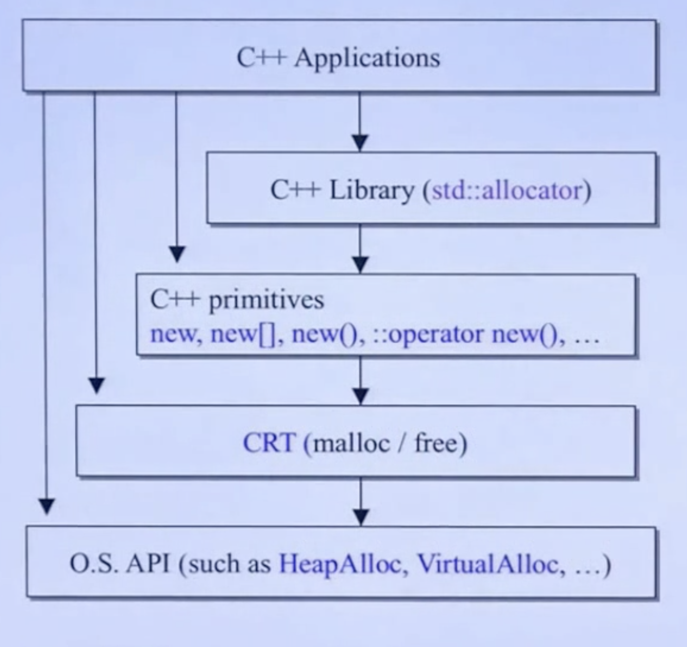
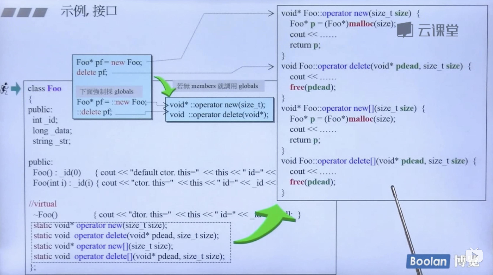

# 一、C++模块

## 1.1 C++基础

### 1.1.1 public/private/protected

#### 1.1.1.1 三种标号的访问范围

- private声明的属性，只能被以下情况访问：
  - 所属类中的函数
  - 其友元函数访问
- protected声明的属性，只能被下列情况访问：
  - 所属类中的函数
  - 子类的函数
  - 其友元函数
- public 声明的属性，只能被下列情况访问：
  - 所属类中的函数
  - 子类的函数
  - 其友元函数
  - 该类的对象

#### 1.1.1.2 三种标号的继承

**private属性(成员变量和成员函数)不能被继承。**

- private继承：父类的protected和public属性(成员变量和成员函数)在子类中都会变为private。
- protected继承：父类的protected和public属性(成员变量和成员函数)在子类中都会变为protected。
- public继承：父类的protected和public属性(成员变量和成员函数)不发生变化。

### 1.1.2 函数指针

函数指针本质上是一个指针，不过这个指针比较特殊，其指向的是函数的地址，该指针可以看做是函数名。

另外，不同类型的函数指针之间不能转换。

#### 1.1.2.1 **函数指针声明**

格式为：```返回值类型 (*函数指针名称)(参数列表)```

例如：

```
int (*pFunc)(int a,int b);
```

- pFunc是一个指针，指向一个函数，该函数有两个int型形参，返回值类型为Int。
- pFunc两边的括号不能省略，括号的优先级要比```*```高。

区分这两种情况：

```
int (*pFunc)(int a,int b);//pFunc是个指向函数的指针，返回值为int
int  *pFunc(int a,int b);//pFunc是个函数，返回值为int*
```

#### 1.1.2.2. 函数指针赋值与调用

给函数指针赋值时，只需给出函数名，不必给出参数。

```C++
int (*pFunc)(int val1,int val2);
int getSum(int n1,int n2)
{
    return n1 + n2;
}

pFunc = getSum;//赋值
int res = pFunc(3,5);
printf("res:%d \n",res);//结果为res:8 
```

#### 1.1.2.3 typedef简化函数指针

函数指针可以作为函数形参、函数返回值使用，如果其本身定义的非常复杂，可通过```typedef```简化。

```C++
typedef int (*FuncCall1)(int n, int m);//定义函数指针类型
int compareNum(int a,int b)
{
    if (a > b) return 1;
    if (a < b) return -1;
    return 0;
}
FuncCall1 cf;//声明一个函数指针
cf = compareNum;//赋值
int res = cf(4,3);//调用
printf("res:%d \n",res);//1
```

#### 1.1.2.4 函数指针作为形参

函数指针作为形参：

```C++
//第三个参数为函数指针
int funcTemp(int a, int b,int(*Func)(const int a, const int b))
{
    return Func(a,b);
}

int res = funcTemp(4,5,getSum);
printf("res:%d \n",res);//res: 9

int res2 = funcTemp(4,5,compareNum);
printf("res:%d \n",res2);//res: -1
```

也可以将形参通过```typedef```简化：

```C++
int funcTemp2(int a, int b,FuncCall1 fc)
{
    return fc(a,b);
}

int res2 = funcTemp2(4,7,getSum);
printf("res:%d \n",res2);//res: 11
```

#### 1.1.2.5 函数指针作为返回值

函数指针作为返回值时，理解稍微复杂，举例说明：

```
int (*ff(int))(int*,int);
```

此函数的返回值为：

```
int (*)(int* int)
```

函数名定义：

```ff(int)
ff(int)
```

简化为：

```
typedef int(*PF)(int*,int);
PF ff(int);
```

#### 1.1.2.6 指向类成员函数的指针

指向类成员函数的指针比普通的函数指针相比，多了一个类的限定。

声明：

```C++
class A
{
public:
    void Speak(){
        printf("A::Speak.....\n");
    }
};

//声明指向类成员函数的指针
void (A::*pFunc1)();
```

赋值：

```
pFunc1 = &A::Speak;
```

调用：

```
A a1;
(a1.*pFunc1)();//A::Speak.....
```

**也可以通过```typedef```简化声明**:

```
typedef void (A::*Func2)();//声明函数指针类型
Func2 ptr2 = &A::Speak;//声明变量并赋值
A a2;
(a2.*ptr2)();//调用
```

### 1.1.3 重载函数

#### 1.1.3.1 重载函数定义

出现在相同作用域内的函数，如果其函数名相同，而形参列表不同，则称之为重载函数。

**形参列表不同的含义为：**形参个数不同或形参类型不同，函数不能基于返回值类型不同实现重载。

**函数重载与重复声明的区别：**

- 如果两个函数返回值类型和形参列表相同，则第二个函数视为重复声明。
- 如果两个函数的形参列表完全相同，而返回值不同，则第二个函数声明是错误的。

#### 1.1.3.2 函数重载与const 形参

函数重载是基于形参列表的不同而实现的，但是```const```形参与非```const```形参有些情况下不能实现函数重载。

看以下代码：

```C++
void lookup(Phone tm);
void lookup(const Phone tm);//重定义

void lookup2(Phone& ph);
void lookup2(const Phone& ph);//重载

void lookup3(Phone* ptr);
void lookup3(const Phone* ptr);//重载

void lookup4(Phone* ptr);
void lookup4(Phone* const ptr);//重定义
```

形参与const形参的等价性仅适用于非引用形参，也就说对于引用和指针来讲，const形参与非const形参可用于实现函数重载。

- 有const引用形参的函数与有非const引用形参的函数是不同的。
- 有指向const类型的指针形参的函数，与带有指向相同类型的非const对象的指针形参的函数不同。
- 不能基于指针本身是否为const来实现函数重载。因为const修饰指针本身，而不是修饰指针所指向的类型。

注意区分**指针常量和常量指针**的区别。

```
const int* ptr;//常量指针
int const* ptr2;//常量指针
int* const ptr3 = NULL;//指针常量
```

- 常量指针：指针所指向的对象为常量，不允许修改。
- 指针常量：指针本身为常量，指针的值不允许修改。

### 1.1.4 多态与析构函数

为了防止内存泄漏，含有虚函数的类应该将其析构函数设为虚函数。

例如：

```C++
class Base1
{
public:
    Base1(){}
    virtual ~Base1(){printf("Base1::~Base1  \n");}
};
class Derived:public Base1
{
public:
    Derived(){}
    virtual ~Derived(){printf("Derived::~Derived  \n");}
};

int main()
{
    Base1* ptr = new Derived();
    delete ptr;
    return 0;
}
```

如果基类```Base1```的析构函数为非虚函数时，打印的日志为：

```
Base1::~Base1  
```

丢掉了派生类析构函数的调用，可能会产生泄漏。如果将父类的析构函数改为虚函数，则结果为：

```
Derived::~Derived  
Base1::~Base1
```

### 1.1.5 继承与友元

#### 1.1.5.1 友元类

一个类A可以将类B声明为自己的友元，则类B中所有的成员函数都可以访问类A的```private```和```protected```成员。

```C++
class CCar
{
private:
    int price;
    friend class CDriver;  //声明 CDriver 为友元类
};
class CDriver
{
public:
    void ModifyCar(CCar myCar) 
    {
        myCar.price += 1000;  //因CDriver是CCar的友元类，故此处可以访问其私有成员
    }
};
```

#### 1.1.5.2 友元函数

在类中，可以将**全局函数或其他类的非私有成员函数**声明为友元函数，在友元函数内部可以访问类的私有成员。

**将全部函数函数声明为友元函数的格式：**

```
friend 返回值类型 函数名(参数列表)
```

**将其他类的非私有函数声明为友元函数的格式：**

```
friend 返回值类型 类名::函数名(参数列表)
```

```C++
class CDriver;  //前向声明：提前声明CDriver类
class CCar
{
private:
    int price;
    friend void CDriver::ModifyCar(CCar myCar);  //声明友元函数
    friend int  GetExpensiveCar(CCar cars[], int total);//声明友元函数
};

class CDriver
{
public:
    void ModifyCar(CCar myCar)  //改装汽车
    {
        myCar.price += 1000;  //因CDriver是CCar的友元类，故此处可以访问其私有成员
    }
};

int GetExpensiveCar(CCar cars[], int total)
{
    int tmpMax = -1;
    for (int i = 0; i<total; ++i)
        if (cars[i].price > tmpMax)
            tmpMax = cars[i].price;
    return tmpMax;
}
```

#### 1.1.5.3 继承与友元

友元关系不能被继承。

- 基类中的友元类、友元函数不能被子类继承，即友元类对派生类的成员没有特殊访问权限。
- 基类被授予友元关系，

```C++
class CCar
{
private:
    int price;
    friend class CDriver;  //声明 CDriver 为友元类
};
class CMinCar:public CCar
{
private:
	int num;
};

class CDriver
{
public:
    virtual void ModifyCar(CCar myCar) {
        myCar.price += 1000;  //ok
    }
    virtual void ModifyCar(CMinCar myMinCar){
        myMinCar.num += 1;//error
    }
};

class CDriver2:public CDriver
{
public:
    virtual void ModifyCar(CCar myCar)  {
        myCar.price += 1000;  //error
    }
    virtual void ModifyCar(CMinCar myMinCar) {
        myMinCar.num += 1;//error
    }
};

```

### 1.1.6 static函数

- static 成员函数没有this指针。
- static 成员函数不能声明为 const。
- static 成员函数不能被声明为虚函数。
- static数据成员不同于普通数据成员，不是通过类的构造函数初始化，而是应该在定义时初始化。
- 如果基类中定义了static成员，则整个继承体系中就只有一个这样的成员。

### 1.1.7 C++模板

#### 1.1.7.1 模板函数

先看如下代码：

```C++
template <class T>
int compare(const T& v1, const T& v2)
{
    if (v1 > v2)
        return 1;
    if (v1 < v2)
        return -1;
    return 0;
}
```

模板函数的声明要点：

- 模板函数是一个特殊的函数，以关键词```template```开头。
- ```template```之后紧跟模板形参表，模板形参表由一个或多个模板形参组成，模板形参之间以逗号分隔。
- 模板形参跟在```class```或```typename```关键词之后定义，声明模板形参类型时，这两个关键词作用完全相同。
- 模板形参列表不能为空。
- 模板形参的名称没有本质含义，可以随意命名。

使用模板函数的目的是为了抽象出一套通用的函数的模板，根据模板形参的类型，**实例化**不同的函数实例。

比如下面函数的调用：

```
int res = compare(1,2);
```

编译器会实例化出形参表为```int,int```的函数：

```
int compare(const int& v1, const int& v2);
```

#### 1.1.7.2 inline函数模板

模板函数跟普通函数一样，可以通过```inline```关键词声明为内联函数。

**声明内联函数模板的要点：inline关键词必须在模板形参列表之后，函数返回值之前 ，不能在template关键词之前。**

举例说明：

```C++
template<class T>
inline int min(const T& v1, const T& v2)
{
    if(v1 < v2)
        return v1;
    return v2;
}
```

#### 1.1.7.3 模板类

模板类与模板函数一样，都是以·```template```开始，紧跟模板形参列表。

```C++
template <class T>
class Queue
{
public:
    void Push(const T& val);
    const T& Front();
};
```

#### 1.1.7.4 在模板内部定义类型

**在模板中定义内部类型时，必须使用typename关键词。**例如：

```
template<class Parm, class U>
void fcn(Parm* array,U val)
{
    typename Parm::size_type* ptr;
}
```

此时```size_type```就是模板类型```Parm```的一个内部成员类型，而不是成员变量，也不是成员函数。

#### 1.1.7.5 非类型的模板形参

模板形参不一定都是类型，也可以是值。

在调用函数时，非类型形参将用值代替，值的类型在模板形参列表中指定。

例如：

```C++
template<class T, size_t N>
void arrayInit(T (&param)[N])
{
    for (size_t i = 0; i < N; i++)
    {
        param[i] = i;
    }
}

//use
int arr1[10];
arrayInit(arr1);//对应arrayInit(int(&)[10])
```

```arrayInit```是一个包含一个**类型模板形参**和一个**非类型模板形参**的模板函数，该模板函数接受一个数组引用作为函数形参。

### 1.2.8  sizeof

> Q：定义一个空的类型，里边不含任何函数和成员 变量，对类型求sizeof，得到的结果是多少？
>
> A：答案是1。
>
> Q：为什么不是0？
>
> A：空类型的实例中不含任何信息，本来求sizeof应该是0，但是当声明该类型的实例时，它必须在内存中占用的一定的空间，否则无法使用这些实例。至于占用多少内存，由编译器决定，VS为每个空类型的实例分配一个字节。
>
> Q：如果在该类型中添加一个构造函数和析构函数，再对该类型求sizeof，得到的结果又是多少？
>
> A：还是1。调用构造函数和析构函数只需要知道函数的地址即可，而这些函数的地址只与类型相关，而与类型的实例无关，编译器也不会因为这两个函数而在实例内添加任何额外的信息。
>
> Q：那如果把析构函数标记为虚函数呢？
>
> A：C++的编译器一旦发现一个类型中有虚拟函数，就会为该类型生成虚函数表，并在该类型的每一个实例中添加一个指向虚函数表的指针。在32位的机器上，一个指针占4字节的空间，因此求sizeof得到4；如果是64位的机器，一个指针占8字节的空间，因此求sizeof则得到8。


### 1.2.9 复制构造函数考察

```C++
class A
{
public:
    A(int val){value = val;}
    A(A other){ value = other.value; }
    void Print()
    {
        std::cout<<"A::Print:"<<value<<std::endl;
    }
private:
    int value;
};

int main()
{
    A a = 10;
    a.Print();

    A b = a;//调用复制构造函数
    
    A c;
    c = a;//调用复制操作符
    b.Print();
    return 0;
}
```

一张有上述代码的 A4 打印纸要求分析编译运行的结果，并提供3个选项：

- A.编译错误；

- B.编译成功，运行时程序崩溃；

- C.编译运行正常，输出10。

结果为A，第19行出错，原因是类的复制构造函数的参数必须为引用。


### 1.2.10 赋值操作符考察

#### 1.2.10.1 定义

- 赋值操作符接受单个形参，且该形参为同一类类型的引用，一般为const引用。
- 赋值操作符的返回值也是同一类类型的引用，即```*this```。
- 判断形参与当前this是否为同一个实例，如果是同一个实例，无需进行赋值操作，直接返回即可。
- 判断是否需要自身已有的内存，否则可能出现内存泄漏。

#### 1.2.10.2 调用时机

```C++
MyString c1;
MyString c2 = c1;//拷贝构造
MyString c3(c1);//拷贝构造
MyString c4;
c4 = c1;//先调用赋值操作符，在调动拷贝构造，在VS Code中测试的结果
```


#### 1.2.10.3 面试题

如下为类型CMyString的声明，请为该类型添加赋值运算符函数。

```C++
class MyString
{
public:
    MyString(char* pData = NULL);
    MyString(const MyString& rh);
    ~MyString();
private:
    char* m_pData;
};
```

考虑上面四个方面，至少应该给出的答案为（初级程序员）：

```C++
MyString& operator= (const MyString& rf)
{
    if(this == &rf)
    {
        return *this;
    }

    delete[] m_pData;
    m_pData = NULL;
    m_pData = new char[strlen(rf.m_pData) + 1];
    strcpy(m_pData,rf.m_pData);
    return *this;
}
```

高级程序员需要考虑异常安全性问题：

上述代码，若通过new创建内存时抛出异常，而```MyString```的data数据已被释放，会很容易导致异常崩溃。更好的方法如下：

```C++
MyString& operator= (const MyString& rf)
{
    if(this != &rf)
    {
        MyString temp(rf);
        char* pTemp = temp.m_pData;
        temp.m_pData = m_pData;
        m_pData = pTemp;
    }
    return *this;
}
```

先创建一个临时实例 strTemp，接着把strTemp.m_pData和实例自身的m_pData做交换。由于strTemp是一个局部变量，当程序运行到 if 的外面时也就出了该变量的作用域，就会自动调用strTemp 的析构函数，把 strTemp.m_pData 所指向的内存释放掉。因为strTemp.m_pData与当前实例的m_pData交换，实际上是释放了自身实例之前的内存空间。

在新的代码中，我们在CMyString的构造函数里用new分配内存。如果由于内存不足抛出诸如bad_alloc等异常，我们还没有修改原来实例的状态，因此实例的状态还是有效的，这也就保证了异常安全性。

### 1.2.11 C++书籍推荐

- 《C++ Primer》：读完这本书，会对C++的语法有全面的认识。
- 《Effective C++》：此书适合面试之前突击，本书列举了使用C++经常出现的问题及解决这些问题的技巧。书中提到的问题也是很多面试官喜欢提问的问题。
- 《Inside C++ Object Mode》：读完此书可以深入了解C++对象的内部，比如前面的sizeof的问题、虚函数的调用机制等。
- 《The C++ Programming Language》：如果是想全面深入掌握C++，没有哪本书比这本书更适合的了。

### 1.2.11 基础知识

#### 1.2.12.1 map与under_map的区别


## 1.2 C++进阶一——《Inside C++ Object Mode》

### 1.2.1 默认构造函数的构建操作

#### 1.2.1.1 带有默认构造函数的Member Class Object

- 若一个类无任何构造函数，但它内含一个成员类对象，而后者有默认构造函数，那么这个类的implict default constructor（隐式默认构造函数）就是“nontrivial”（有用的），编译器将为此类合成一个inline的默认构造函数，此合成操作只有在构造函数真正需要被调用时才会发生。
- 当一个类包含多个成员类对象时
  - 若此类无任何构造函数，则编译器会自动合成一个默认构造函数。当调用此构造函数时，编译器将按照成员类对象声明的顺序依次调用各个默认构造函数。
  - 若此类有默认构造函数，则调用此函数时，编译器将按照成员类对象声明的顺序依次调用对应的构造函数（可能是默认构造函数，也肯能是含参数的构造函数）。
  - 若此类有多个构造函数，无默认构造函数，则编译器将不会合成默认构造函数，而是调用每个现有构造函数时，都会执行 默认构造函数的操作（即按照成员类对象声明的顺序依次调用其默认构造函数 ）。
  - 无论是程序员实现的构造函数，还是编译器合成的默认构造函数，无论成员类对象在构造函数内初始化的顺序如何，其构造函数的调用顺序都是按照声明的顺序执行

#### 1.2.1.2 带有默认构造函数的Base Class（基类）

若一个无任何构造函数的类派生自一个带有默认构造函数的基类，则编译器将为此派生类合成一个"notrivial"的默认构造函数，它将调用上一层基类默认构造函数（根据声明顺序）。

#### 1.2.1.3 带有一个虚函数的类

需要合成默认构造函数的情况

- 类声明一个虚函数
- 类派生自一个继承串链，其中有一个或更多的虚基类
- 不管哪种情况，只有缺乏用户声明的构造函数，编译器会自动合成一个默认构造函数

#### 1.2.1.4 带有一个虚基类的类

为了避免菱形继承，如下图所示，A继承X和B继承B时均需采用虚继承方式。


总结：

- 编译器必须为未声明构造函数的类声明默认构造函数的四种情况：
  - 包含成员类对象
  - 基类中包含默认构造函数
  - 包含虚函数
  - 采用虚继承
- 在合成的默认构造函数中，只有基类子对象和成员类对象会被初始化，所有其他的非静态数据成员，如整数、整数指针、整数数组等等都不会被初始化，为了避免野指针情况，程序员务必为非静态指针变量赋初值。
- 多态仅针对于指针和引用有效，对变量或对象无效。

### 1.2.2 复制构造函数的构建操作

#### 1.2.2.1 复制构造函数定义

复制构造函数是一个构造函数，第一个参数的类型是当前类的类型，可以有多个参数，其第二参数及后继参数需提供一个默认值。

#### 1.2.2.2 三种调用复制构造函数的情况

- 类对象的赋值操作```X x1; X x2 = x1; ```

- 当类对象作为参数传给函数时，```void func1(X tmp);```

- 当类对象作为函数返回值时，

  ```X func2(){```

  ​    ```X xt;```

  ​    ```return xt;```

  ```}```

#### 1.2.2.3 复制构造函数的实现方式

定义class时，分为两种情况：

- 开发人员明确声明复制构造函数及其成员变量的赋值。
- 开发人员没有明确声明复制构造函数，由编译器自动合成，其内部是通过defualt memberwise initializaiton完成，即把每一个内建或派生的成员变量的值，从某个object拷贝一份到另一个object。但是它不会拷贝成员类对象，而是以递归的方式施行memberwise initializaiton。参考**《Inside the c++ object model》一书的P49**

通过代码说明内建变量的拷贝：

```c++
class Test1
{
public:
    Test1(){}
    Test1(int tmp,std::string strTmp):m_nLen(tmp),m_strTmp(strTmp){}
    //没有声明复制构造函数
public:
    int m_nLen;
    std::string m_strTmp;
};

Test1 t1(5,"hello");
Test1 t2 = t1;
printf("test :%d  %s",t2.m_nLen,t2.m_strTmp.c_str()); //结果为>> test :5  hello

//跟下面操作一致
t2.m_nLen = t1.m_nLen;
t2.m_strTmp = t1.m_strTmp;
```


将Test1对象作为Test2的成员变量，来说明非内建对象的拷贝：

```c++
class WordTmp
{
public:
    int nVal;
    Test1 t1;
};

WordTmp tTVal2;
WordTmp.nVal = 2;
WordTmp.t1 = t1;

WordTmp tTVal3 = tTVal2;
```

如果将```tTVal2```赋值给```tTVal3```，```WordTmp```的```default memberwise initialization```会拷贝其内建的成员```nVal```，然后再对```Test1``` 类型的成员变量```t1```执行```default memberwise initialization```操作。

#### 1.2.2.4 位逐次拷贝（Bitwise Copy Semantics）

没看明白。。。


#### 1.2.2.5 虚函数表

只要一个类声明了一个或多个虚函数，编译期间必然会执行的两个操作：

- 增加一个虚函数表(vtbl)，内含每一个有作用的虚函数的地址。
- 为类对象(或指针)分配一个指向虚函数表的指针(vptr)。

**重要概念：切割（sliced）**

```
//这将会发生切割行为
DerivedClass dObj1;
BaseClass    bObj2 = dObj1;
```

此时bObj2会丢失属于DerivedClass的部分，bObj2本质上是BaseClass类型的对象。

实际上是因为合成出来的基类复制构造函数会明确设定bObj2的虚函数指针（vptr）指向基类的虚函数表，而不是直接直接拷贝右手边派生类对象的vptr。

#### 1.2.2.6 位逐次拷贝无效的情况

1. 当class内含一个成员对象，而后者的class声明有一个复制构造函数时；
2. 当class继承自一个基类，而后者存在有一个复制构造函数时（无论是被明确声明还是被合成）；
3. 当class声明了一个或多个虚函数时；
4. 当class派生自一个继承串链，其中有一个或多个虚基类时。
   - 一个类对象如果以另一个对象作为初值，而后者有一个virtual base class subobject，那么会使“bitwise copy semantics”失效，换句话说，这个问题不发生在一个类对象以另一个同类的object作为初值，而是发生在 一个类对象以其派生类object作为初值时。
   - 

### 1.2.3 程序转化语意

#### 1.2.3.1 明确的初始化

```
X x0;
X x1(x0); //编译器实际执行的是复制构造函数操作  x1.X::X(x0)
X x2 = X(x0);//编译器实际执行的是复制构造函数操作  x2.X::X(x0)
```

#### 1.2.3.2 参数的初始化

C++标准中指出，将一个类对象作为参数传给一个函数，或作为一个函数的返回值，相当于以下形式的初始化操作：

```
//temp代表参数(返回值)，而arg代表真正的参数值。
X temp = arg;
```

**即编译器调用复制构造函数时定义一个临时对象，然后将临时对象传给函数，或作为返回值返回。**

```C++
X xx;
foo(xx);

//编译器对复制构造函数的调用过程为
X __temp0;
__temp0.X::X(xx);
foo(__temp0);
//此时foo的定义发生改变，变为void foo(X& x0)； 其中class X 声明了一个析构函数，会在foo()函数完成之后被调用，释放临时对象__temp0。
//疑问：如果形参为指针呢？也会调用指针的析构函数？
```

#### 1.2.3.3 返回值的初始化

以下面这段代码为例，说明函数执行过程：

```C++
X foo()
{
    X x1;
    //process...
    return x1;
}

//调用函数
X xx = foo();
```

x1作为函数返回值返回实际上有一个双阶段转化过程：

- 第一步，首先生成一个X 类型的引用。
- 第二步，在return 指令之前，执行一个复制拷贝构造函数，将想要返回的对象作为第一步创建引用的初值。

其真正的执行过程是：编译器会改写这个函数，使它不返回任何值，而是将想要返回的对象作为形参引用对象返回。

foo() 函数的转化如下：

```C++
void foo(X& __res)
{
    X x1;
    x1.X::X();//执行默认构造函数
    
    //process..
    
    __res.X::X(xx);///执行复制构造函数
    return;
}

//实际上的调用形式会被转化：
X xx;
foo(xx);
```

考虑下面三种情况下构造函数的执行过程：

```
X x1(1024);
X x2 = X(1024);
X x3 = (X)1024;
```

上述第一行代码明确被单一的构造函数设定初值：

```
x1.X::X(1024);
```

而第二行和第三行代码，提供了两个步骤的初始化操作：

```
X __temp;
__temp.X::X(1024);//调用含参构造函数
x2.X::X(__temp);//调用复制构造函数
__temp.X::~X();//临时对象调用析构函数
```

### 1.2.4 初始化列表

#### 1.2.4.1 什么是初始化列表

初始化列表位于类的构造函数中，以冒号开头，以分号分隔多个初始化字段。

```C++
class Apple
{
public:
	Apple(int nId,string strName):id(nId),name(strName){}; //初始化列表
private:
	int id;
	string name;
}
```

#### 1.2.4.2 必须使用初始化列表的情况

1. 当初始化一个引用对象时；
2. 当初始化一个const对象时；
3. 当调用一个基类的含参构造函数时；
4. 当调用一个member class 的含参构造函数时。


变量初始化的次序：

```C++
class Word
{
public:
	Word():m_nCount(0),m_strCont("hello"){}
private:
	std::string m_strCont;
	int m_nCount;
};
```

上述代码中，虽然在初始化列表中，```m_nCount```位于```m_strCont```之前，但实际上是先初始化```m_strCont```，因为这两个变量声明的次序是先声明```m_strCont```。

**类成员变量的初始化顺序由其声明顺序决定，而不是在初始化列表中的排序。**

编译器会对初始化列表一一处理并可能重新排序，以反映出成员的声明次序，同时它会在构造函数内插入一些代码。


思考问题：

```C++
class X{ };
class Y : public virtual X{ };
class Z : public virtual X{ };
class A : public Y, public Z { };

int main()
{
    printf("X:%ld Y:%ld Z:%ld A:%ld \n",sizeof(X),sizeof(Y),sizeof(Z),sizeof(A));
    return 0;
}
```

在VS Code中打印出的结果为：```X:1 Y:8 Z:8 A:16 ```。

一个空的class X，其sizeof的值为1，是因为它有一个隐含的1``byte``，是被编译器插入进去的一个```char```，这使得这个类的两个对象得以在内存中拥有独一无二的地址：

````
X a,b;
if(&a == &b) 
	printf("ok \n");
elses
	printf("no \n");//结果为no
````


### 1.2.5 类内变量的布局

类的非静态变量在类对象中的排列顺序与其被声明的顺序相同，任何中间插入的静态数据变量都不会被放进类对象的布局之中。

以代码为例：

```C++
class Point3D
{
private:
	float x;
	static List<Point3D*>* freeList;
	float y;
	static const int chunkSize = 200;
	float z;
};
```

每一个Point3D对象都是由三个float变量组成，次序是```x,y,z```。静态变量```freeList / chunkSize```都不会被放进Point3D对象的布局之中，而是存在于程序的```data segment```中。

```C++ Standard```要求在同一个访问区段（即```private/public/protected```）中，变量的排序只需符合“较晚出现的变量在类对象中有较高的地址”这一个条件即可。


编译器还可能会合成一些内部使用的成员变量，如```vptr```，即虚函数指针，当前所有的编译器都把它安插在每一个“内含虚函数的类”的对象中。传统上，vptr会被放置在所有明确声明的成员变量之后，不过也有一些编译器把vptr放在一个类对象的最前端。


```C++ Standard```允许编译器将多个访问区段的变量自由排列，不必在乎它们出现在类声明中的次序。

```C++
class Point3D
{
private:
	float x;
	static List<Point3D*>* freeList;
private:
	float y;
	static const int chunkSize = 200;
private:
	float z;
};
```

上述代码中，Point3D 类对象的**大小和组成**与先前声明的那个相同，但是成员变量的排列次序则由编译器而定。

### 1.2.6 类内变量的存取

```
Point3D origin, *pt = &origin;
origin.x = 10;
pt->x = 10;
```

思考：上述对于x存取的两种方式有什么重大差异吗？

#### 1.2.6.1 静态类型

静态变量只有一个实体，并不在类对象中，而是存放在程序的data segment之中。

```
origin.chunkSize = 250;
pt->chunkSize = 250;
Point3D::chunkSize = 250;
```

上述三种方式的调用结果完全相同，只是```.```和```->```只是语法上的一种方便访问的方式。

#### 1.2.6.2 非静态类型

非静态变量直接存放在每个类对象之中。想要对一个非静态变量进行存取操作，编译器需要把类对象的起始地址加上变量的偏移量(offset)。举例说明：

```
origin.y = 0;
```

则地址&origin.y将等于：

```
&origin + (&Point3D::y - 1);
```

> 注意其中的-1操作。指向成员变量的指针，其偏移量总是被加上1，这样可以使编译器区分出“一个指向成员变量的指针，用以指出类的第一个成员”和“一个指向成员变量的指针，没有指出任何成员”两种情况。

没看明白引用的这段话。。。

**每一个非静态成员变量的偏移量在编译时期即可获知，即便成员变量属于基类也是如此。**


**非静态变量在虚继承中的存取效率**

```
Point3D* pt3d;
pt3d->x = 0;
```

其执行效率在x是一个结构体变量、类成员变量、单一继承、多重继承的情况下完全相同。但如果x是一个虚基类的成员变量，则存取速度会慢一点。


现在回想本节最开始的问题，通过对象和指针存取成员有什么重大差异？

```
Point3D origin, *pt = &origin;
origin.x = 10;
pt->x = 10;
```

答案为：当```Point3D```是一个派生类，并且被存取的成员变量(如x)是从虚基类中继承而来时，就会存在重大的差异。因为pt的具体类型在执行期才能明确，经由一个额外的间接导引才能解决。但如果使用origin，其类型确定为``Point3D``，即便它继承自虚基类，成员变量的偏移量也在编译时期就固定了。


### 1.2.7 继承与成员变量

分为四种情况介绍：单一继承且不含虚函数、单一继承并含虚函数、多重继承、虚继承。

#### 1.2.7.1 只要继承不要多态

定义没有继承关系的```Point2D```和```Point3D```两个类：

```C++
class Point2d
{
public:
	float x;
	float y;
};

class Point3d
{
public:
	float x;
	float y;
	float z;
};
```

这两个类没有虚函数，它们的布局与结构体完全一样。


这种方式下，对于x和y的操作需要分别在```Point2D```和```Point3D```两个类中实现，从设计模式上来讲，这种设计是不优雅的，一般通过继承方式。

```C++
class Point2d
{
public:
	Point2d(float nX = 0,float nY = 0):_x(nX),_y(nY){}
	float getX(){return _x;}
	void  setX(float nT){_x = nT;}
	float getY(){return _y;}
	void  setY(float nY){_y = nY;}
protected:
	float _x;
	float _y;
};

class Point3d : public Point2d
{
public:
	Point3d(float nX = 0,float nY = 0,float nZ = 0)
		:Point2d(nX,nY),_z(nZ){ }
	float getZ(){return _z;}
	void  setZ(float nZ){_z = nZ;}
protected:
	float _z;
};
```

单一继承且没有虚函数时的布局为：


访问类的sizeof:

```
printf("Point2d: %ld Point3d: %ld\n",sizeof(Point2d), sizeof(Point3d));
//结果为 Point2d: 8 Point3d: 12
//Point2d : 4 + 4
//Point3d : 4 + 4 + 4
```

#### 1.2.7.2 加上多态

加上多态，也就是应用虚函数。代码如下：

```C++
class Point2d
{
public:
	Point2d(float nX = 0,float nY = 0):_x(nX),_y(nY){}
	float getX(){return _x;}
	void  setX(float nT){_x = nT;}
	float getY(){return _y;}
	void  setY(float nY){_y = nY;}
	
    virtual void setZ(float nZ){}//虚函数
    virtual float getZ(){return 0;}//虚函数
protected:
	float _x;
	float _y;
};

class Point3d : public Point2d
{
public:
	Point3d(float nX = 0,float nY = 0,float nZ = 0)
		:Point2d(nX,nY),_z(nZ){ }
	float getZ(){return _z;}
	void  setZ(float nZ){_z = nZ;}
protected:
	float _z;
};
```

添加了虚函数之后：

- 每一个```Point2d```的类都会导入一个虚函数表，此表用于存放类中所声明的每一个虚函数的地址。
- 每一个```Point2d```和```Point3d```的类对象都会导入一个虚函数指针(vptr)，提供执行期的链接，使每一个对象都能找到对应的虚函数表，这就是多态的本质。


```Point2d```和```Point3d```是单一继承关系，加上了虚函数之后的继承布局为：**（此图是把vptr指针放在基类的尾端，现在的编译器一般是放在基类的头部）**


访问类的sizeof（没想明白。。）：

```
printf("Point2d: %ld Point3d: %ld\n",sizeof(Point2d),sizeof(Point3d));
//结果为 Point2d: 16 Point3d: 24
```

疑问：为什么```Point3d```没有所属的虚函数指针，用的却是```Point2d```的虚函数指针。难道是因为```Point3d```类中没有虚函数吗？


#### 1.2.7.3 多重继承

单一继承提供了一种“自然多态”的形式，是关于类体系中的基类和子类之间的转换。

以代码展示多继承体系：

```C++

class Point2d
{
public:
	//有虚函数，所以Point2d对象中会有vptr
protected:
	float _x;
	float _y;
};

class Point3d : public Point2d
{
public:
	//...
protected:
	float _z;
};

class Vertex
{
public:
    //有虚函数，所以Vertex对象有vptr
protected:
    Vertex* next;
};

class Vertex3d:public Point3d, public Vertex
{
public:
    //...
protected:
    float mumble;
};
```

继承关系为：


对于多重派生对象，将其地址指定给“最左端（也就是第一个）基类的指针”，情况与单一继承时相同，二者都有相同的起始地址。至于第二个或后继的基类的地址指定操作，则需要需改：加上（或减去，如果downcast）介于中间的 ```base class subobjects```的大小。


声明下面四个变量：

```
Vertex3d v3d;
Vertex*  pv;
Point2d* p2d;
Point3d* p3d;
```

当执行下面的操作时（```Vertex```是```Vertex3d```的第二个基类）：

```
pv = &v3d;
//需要进行的内部转化为：
//虚拟C++码
pv = (Vertex*)( ((char*)&v3d) + sizeof(Vertex3d) );
```

而下面的指定操作，都需要简单地拷贝其地址就行了。

```
p2d = &v3d;
p3d = &v3d;
```

如果有两个指针执行如下的操作：

````
Vertex3d* pv3d;
Vertex*   pv;
pv = pv3d;
````

内部不能够只是简单地被转化为：

```
//虚拟C++代码
pv = (Vertex*)((char*)pv3d) + sizeof(Vertex3d);
```

因为当```pv3d```为0时，```pv```将获取```sizeof(Vertex3d)```的值，这是错误的！，因此对于指针，内部转换操作需要有一个条件判断：

```
//虚拟C++代码
pv = pv3d ? (Vertex*)((char*)pv3d) + sizeof(Vertex3d) : 0;
```

至于引用，则不需要针对可能为0值做处理，因为引用不可能为空。


此处多重继承的布局为：


#### 1.2.7.4 虚继承

没看明白。。


### 1.2.8  函数的各种调用方式

C++支持三种类型的成员函数：静态、非静态和虚函数，每一种类型被调用的方式都不同。

以下列代码为例：

```C++
Point3d Point3d::normalize() const
{
    Point3d res;
    float length = magnitude();
    res.x = x/length;
    res.y = y/length;
    res.z = z/length;
    
    return res;
}

float Point3d::magnitude() const
{
    return sqrt(x * x + y * y + z * z);
}

Point3d obj;
Point3d* ptr;
obj.normalize();
ptr->normalize();
```


#### 1.2.8.1 非静态成员函数

C++ 标准的设计准则之一就是：**非静态成员函数至少必须和一般的非成员函数有相同的效率**。**即选择调用成员函数不应该带来额外负担，编译器内部会将成员函数转化为对等的非成员函数。**

```
float magnitude(const Point3d* _this){}
float Point3d::magnitude() const  { }
```

转化步骤为：

1. 改写函数原型：增加一个额外的参数，该额外参数被称为this指针。

   ```
   //非const 非静态成员函数
   Point3d Point3d::magnitude(Point3d* const this)

   //const 非静态成员函数
   Point3d Point3d::magnitude(const Point3d* const this)
   ```

2. 将每一个 对非静态成员变量的存取操作 改为经由 ```this```指针来存取：

   ```
   {
       return sqrt(this->x * this->x + this->y * this->y + this->z * this->z);
   }
   ```

3. 将成员函数重新写成一个外部函数，对函数名称进行“```mangling```”处理，使其独一无二的存在在程序中。

   ```
   extern magnitude_7Point3dFv(register Point3d* const this);
   ```

经过上述三步就转换结束，其每一个调用操作也都必须转换：

```C++
//原来的调用
obj.magnitude();
//变成
magnitude_7Point3dFv(&obj);

//而原来的指针调用
ptr->magnitude();
//变成了
magnitude_7Point3dFv(ptr);
```

而上面声明的normalize函数将被改写为：

```
void normalize_7Point3dFv(const Point3d* const this, Point3d& __result){}
```

#### 1.2.8.2 虚拟成员函数

如果```normalize```是虚拟成员函数，则下面的调用：

```
ptr->normalize();
```

将会转化为：

```
(*ptr->vptr[1])(ptr);
```

- vptr是指向虚函数表的指针，每个包含虚函数的类对象都有虚函数指针。
- 其中1是```virtual table slot```的索引值，关联到```normalize```函数。
- 第二个ptr表示this指针。

#### 1.2.8.3 静态成员函数

如果```Point3d::normalize()```是一个静态成员函数，以下的两个调用将会被转化为非成员函数调用：

```
//obj.normalize();
normalize_7Point3dSFV();
    
//ptr->normalize();
normalize_7Point3dSFV();
```

**静态成员函数的主要特性是它没有```this```指针。静态成员函数在调用过程中也会被转化为非成员函数调用。**

次要特性是：

- 它不能直接存取其所在类的非静态成员变量。
- 它不能被声明为```const```、```virtual```和```volatile```。
- 它不需要经由类对象调用。

> C++ 中 volatile关键字和const对应。<https://zhuanlan.zhihu.com/p/33074506>


#### 1.2.8.4 多态与虚函数

**在C++中，多态表示“以一个基类的指针(或引用)，寻址出一个派生类对象“的意思。**

识别一个类是否支持多态，唯一适当的方法就是看看它是否有虚函数。

**虚函数地址如何被构建起来？**

在C++中，虚函数可以在编译期获知，并且这一组地址是固定不变的，执行期不可能新增或替换之。

- 为了找到表格，每一个类对象都会包含一个由编译器内部产生的指针，指向该表格。
- 为了找到函数地址，每一个虚函数被指派一个固定的索引值。

这些工作都由编译器完成，执行期要做的只是在特定的 ```virtual table slot```(记录着虚函数的地址)中激活虚函数。

一个类只有一个虚表，每一个表内含其对应的类对象中所有```active```虚函数实体的地址，关于激活的虚函数下面进行详细的介绍。

**虚函数表中只记录虚函数、纯虚函数的地址。**

#### 1.2.8.5 单继承下的虚成员函数

声明```Point/Point2d/Point3d```三个类，说明单一继承体系下虚函数表中的内容。

```C++
class Point
{
public:
	virtual ~Point(){}
    virtual Point& mult(float factor) = 0;
    float x()const {return _x;}
    virtual float y(){return 0;}
    virtual float z(){return 0;}
protected:
    Point(float x = 0){_x = x;}
    float _x;
};
class Point2d:public Point
{
public:
    Point2d(float x = 0,float y = 0):Point(x),_y(y){}
    ~Point2d(){}

    Point2d& mult(float factor);
    float y() const {return _y;}

protected:
    float _y;
};
class Point3d:public Point2d
{
public:
    Point3d(float x = 0,float y = 0,float z = 0):Point2d(x,y),_z(z){}
    ~Point3d(){}

    Point3d& mult(float factor);
    float z() const {return _z;}

protected:
    float _z;
};
```

布局方式：

虚函数表中的函数类型包括：

- 继承自基类所声明的虚函数的函数体。基类中该函数实体的地址会被拷贝到派生类虚函数相对应的slot中。
- 派生类使用自己的函数实体。这表示它自己的函数实体地址必须放在对应的slot之中。
- 派生类可以加入一个新的虚函数。此时派生类的虚函数表的尺寸会增加一个slot，新的函数实体地址会被放进该slot之中。
- 一个```pure_virtual_called()```函数实体，即纯虚函数地址。

#### 1.2.8.6 多重继承下的虚函数

在多重继承中支持虚函数，其复杂度围绕着第二个及后继的基类身上，以及”必须在执行期调整this指针“这一点上。

举例：

```C++
class Base1
{
public:
    Base1();
    virtual ~Base1();
    virtual void speakClearly();
    virtual Base1* clone()const;
protected:
    float data_base1;
};

class Base2
{
public:
    Base2();
    virtual ~Base2();
    virtual void mumble();
    virtual Base2* clone()const;
protected:
    float data_base2;
};

class Derived:public Base1,public Base2
{
public:
    Derived();
    virtual ~Derived();
    virtual Derived* clone()const;
protected:
    float data_derived;
};
```

在多重继承下，一个派生类内含```n-1```个额外的虚表，```n```表示其上一层基类的个数（单一继承将不会有额外的虚表）。

对于本例的派生类，会有两个虚表被编译器产生：

1. 一个主要实体，与Base1（最左端的基类）共享。
2. 一个次要实体，与Base2（第二个基类）有关。

针对每一个虚表，派生类对象中会有对应的```vptr```（虚函数指针）。用以支持”一个类拥有多个虚表“的传统方法是：将每一个表以外部对象的形式产生出来，并给予独一无二的名称。

例如```Derived```所关联的两个表的名称可能是：

```
vtbl_Derived
vtbl_Base2_Derived
```

- 当将一个```Derived```对象的地址指定给一个```Base1```指针或```Derived```指针时，被处理的虚表是主要表格```vtbl_Derived```。
- 当将一个```Derived```对象的地址指定一个```Base2```指针时，被处理的虚表是次要表格```vtbl_Base2_Derived```。

多重继承下的布局：




**第二或后继的基类会影响对虚函数支持的三种情况：**

- 1. 通过一个指向第二基类的指针，调用派生类的虚函数。如：

  ```
  Base2* ptr = new Derived();

  //调用Derived::~Derived
  //ptr必须向后调整sizeof(Base1)个bytes ? 向后还是向前？？？？应该是向前吧！！
  delete ptr;
  ```

- 2. 通过一个指向派生类的指针，调用从第二基类中继承而来的虚函数。如：

  ```
  Derived* pder = new Derived();

  //调用Base2::mumble()
  //pder必须向前调整sizeof(Base1)个bytes ? 向前还是向后？？应该是向后吧！！！
  pder->mumble();
  ```

- 3. 发生于语言扩充性质之下：允许一个虚函数的返回值类型有所变化，可能是基类类型，也可能是派生类类型。如```clone```函数的使用：

  ```
  //clone函数的派生类版本会传回一个Derived类型指针，默默地改写了它两个基类的函数实体。
  //当通过”指向第二基类“的指针来调用clone()时，this指针的offset问题就会产生：
  Base2* pb1 = new Derived();

  //调用Derived::clone()
  //返回值必须被调整，以指向Base2 subobject
  Base2* pb2 = pb1->clone();
  ```

#### 1.2.8.7 虚继承下的虚函数

太复杂了，没搞懂。

#### 1.2.8.8 函数效能

下面总结出非成员友元函数、成员函数、以及虚成员函数的执行性能：

内联函数 > 非成员函数 = 静态函数 = 非静态成员函数 > 单一继承下的虚函数 > 多重继承下的虚函数 >= 虚继承下的虚函数。

前面已经讲到：非静态成员函数和静态函数，在被调用时都会被编译器转化为非成员函数，因此三者的执行效率一样。

#### 1.2.8.9 指向虚函数的函数指针

C++多态仍然能够在使用”指向类成员函数的指针“情况下运行。

```C++
class Base1
{
public:
    Base1(){}
    virtual ~Base1(){printf("Base1::~Base1  \n");}
    virtual void speakClearly(){printf("Base1::speakClearly  \n");}
};

class Derived:public Base1
{
public:
    Derived(){}
    virtual ~Derived(){printf("Derived::~Derived  \n");}
    virtual void speakClearly(){printf("Derived::speakClearly  \n");}
};

int main()
{
    void (Base1::*pmf)() = &Base1::speakClearly;
    Base1 ba;
    (ba.*pmf)();	//Base1::speakClearly

    Base1* ptr = new Derived();
    (ptr->*pmf)();	//Derived::speakClearly
    return 0;
}
```

### 1.2.9 继承体系下的对象构造

类的构造函数会被编译器扩充而产生大量的扩充码，扩充程度由类的继承体系确定。扩充码必须附加在基类构造函数执行之后，程序员提供的代码之前。

编译器扩充的操作顺序一般为：

1. 调用所有基类的构造函数，以基类的声明顺序为调用顺序，不是初始化列表中的顺序。
2. 所有虚基类的构造函数必须由左到右的被调用。
3. 如果类对象有虚表指针，则初始化虚表指针，将其指向正确的虚表。
4. 记录在初始化列表中的成员变量将被放进构造函数体内，并以成员变量声明的顺序为调用顺序，而不是初始化列表中的顺序。
5. 如果有一个成员并没有出现在初始化列表中，但是它有默认构造函数，则其默认构造函数也会被调用。


**合成析构函数、拷贝构造函数、复制操作符**

```C++
class Point
{
public:
    Point(float x = 0,float y = 0);
    Point(const Point&);//拷贝构造函数
    Point& operator=(const Point&); //复制操作符
    virtual ~Point();//虚析构函数
};

class Line
{
public:
    Line(const Point& begin,const Point& end)
    :_end(end),_begin(begin){}
private:
    Point _begin,_end;
};
```

Line只明确声明了含参构造函数，无拷贝构造函数，无赋值操作符。

Line构造函数会被编译器扩充，扩充码如下：

```
Line* Line::Line(Line* this,const Point& begin,const Point& end)
{
    this->_begin.Point::Point(begin);
    this->_endn.Point::Point(end);
    return this;
}
```

当声明Line变量时：

```
Line a;
```

Line类的析构函数会被自动合成，如下：**与构造函数的执行顺序相反**

```
void Line::Line(Line* this)
{
	this->_endn.Point::~Point();
    this->_begin.Point::~Point();
}
```

当写出下面的代码时，Line类的拷贝构造函数会自动合成。

```
Line b = a;
```

当写出下面代码时，Line类的赋值操作符将被自动合成。

```
a = b;
```

#### 1.2.9.1 虚继承下的对象构造

我们都知道使用虚继承是为了避免菱形集继承而产生歧义，那么虚继承情况下，构造对象时，其子类构造函数会如何被扩充呢？

以上面```1.2.9提到的Point```为基类，创建如下的类体系：


```C++
class Point
{
public:
	//虚析构函数
	//虚成员函数
}

class Point3d : public virtual Point 
{
public:
	Point3d(float x = 0,float y = 0,float z = 0)
		:Point(x,y) , _z(z){}
	//...
}
class Vertex : public virtual Point{}
class Vertex3d : public Point3d,public Vertex {}
class PVertex : public Vertex3d {}
```

程序员在定义```Point3d```和```Vertex```类的构造函数时，都会在其初始化列表中调用虚基类```Point```对应的构造函数，那为什么当定义```Vertex3d```的构造函数，并在其初始化列表分别调用```Point3d```和```Vertex```类的构造函数不会出错呢？

原因就在于编译器会对构造函数进行扩充，当```Point3d```采用虚继承时，其构造函数会被扩充为如下的伪代码：

```C++
Point3d* Point3d::Point3d(Point3d* this, bool __most_derived, float x, float y, float z)
{
    if(__most_derived != false)
    {
       this->Point::Point(x, y, z);
    }
    this->__vptr_Point3d = __vtbl_Point3d;
    this->__vptr_Point3d_Point = __vtbl_Point3d_Point;//这个不明白
    this->_z = z;
    return this;
}
```

当```Point3d```和```Verte```的构造函数被直接子类调用时，其中```__most_derived```被设为```false```。如```Vertex3d```：

```C++
Vertex3d* Vertex3d::Vertex3d(Vertex3d* this, bool __most_derived, float x, float y, float z)
{
    if(__most_derived != false)
    {
       this->Point::Point(x, y, z);
    }
    
    //调用上一层基类的构造函数
    this->Point3d::Point3d(false, x, y, z);
    this->Vertex::Vertex(false, x, y);
    
    //设置__vptr指针
    //设置程序员给定的代码
    return this;
}
```

当我们如下声明变量时：

```
Point3d origin;
Vertex3d cv;
```

- 当声明```origin```时，Point3d的构造函数可以正确调用虚基类的构造函数。
- 当声明```cv```时，Vertex3d的构造函数会调用Point的构造函数，而Point3d和Vertex的构造函数中会剔除对Point构造函数的调用，其他部分正常执行。

#### 1.2.9.2 在构造函数中调用虚函数

C++语言规定：在某个类的构造函数（或析构函数）中调用虚函数，执行的是当前构造函数（或析构函数）所属类的虚函数的函数体。

以下列代码为例：

```C++
class Point
{
public:
    Point(float x = 0,float y = 0)
    {
        printf("Point::Point() \n");
        size();
    }
    virtual void size(){printf("Point::size \n");}
};

class Point3d : public Point
{
public:
    Point3d(float x = 0,float y = 0,float z = 0)
        :Point(x,y)
        {
            printf("Point3d::Point3d() \n");
            size();
        }
    virtual void size(){printf("Point3d::size \n");}
};
```

当声明如下变量时：

```
Point3d vd;
```

打印的结果为:

```
Point::Point() 
Point::size 
Point3d::Point3d() 
Point3d::size 
```

当子类```Point3d```的构造函数调用基类```Point```的构造函数时，在基类构造函数内访问虚函数```void size()```，实际上执行的是基类中对应的函数体```Point::size()```，而在子类```Point3d```中访问虚函数```size()```时，实际上执行的是子类中对应的函数体```Point3d::size()```

#### 1.2.9.3 vptr的初始化

```vptr```是虚函数指针，指向类的虚函数表。通过vptr找到虚函数表中对应的虚函数，这是C++多态的本质。

**vptr初始化的时机：基类构造函数执行之后，程序员提供的代码或构造函数中初始化列表初始化之前。**所以才会出现 ```1.2.9.2```中的情况。


**最后总结构造函数的执行顺序**：

1. 在派生类的构造函数中，所有的虚基类及基类的构造函数都会被执行。
2. 对象的虚表指针（一个或多个）被初始化，分别指向对应的虚函数表。
3. 如果有初始化列表，将在构造函数内扩展开来。这一步是在虚表指针初始化之后执行。
4. 执行程序员所提供的代码。

### 1.2.10 复制操作符

一个类对于默认复制操作符，在如下情况时```bitwise copy```失效：

- 当类内包含一个类对象，并且类对象所属的类有复制操作符时；
- 当一个类的基类有一个复制操作符时；
- 当类有虚基类时，无论虚基类是否包含复制操作符；
- 当类中声明了虚函数时；

上述四种情况下，同样也是当类无默认构造函数时，编译器必须自动合成的情况。
也没看明白讲的是什么！！！

### 1.2.11 析构函数

如果一个类中没有定义析构函数，那么编译器自动合成析构函数的情况有：

- 类中包含一个其他类的成员对象，该对象所属的类拥有析构函数；
- 当前类的基类中拥有析构函数；

其他情况下，析构函数会被认为不需要，因此编译器也不会被合成，更不会被调用。

由程序员定义的析构函数的扩展方式与构造函数类似，但顺序相反：

1. 调用当前类的析构函数，也就是说vptr在程序员提供的析构函数体执行之前被重设。
2. 如果类内包含成员类对象，且后者包含析构函数，那么它们将以声明顺序的相反顺序被调用。
3. 如果对象内有vptr指针，则重设vptr指针。
4. 调用直接基类的析构函数（如果有的话），它们以声明顺序的相反顺序被调用。
5. 如果有虚基类，且后者包含析构函数时，而当前类是最尾端的派生类，则它们会以构造顺序的相反顺序被调用。

### 1.2.12 对象的构造和析构

#### 1.2.12.1 全局对象

```Matrix m;```

C++保证，全局对象会在main函数内第一次调用之前构造出来，并在main函数结束之前释放掉。

C++中所有的成员对象都被放置在程序的```data segment```中。

如果明确给定一个值，那么此值就是它的初始值，否则其初始值为0。

**虽然对象会在编译时期会被放置到data segment中，并被赋值为0，但其构造函数一直要到程序激活时才会调用。**


### 1.2.13 new和delete运算符

new和delete是C++语言的两个操作符，不是函数。

#### 1.2.13.1 new操作符

通过new操作符创建一个指针，内部会分为两步操作：

- 创建一块内存，并将其初始化。
- 初始化：如果有构造函数，调用构造函数初始化。。

如通过new操作符写出语句：

```
int* ptr1 = new int(10);
```

编译器实际上执行两个操作：

1. 通过new操作符，配置所需的内存。

```
int* ptr1 = __new(sizeof(int));//调用函数库的new操作符
```

2. 给配置得到的对象设置初值(或调用构造函数)

```
*ptr1 = 10;
```

#### 1.2.13.2 delete操作符

调用delete操作符释放指针，内部也分为两步操作：

1. 如果有析构函数，调用析构函数；

2. 释放指针指向的内存空间。

像下面的语句：

```
delete ptr1;
ptr1 = NULL;
```

实际上，编译器会判断ptr1是否为空，不为空就释放其指向的内存空间。

```
if(ptr1 != 0)
{
	//如果有析构函数，就调用析构函数
    __delete(ptr1);
}
```

注意：**编译器不会将在delete指针后将其赋空置，最友好的方式是，一旦调用delete操作符之后，就将其指针的值只为null。**

#### 1.2.13.3 针对数组的new

如下面的语句：

```
//Point是程序员自定义的类，有构造函数
Point* pArrays = new Point[5];
```

当调用new操作符时，编译器执行的操作是：

1. 申请指定大小的内存。
2. 对数组中的五个```Point```指针分别执行构造函数进行初始化。

### 1.2.14 模板的对象模型

编译器看到模板时，不会执行任何处理，只有当模板函数被调用或模板类创建对象时，才会具体的实例化一个函数或一个类。

当模板类实例化出一个具体的类时，**其成员函数在未被调用之前是不会实例化的**。

例如：

```
Point<float>* ptr = new Point<float>();
```

上述语句执行时，会有三个实例化过程：

1. ```Point```模板类的```float```实例。
2. ```new```操作符的实例化。
3. 构造函数的实例化。

注意区分模板的两个定义：

1. 定义出模板
2. 实例化出模板

### 1.2.15 执行期类型识别(Runtime Type Identification, RTTI)

```dynamic_cast```运算符可以在执行期确定对象的真正类型，是安全的类型转化。

```type_info```是C++标准所定义的包含类型描述器的类，该类中记录了具体的类型信息。

虚函数表中第一个```slot```中记录着```type_info```对象的地址。


**dynamic_cast应用到多态指针使用**

- 如果传回真正的类型，表明确定了指针的动态类型。
- 如果返回0，表示类型转化失败，不存在派生类与基类的关系。


**dynamic_cast应用到多态引用使用**

- 如果引用能被转化为存在的派生类类型，向下转化能正常进行。
- 如果引用不是真正的某个派生类引用，**不能返回0值，**而是会自动抛出一个```bad_cast```异常，


**Typeid运算符**


**dynamic_cast和static_cast的使用时机**：

- 当转换一个指向多态的对象时，可以通过```dynamic_cast```运算符，虽然代价较高，但是类型转换是安全的。当转化失败时，会返回空值。

- 当转化非多态对象时，通过```static_cast```运算符。


### 1.2.16 C++类的内部布局和大小

[可参考这里](https://blog.csdn.net/u014558668/article/details/77476448)，将的比较详细


### 1.2.17 工具及资源

- Dev-C++ 5.11

- [Doug Lea](http://gee.cs.oswego.edu/)：研究DL malloc 的大佬

- 书籍：

  


### 1.2.18 内存管理

C++内存管理基本知识：

#### 1.2.18.1 执行流程(从高阶到低阶)



#### 1.2.18.2 4种基础工具


四种方式的使用：

```c++
 //1. malloc/free
void* p1 = malloc(512);//512 bytes
free(p1);

//2. new/delete
std::complex<int>* p2 = new std::complex<int>();
delete p2;

//3. ::operator new/::operator delete
void* p3 = ::operator new(512);//512 bytes
::operator delete (p3);//注意这个括号，丢失报错

//4. 分配器
int* p4 = std::allocator<int>().allocate(7);//7 ints
std::allocator<int>().deallocate(p4,7);
```

注意：

```C++
//complex代表复数，如2 + 3i
std::complex<int> a{2,3};
```

不可以使用指针调用构造函数，如下面的用法：

```C++
string* ptr = new string();
ptr->string::string("hellos");

//编译报错：
// error: no member named 'string' in 'std::__1::basic_string<char>'
```

#### 1.2.18.3 new/delete 表达式

**一、new**

```C++
A* ptr = new A();
```

编译器实际上执行两步操作：

1. 调用```operator new```分配内存，本质上执行的是```malloc```。
2. 进行初始化，如果有构造函数，调用类的构造函数。

可参考1.2.13.1节。

**二、delete**

```C++
delete ptr;
ptr = NULL;
```

编译器同样也是执行两步操作：

1. 调用类的析构函数。
2. 调用```operator delete```释放内存。

可参考1.2.13.2节。

#### 1.2.18.4 array new / array delete

array new : 创建一个长度为n的数组，分配内存，执行n次构造函数。

array delete:释放一个长度为n的数组，执行n次析构函数，释放内存。

```C++
//Complex是自定义的类，有默认构造函数
Complex* pca = new Complex[3];//执行3次类Complex的构造函数
//...
delete[] pca;//执行3次析构函数
```

array delete与ptr delete的区别在于：

- array delete：是执行n次析构函数
- ptr delete：仅执行一次析构函数



#### 1.2.18.5 placement new（定点new）

placement new 本身不分配内存，代表将某个对象构建在指定内存上。

placement new 相当于：```new(ptr)```和```::operator new(size,void*)```。

用法：

```
char* buf = new char[sizeof(Complex) * 3];
Complex* pc = new(buf) Complex(1,2);
//..
delete[] buf;
```

#### 1.2.18.6 重载

**一、C++内存分配的执行路径**

​	


- ``` new```->```operator new```->```::operator new```->```malloc```。
- ```delete```->```operator delete```->```::operator delete```->```free```。

了解了内存分配的执行路径，知道如何通过函数重载来”接管“内存分配与释放，这就是所谓的所谓的内存管理。

**二、重载::operator new和::operator delete**

::operator new和::operator delete 是一个全局的函数，可以被重载，但很少这么做，因为这是一个全局函数，影响范围较广。

**三、重载operator new 和operator delete**

operator new 和 operator delete 是类的成员函数，本质上是**静态函数**。即便声明函数时，未添加关键字static，编译器被会编译器当做static 函数处理。


**四、重载operate new[] 和operator delete[]**

operate new[] 和operator delete[] 分别代表数组内存的分配和释放。


**五、new/delete/array new/array delete 重载实例**



使用：


# 二、数据结构

## 2.1 链表

### 2.1.1 定义

链表是一种在物理上非连续、非顺序的数据结构，由若干个节点组成。

链表分为单链表和双向链表，单链表的每个节点都包含两部分，一部分是存放数据的变量data，另一部分是保存下一个节点的next指针。双向链表的每个节点都包含三部分，除了单链表节点的两部分之外，还包含一个指向前一节点的pre指针。

如果不考虑查找元素过程，只考虑纯粹的插入和删除操作，其时间复杂度为$O(1)$。

### 2.1.2 链表与数组的比较

数组是有限个相同类型的变量所组成的有序集合，在内存中顺序存储的线程表。

|      | 查找     | 插入       | 删除       |
| ---- | ------ | -------- | -------- |
| 数组   | $O(1)$ | $O(n)$   | $O( n )$ |
| 链表   | $O(n)$ | $O( 1 )$ | $O( 1 )$ |

### 2.1.3 关于链表的算法题

1. [反转链表](https://leetcode-cn.com/problems/reverse-linked-list/)

   反转一个单链表。

   - 示例:

   输入: 1->2->3->4->5->NULL
   输出: 5->4->3->2->1->NULL

   - 进阶:
     你可以迭代或递归地反转链表。你能否用两种方法解决这道题？

   ```C++
    struct ListNode {
       int val;
       ListNode *next;
       ListNode(int x) : val(x), next(NULL) {}
    };
    
    //迭代
   ListNode* ReverseList(ListNode* pHead)
   {
       if(NULL == pHead)
       {
           return pHead;
       }
       ListNode* pPre = NULL;
       while(pHead)
       {
           ListNode* pNext = pHead->next;
           pHead->next = pPre;
           pPre = pHead;
           pHead = pNext;
       }
       return pPre;
   }

   //递归
   ListNode* ReverseListTravel(ListNode* pHead)
   {
       
   }
   ```

2. [从尾到头打印链表](https://www.nowcoder.com/practice/d0267f7f55b3412ba93bd35cfa8e8035?tpId=13&tqId=11156&tPage=1&rp=1&ru=%2Fta%2Fcoding-interviews&qru=%2Fta%2Fcoding-interviews%2Fquestion-ranking)

输入一个链表，按链表从尾到头的顺序返回一个ArrayList。

NOTE：三种方法分别是链表逆序、使用栈、使用递归。

**方法一：链表逆序**

```C++
vector<int> printListFromTailToHead(ListNode* head) {
    vector<int> res;
    if(NULL == head)
    {
        return res;
    }

    ListNode* pre = NULL;
    while (head && head->next)
    {
        ListNode* next = head->next;
        head->next = pre;
        pre = head;
        head = next;
    }

    if (head)
    {
        head->next = pre;
    }
    while (head)
    {
        res.push_back(head->val);
        head = head->next;
    }
    return res;
}
```

**方法二：使用栈**

```C++

```
3. [链表中倒数第k个结点](https://www.nowcoder.com/practice/529d3ae5a407492994ad2a246518148a?tpId=13&tqId=11167&tPage=1&rp=1&ru=/ta/coding-interviews&qru=/ta/coding-interviews/question-ranking)

输入一个链表，输出该链表中倒数第k个结点。

NOTE：使用两个指针，其中一个指针从头开始遍历，另一个指针提前(k - 1)步开始遍历。当第二个指针到达最后一个结点时，第一个指针指向的就是结点就是倒数第K个。

```C++
struct ListNode {
	int val;
	struct ListNode *next;
	ListNode(int x) :
			val(x), next(NULL) {
	}
};

ListNode* FindKthToTail(ListNode* pListHead, unsigned int k) {
    if(pListHead == NULL || k <= 0)
        return NULL;
    ListNode* pPreNode = pListHead;
    ListNode* pCurNode = NULL;
    for(int i = 0;i < (k - 1);i++)
    {
        if(pPreNode)
        {
            pPreNode = pPreNode->next;
        }
    }

    if(pPreNode == NULL)
    {
        return pCurNode;
    }

    pCurNode = pListHead;
    while(pPreNode != NULL && pPreNode->next != NULL)
    {
        pPreNode = pPreNode->next;
        pCurNode = pCurNode->next;
    }

    return pCurNode;
}
```
4. [合并两个排序的链表](https://www.nowcoder.com/practice/d8b6b4358f774294a89de2a6ac4d9337?tpId=13&tqId=11169&tPage=1&rp=1&ru=/ta/coding-interviews&qru=/ta/coding-interviews/question-ranking)

输入两个单调递增的链表，输出两个链表合成后的链表，当然我们需要合成后的链表满足单调不减规则。

```C++
struct ListNode {
	int val;
	struct ListNode *next;
	ListNode(int x) :
			val(x), next(NULL) {
	}
};

ListNode* Merge(ListNode* pHead1, ListNode* pHead2)
{
    if(pHead1 == NULL)
        return pHead2;
    else if(pHead2 == NULL)
        return pHead1;

    
    ListNode* pNode = NULL;
    if(pHead1->val < pHead2->val)
    {
        pNode = pHead1;
        pHead1 = pHead1->next;
    }
    else
    {
        pNode = pHead2;
        pHead2 = pHead2->next;
    }

    ListNode* pRes = pNode;
    while(pHead1 != NULL && pHead2 != NULL)
    {
        if(pHead1->val < pHead2->val)
        {
            pRes->next = pHead1;
            pRes = pHead1;
            pHead1 = pHead1->next;
        }
        else 
        {
            pRes->next = pHead2;
            pRes = pHead2;
            pHead2 = pHead2->next;
        }
    }
    
    if(pRes)
    {
        pRes->next = pHead1 ? pHead1 : pHead2;
    }
    return pNode;
}
```
5. [两个链表的第一个公共结点](https://www.nowcoder.com/practice/6ab1d9a29e88450685099d45c9e31e46?tpId=13&tqId=11189&tPage=2&rp=2&ru=/ta/coding-interviews&qru=/ta/coding-interviews/question-ranking)

输入两个链表，找出它们的第一个公共结点。（注意因为传入数据是链表，所以错误测试数据的提示是用其他方式显示的，保证传入数据是正确的）

6. [链表中环的入口结点](https://www.nowcoder.com/practice/253d2c59ec3e4bc68da16833f79a38e4?tpId=13&tqId=11208&tPage=3&rp=3&ru=/ta/coding-interviews&qru=/ta/coding-interviews/question-ranking)

给一个链表，若其中包含环，请找出该链表的环的入口结点，否则，输出null。

7. [删除链表中重复的结点](https://www.nowcoder.com/practice/fc533c45b73a41b0b44ccba763f866ef?tpId=13&tqId=11209&tPage=3&rp=3&ru=/ta/coding-interviews&qru=/ta/coding-interviews/question-ranking)

在一个排序的链表中，存在重复的结点，请删除该链表中重复的结点，重复的结点不保留，返回链表头指针。 例如，链表1->2->3->3->4->4->5 处理后为 1->2->5。

8. 判断是否为环形链表

## 2.2 栈

#### 2.2.1 基本知识

栈是一种逻辑结构，物理上可以基于数组实现，也可以基于链表实现。

特点是先入后出，最早进入的元素称为栈底，最后进入的元素称为栈顶。

基本操作为入栈和出栈。

入栈和出栈的复杂度：$O( 1 )$。因为入栈和出栈只涉及到栈顶元素，不存在其他元素的整体移动，无论是基于数组实现还是链表实现，其复杂度均为$O( 1 )$。

#### 2.2.2 关于栈的算法题


## 2.3 队列

#### 2.3.1 基本知识

队列同栈一样，也是一种既可以基于数组实现，也可以基于链表实现的逻辑结构。

特点是先入先出，队列的出口端成为队头，入口端称为队尾。

入队和出队的复杂度：$O( 1 )$。

#### 2.3.2 关于队列的算法题


## 2.4 散列表

#### 2.4.1 基本知识

散列表又称哈希表，是以键值对的方式成对存储，根据键可以高效的获取值，时间复杂度接近于$O( 1 )$。

哈希表本质上也是一个数组。


## 2.5 数据结构的遍历

数据结构的基本存储分为链式和顺序两种方式，基本操纵为增删改查，遍历分为迭代和递归。

### 2.5.1 数组

```C++
int arr1[] = {4,3,5,1};
int num = sizeof(arr1)/sizeof(int);
for (int i = 0; i < num; i++)
{
    printf("%d ",arr1[i]);
}
```

### 2.5.2 单链表

```C++
struct LinkNode
{
    int nData;
    LinkNode* pNext;
};

void traverse(LinkNode* pHead)
{
    //迭代访问
    for (LinkNode* current = pHead; current != nullptr; current = current->pNext)
    {
        /* code */
    }

    //递归访问
    traverse(pHead->pNext);
}
```

### 2.5.3 二叉树

```C++
truct TreeNode
{
    int nData;
    TreeNode* pLeft;
    TreeNode* pRight;
};

void traverse(TreeNode* pHead)
{
    //递归迭代
    traverse(pHead->pLeft);
    traverse(pHead->pRight);
}
```

与单链表的递归访问相似，因此可以抽象出N叉树的遍历。

### 2.5.4 N叉树

```c++
struct NTreeNode
{
    int nData;
    std::vector<NTreeNode*> aChildNodes;
};

void traverse(NTreeNode* pHead)
{
    if(pHead == nullptr) return;
    for (size_t i = 0; i < pHead->aChildNodes.size(); i++)
    {
        /* code */
    }
}
```

N叉树的遍历又可以扩展为图，因为图就是多个N叉树的组合。

## 2.6 二叉树


### 2.6.1 相关算法题

- [重建二叉树](https://www.nowcoder.com/practice/8a19cbe657394eeaac2f6ea9b0f6fcf6?tpId=13&tqId=11157&tPage=1&rp=1&ru=%2Fta%2Fcoding-interviews&qru=%2Fta%2Fcoding-interviews%2Fquestion-ranking)
- 

## 2.7 二分图

二分图是一个拥有特殊性质的图：能够用两种颜色为所有顶点着色，使得任意一条边连接的两个顶点的颜色不同。

如图：


二叉平衡树如何用一维数组存储？


# 三、算法

## 3.1 动态规划算法

### 3.1.1 定义

动态规划算法是通过拆分问题，定义问题状态和状态之间的关系，使得问题能够以递推（或分治）的方式去解决。

### 3.1.2 基本思想

由于动态规划解决的问题多数有重叠子问题的特点，为减少重复计算，对每一个子问题只求解一次，将其不同阶段的不同状态保存在一个二维数组中。

### 3.1.3 原理

动态规划的使用条件：**可分解为多个相关子问题，子问题的解被重复使用**。

动态规划的特点：整个问题的最优解取决于子问题的最优解，将子问题称为状态，最终状态的求解归结为其他状态的求解。

### 3.1.4 应用场景

- 计算最大/最小值
- 求可行或不可行
- 求方案总数，若求所有可行的方案，则肯定不能使用动态规划。

### 3.1.5 关于动归的算法题

- [查找字符串的最长回文子串](https://leetcode-cn.com/problems/longest-palindromic-substring/)
- [无重复字符的最长子串](https://leetcode-cn.com/problems/longest-substring-without-repeating-characters/)

动态规划算法的分类：

- 线性动归：拦截导弹、合唱队形、挖地雷、建学校、剑客决斗等；
- 区域动归：石子合并、加分二叉树、统计单词个数、炮兵布阵等；
- 树形动归：贪吃的九头龙、二分查找树、聚会的欢乐、数学三角形等；
- 背包问题：01背包问题、完全背包问题、分组背包问题、二维背包、装箱问题、挤牛奶等。

[参考资料](https://www.cnblogs.com/mini-coconut/p/9075277.html)

## 3.2 排序算法

### 3.2.1 冒泡排序


### 3.2.2 插入排序


### 3.2.3 选择排序


## 3.3 查找算法

### 3.3.1 顺序查找

顺序查找就是遍历数组，从头开始查找是否有匹配的值。

时间复杂度为：```O(n)```。

```C++
int TraverseFind(const vector<int>& values,int target)
{
    for(int i = 0;i < values.size();i++)
    {
        if(values[i] ==target )
        {
            return i;
        }
    }
    return -1;
}
```

### 3.3.2 二分查找

二分查找也称折半查找，每次查找的区间范围为上一次查找的一半。

时间复杂度为：```O(logn)```。

递归查找：

```C++
int BinaryFindRecurveImpl(const vector<int>& values,int target,int start,int end)
{
    if(start > end)
    {
        return -1;
    }

    int middle = (start + end) / 2;
    if(values[middle] == target)
    {
        return middle;
    }
    else if(values[middle] > target)
    {
        return BinaryFindRecurveImpl(values,target,start,middle - 1);
    }
    return BinaryFindRecurveImpl(values,target,middle + 1,end);
}

int BinaryFindRecurve(const vector<int>& values,int target)
{
    int start = 0;
    int end = values.size() - 1;
    return BinaryFindRecurveImpl(values,target,start,end);
}
```

非递归查找：

```C++
int BinaryFind(const vector<int>& values,int target)
{
    int start = 0;
    int end = values.size() - 1;
    while(start <= end)
    {
        int middle = (start + end) / 2;
        if(values[middle] == target)
        {
            return middle;
        }
        else if(values[middle] > target)
        {
            end = middle - 1;
        }
        else
        {
            start = middle + 1;
        }
    }
    return -1;
}
```

**应用场景**：

1. [二维数组中的查找](https://www.nowcoder.com/practice/abc3fe2ce8e146608e868a70efebf62e?tpId=13&tqId=11154&tPage=1&rp=1&ru=%2Fta%2Fcoding-interviews&qru=%2Fta%2Fcoding-interviews%2Fquestion-ranking)
2. [寻找两个有序数组的中位数](https://leetcode-cn.com/problems/median-of-two-sorted-arrays/)：用到二分查找
3. [旋转数组的最小数字](https://www.nowcoder.com/practice/9f3231a991af4f55b95579b44b7a01ba?tpId=13&tqId=11159&tPage=1&rp=1&ru=%2Fta%2Fcoding-interviews&qru=%2Fta%2Fcoding-interviews%2Fquestion-ranking)
4. 


## 3.X 其他

**数列类**：

- [菲波那切数列](https://www.nowcoder.com/practice/c6c7742f5ba7442aada113136ddea0c3?tpId=13&tqId=11160&tPage=1&rp=1&ru=%2Fta%2Fcoding-interviews&qru=%2Fta%2Fcoding-interviews%2Fquestion-ranking)
- [跳台阶](https://www.nowcoder.com/practice/8c82a5b80378478f9484d87d1c5f12a4?tpId=13&tqId=11161&tPage=1&rp=1&ru=%2Fta%2Fcoding-interviews&qru=%2Fta%2Fcoding-interviews%2Fquestion-ranking)
- [变态跳台阶](https://www.nowcoder.com/practice/22243d016f6b47f2a6928b4313c85387?tpId=13&tqId=11162&tPage=1&rp=1&ru=%2Fta%2Fcoding-interviews&qru=%2Fta%2Fcoding-interviews%2Fquestion-ranking)
- [矩形覆盖](https://www.nowcoder.com/practice/72a5a919508a4251859fb2cfb987a0e6?tpId=13&tqId=11163&tPage=1&rp=1&ru=%2Fta%2Fcoding-interviews&qru=%2Fta%2Fcoding-interviews%2Fquestion-ranking)


[数字的整数幂](https://www.nowcoder.com/practice/1a834e5e3e1a4b7ba251417554e07c00?tpId=13&tqId=11165&tPage=1&rp=1&ru=%2Fta%2Fcoding-interviews&qru=%2Fta%2Fcoding-interviews%2Fquestion-ranking)：快速幂算法


# 四、图形学

渲染管线

FBO

延迟渲染

阴影

MASS

3d跟2d的区别

---

## 4.1 EGL 

### 4.1.1 什么是EGL

EGL是OpenGL ES API与设备的原生窗口系统之间的一个中间接口层，EGL作为一个桥梁，将OpenGL ES绘制的画面呈现在设备窗口上，EGL主要由系统制造商实现。

### 4.1.2 EGL的作用

1. 与设备的原生窗口系统通信
2. 创建渲染表面
3. 查询渲染表面可用的类型和配置
4. 在OpenGL ES 和其他渲染API之间同步渲染
5. 管理纹理贴图等资源

### 4.1.3 EGL使用步骤

1. 与原生窗口系统进行通信

```
EGLDispaly display = eglGetDisplay(EGL_DEFAULT_DISPLAY);
if(display == EGL_NO_DISPLAY)
{
    //unable to open connection to local window system
}
```

2. 初始化EGL

与原生窗口系统成功连接后，需进行初始化操作

```
EGLint majorVersion;
EGLint minorVersion;
if(!eglInitialize(display,&majorVersion,&minorVersion))
{
    //unable to initialize egl
}
```

3. 让EGL选择配置

```
//API
EGLBoolean eglChooseConfig(
	EGLDisplay display,
	const EGLint* attribList,
	EGLConfig* configs,
	EGLint maxReturnConfigs,
	EGLint* numConfigs
);

//使用
EGLint attribList [] = {
    EGL_RENDERABLE_TYPE,EGL_OPENGL_ES3_BIT_KHR,
    EGL_REN_SIZE,5,
    EGL_GREEEN_SIZE,6,
    EGL_BLUE_SIZE,5,
    EGL_DEPTH_SIZE,1,
    EGL_NONE
};

const EGLint MaxConfigs = 10;
EGLConfig configs[MaxConfigs];
EGLint numConfigs;
if(!eglChooseConfig(display,attribList,configs,MaxConfigs,&numConfigs))
{
    //error..
}
```


**确定可用的表面配置**：EGL初始化成功后，可以确定渲染表面可用的类型和配置。

```
EGLBoolean eglGetConfigs(
	EGLDisplay display,//渲染表面
	EGLConfig* configs,//一个指定长度的空数组，返回值
	EGLint maxReturnConfigs,//configs的数组长度
	EGLint* numConfigs//实际可用的配置数量，返回值
);
```

表面配置中包含的信息有：

- 可用的颜色
- 深度缓冲区
- 模板缓冲区
- 表面类型

4. 创建屏幕上的渲染区域：EGL窗口，也称渲染表面

```
//API
EGLSurface eglCreateWindowSurface(
	EGLDisplay display,
	EGLConfig config,
	EGLNativeWindowType window,
	const EGLint* attribList
);

//使用
EGLint attribList [] = {
    EGL_RENDER_BUFFER,EGL_BACK_BUFFER,//默认值
    EGL_NONE
};

//window 入参
EGLSurface surface = eglCreateWindowSurface(display,config,window,attribList);
```

5. 创建渲染上下文

```
EGLContext eglCreateContext(
	EGLDisplay display,
	EGLConfig config,
	EGLContext shareContext,
	const EGLint* attribList
);

//使用
EGLiny attribList [] = {
	EGL_CONTEXT_CLIENT_VERSION,3,
    EGL_NONE
};
EGLContext context = eglCreateContext(display,config,EGL_NO_CONTEXT,attribList);
```

6. 指定当前渲染上下文

```
EGLBoolean eglMakeCurrent(
	EGLDisplay display,
	EGLSurface draw,
	EGLSurface read,
	EGLContext context
);

//use
if(!eglMakeCurrent(display,window,window,context))
{
    //error..
}
```

## 4.2 着色器程序

使用着色器程序对象的6个准备步骤：

1. 创建着色器对象(一个顶点着色器和一个片元着色器)
2. 加载着色器源码
3. 编译着色器对象
4. 创建着色器程序对象
5. 将编译好的着色器对象attach到着色器程序对象
6. 链接着色器程序对象

上述6步完成之后，就可以使用着色器程序对象了，代码为```glUseProgram```。

## 4.3 着色语言

1. 支持结构体
2. 支持数组
3. 支持运算符
4. 参数修饰符：in/out/inout
5. 函数不支持递归调用
6. 顶点着色器中in变量的个数最少为16，为了兼容不同平台，in变量的个数应该不多于16.
7. 顶点着色器out变量和片元着色器的in变量不能指定布局限定符，同样最大个数尽量不大于16.
8. 统一变量通常保存在硬件的**”常量存储“**中，可以看做是向量的物理数组；顶点着色器输出/片元着色器输入一般保存在**插值器**中，通常也保存为一个向量数组。


### 4.3.1 统一变量缓冲区对象

统一变量缓冲区对象可以通过一个缓冲区对象支持统一变量数据的存储。

好处：

- (1)使用统一变量缓冲区对象，其数据可以一次设置，多个程序共享；
- (2)可以存储更大量的统一变量数据；
- (3)更高效。

统一变量缓冲区对象与OpenGL ES着色语言中的统一变量块搭配使用。

```
uniform TransformBlock
{
    mat4 matViewProj;
    mat4 matNormal;
};

layout(location = 0) in vec4 a_pos;
//使用
void main()
{
    gl_Position = matViewProj * a_pos;
}
```

### 4.3.2 片元着色器

片元着色器将输出一个或多个颜色。默认情况下，只渲染到一个颜色缓冲区，此时布局限定符是可选的。

但是当渲染到多个渲染目标时(MRT)，可以使用布局限定符指定每个输出前往的渲染目标。

```
layout (location = 0) out vec4 o_fragment;

void main()
{
    o_fragment = vec4(1.0,1.0,1.0,1.0);
}
```

### 4.3.3. 插值限定符

GLES3.0着色语言中支持两种插值形式：平滑着色和平面着色。

平滑着色使用smooth限定符；片面着色使用flat限定符。

当不使用任何限定符时，默认的插值方式是平滑着色。即来自顶点着色器的输出变量在图元中线性插值，片元着色器接受线性插值之后的数值作为输入变量。

```
//vertex shader
smooth out vec4 v_color;

//fragment shader
smooth in vec4 v_color;
```

前面提到的平面着色类型是指，图元中的值没有进行插值，而是将其中一个顶点设置驱动顶点，该顶点的值被用于图元中的所有片元。

### 4.3.4 精度限定符

着色语言支持三种精度限定符：低、中、高，对应的关键字分别为lowp、mediump和highp。

指定某个类型的默认精度：

```
precision highp float;
precision meduimp int;
```

- 在顶点着色器中，如果没有指定默认精度，则int和float类型的默认精度为highp。
- 在片元着色器中，浮点值没有默认的精度值，每个着色器必须声明一个默认的float精度，或为每个float变量指定精度。

### 4.3.5 不变形

着色语言中引入```invariant```关键字可以用用于任何可变的**顶点着色器输出**。

着色器需要编译，而编译器可能会进行优化，就会导致对于同一计算产生的结果存在微小的误差或者偏移，甚至会产生伪像。

引入```invariant```关键字可规定 用来计算输出的相同计算的值必须相同。

**NOTE：invariant关键字只能在必要时使用，否则可能导致性能下降。**


## 4.4 缓冲区对象

缓冲区对象包括**顶点缓冲区对象**、**统一变量缓冲区对象**(4.3.1节)、**复制缓冲区对象**、变换反馈缓冲区对象、像素解包缓冲区对象、像素包装缓冲区对象。

### 4.4.1 顶点缓冲区对象

使用顶点数组保存顶点属性，其数据实际是存储在客户内存中。调用glDraw绘制命令时，这些数据必须从客户内存拷贝到图形内存。如果每帧顶点数据不发生任何变化时，每帧渲染执行拷贝操作会增加内存带宽，降低渲染效率。

使用顶点缓冲区对象不同于顶点数组，顶点缓冲区对象直接在图形内存上分配和缓冲顶点数据，直接从该内存中渲染，避免每帧拷贝顶点数据，效率较高。

核心接口：```glBindBuffer```和```glBufferData```/```glBufferSubData```。

还可以使用**顶点数组对象**。

使用顶点缓冲区对象时，每帧渲染时，每个顶点属性需要调用三个接口：

```
glBindBuffer()
glEnableVertexArrtribArray()
glVertexAttribPointer()
```

使用顶点数组对象，每帧渲染时，每个属性对象不必再调用上述三个接口传输数据，使用起来更高效。

直接使用```glBindVertexArray```即可。

### 4.4.2 映射缓冲区对象

使用映射缓冲区对象可以避免将客户内存中的顶点属性拷贝到图形显存，从而提高渲染性能。

API：```glMapBufferRange```用来映射缓冲区对象的某个范围。

映射缓冲区对象使用时，需要结合顶点缓冲区对象。

### 4.4.3 复制缓冲区对象

前面两节介绍了加载顶点属性的两种缓冲区对象（顶点缓冲区和映射缓冲区），上述技术都涉及到从应用程序到设备的数据传输，而复制缓冲区对象则是从缓冲区对象将数据完全复制到设备。

API：```glCopyBufferSubData()```。


## 4.5 顶点着色器

**顶点着色器的主要职能**：通过矩阵计算顶点位置、计算逐顶点的光照、生成或变换纹理坐标。


**顶点着色器编程的注意事项**：

1. 顶点着色器的in顶点属性变量是只读变量，不可修改。
2. 顶点着色器in属性变量不支持结构体或数组。
3. 查询顶点着色器中活动属性数量可以通过：```glGetProgramiv```。
4. 查询顶点着色器中活动属性列表可以使用：```glGetActiveAttrib```。
5. 将通用顶点属性映射到顶点着色器中一个属性变量名称的方法：
   1. 通用顶点属性的索引由顶点着色器的布局限定符指定```layout (location = N)```。
   2. 将通用顶点属性的索引绑定到属性名称````glBindAttribLocation(GLuint program, GLuint index,const GLchar* name)```。


**顶点纹理**：

GLES 3.0支持顶点着色器中的纹理查找操作，可以用作顶点偏移技术，实现渲染地形或水面。

原理为：根据顶点着色器中的纹理坐标采样对应纹理上的值OffsetValue，沿顶点法线方向偏移顶点坐标，顶点偏移执行再执行矩阵变换。

## 4.6 图元装配

### 4.6.1 图元重启

图元重启用来解决调用一次渲染API，绘制多个不连续的图元，例如不连续的三角形条带。

调用```glEnable/glDisable```启动或关闭```GL_PRIMITIVE_RESTART_FIXED_INDEX``。

使用图元重启，是通过在索引列表中插入一个特殊索引将不连续的图元索引连接在一起，这个特殊的索引一般是索引类型的最大值。byte的最大值是```2^8 - 1```，short的最大值是```2^16 - 1```，int的最大值是```2^32 - 1```。

比如两个三角形条带的索引分别是```(1,2,3,4)```和```(8,9,10,11)```，索引类型为```byte```，则组合索引列表为：```(1,2,3,4,255,8,9,10,11)```。

### 4.6.2 几何形状实例化

**几何形状实例化很高效**，一般用于渲染大量相似的对象，比如渲染人群，其变换矩阵、颜色或大小不同。

几何形状实例化可以通过一次API调用多次渲染具有不同属性的一个对象。能够降低多次向OpenGL ES发送许多API调用的CPU消耗。

通过```glDrawArraysInstanced```和```glDrawElementsInstanced```指定图元实例数量。

可以在顶点着色器中通过内建变量```gl_InstanceID```作为缓冲区索引，访问每个实例的数据。

### 4.6.3 图元装配中的操作

图元装配的工作：剪裁、淘汰、透视分割(透视除法)、视口变换。根据图元装配期间的工作可以发现，这个工程中会发生坐标空间变换。

- 剪裁：判断图元是否位于视景体。如果完全在视景体内，则不进行剪裁；如果图元完全在视景体外，则图元将被淘汰；如果图元有部分在视景体内，需要根据平面进行剪裁，剪裁操作将产生新的顶点，组成新的图元。
- 透视分割：对顶点的(x,y,z,w)分别处以w值，使其坐标转换到标准化设备空间，范围为[-1,1]。
- 视口变换：将标准化设备空间的坐标转化视口空间，转化为二维坐标。
- 淘汰：判断是否开启了背面剪裁，如果图元卷绕方式与渲染方式相反，则图元将被淘汰。


视口变换的计算公式：标准化设备空间顶点（Xw,Yw,Zw），窗口坐标（Xd,Yd,Zd）

$Xd = (w/2) * Xw + (x + w/2);$
$Yd = (h/2) * Yw + (y + h/2);$

$Zd = ((f - n) / 2) * Zw + (f + n)/2; $

- x代表视口的起始x坐标。
- y代表视口起点y坐标。
- w代表视口宽度。
- h代表视口高度
- f代表视景体远裁剪平面的值。
- n代表视景体近裁剪平面值。


## 4.7 光栅化

光栅化之前会执行图元的淘汰操作，将背对相机的图元剔除掉，能够提高渲染效率。

### 4.7.1 多边形偏移

当两个多边形相互重叠渲染时，会因为光栅化的精度问题导致深度冲突而产生伪像。

为了避免这种问题，可以启用多边形偏移。

开启或关闭接口：

```
glEnable(GL_POLYGON_OFFSET_FILL);
glDisable(GL_POLYGON_OFFSET_FILL);
```

多边形偏移的API：

```
glPolygonOffset(GLfloat factor,GLfloat units);
```

## 4.8 遮挡查询

遮挡查询用于查询对象来跟踪通过深度测试的片段，这一技术可用来实现镜头光晕特效的可见性测试，以及避免对不可见的物体进行优化或失去操作。

通过```glStartQuery和glEndQuery```开始和结束遮挡查询。

通过```glGetQueryObjectuiv```获取查询对象的结果。


## 4.8 纹理

OpenGL ES 3.0 支持的纹理类型分为： 2D纹理、立方图纹理、2D纹理数组、和3D纹理。

### 4.8.1 2D纹理

2D纹理是一种基础的纹理格式，是一个包含图像数据的二维数组。

纹理的每个数据成为纹素，左下角为原点(0，0)，右上角为(1，1)，取[0,1]范围之外的坐标无效。

调用```glTexImage2D```加载纹理图像，加载之后用于更新图像的各个部分；如果想要更新图像的一个子区域，可以调用```glTexSubImage2D```。

### 4.8.2 立方图纹理

立方图纹理由六张2D纹理组成，每张纹理对应立方体中的一个面。

立方图的6张纹理必须是正方向，要求单张纹理的长度和宽度必须相等。

对立方图进行采样时，需要用到一个3D向量(s,t,r)，参数r用于确定从哪个面对应的2D纹理上采样，根据(s,t)坐标对具体面的2D纹理采样。

立方图纹理最常见的用法是制作环境贴图特效。根据某顶点的法向量和视线方向向量，计算反射向量。根据反射向量确定采样的立方图面。

立方图纹理数据的加载与2D纹理数据的加载调用相同的接口。


### 4.8.3 3D纹理

3D纹理可以看做2D纹理多个切片的数组，由3元坐标(s,t,r)进行采样，与立方图纹理类似。

3D纹理的mip贴图级别比较特殊，每一级mip纹理个数是上一级mip纹理个数的一半。

3D纹理数据的加载调用```glTexImage3D```，更新子区域调用```glTexSubImage3D```。

### 4.8.4 2D纹理数组

2D 纹理数组与3D纹理类似，但用途不同，2D纹理数组用于存储2D图像动画。同样也有由3元坐标(s,t,r)进行采样。

2D纹理数组的mip级别与3D纹理不同，2D纹理数组的每一级mip与上一级mip切片的数量相同。

2D纹理数组图像数据的加载与3D纹理加载调用相同的接口。

### 4.8.5 过滤方式

纹理有两种过滤方式：放大和缩小。

放大发生在当投影到屏幕上的多边形大于纹理的尺寸时；放大时，mipmap贴图不起效。

缩小发生在当投影到屏幕上的多边行小于纹理的尺寸时；缩小时，可以指定mipmap贴图方式。

**放大过滤器：**

- GL_NERAEST：从最靠近纹理坐标的纹理中获取一个单点样本。
- GL_LINEAR：从最靠近纹理坐标的纹理中获取一个双线性样本（四次样本的平均值）。

**缩小过滤器：**

- GL_NEAREST：从最靠近纹理坐标的纹理中获取一个单点样本。
- GL_LINEAR：从最靠近纹理坐标的纹理中获取一个双线性样本（四次样本的平均值）。
- GL_NEARSET_MIPMAP_NEAREST：从所选的最近的mip级别中获取一个单点样本。
- GL_NEARSET_MIPMAP_LINEAR：从两个最近的mip级别中获取样本，并在这些样本之间进行插值。
- GL_LINEAR_MIPMAP_NEAREST：从所选的最近的mip级别中获取双线性采样。
- GL_LINEAR_MIPMAP_LINEAR：从两个最近的mip级别中获取双线性采样，然后在他们之间进行插值。也称为三线性过滤，在所有模式中质量最佳。

### 4.8.6 纹理格式

OpenGL ES 3.0支持的纹理格式：规范化纹理、浮点纹理、整数纹理、共享指数纹理、sRGB纹理和深度纹理。

**规范化纹理**：是指在片元着色器获取纹理坐标，纹理坐标处于[-1,1] 或者[0,1]范围内。

**浮点纹理**：GLES3.0 引入的纹理格式，支持16位半浮点数据和32位浮点数据。

**整数纹理**：整数纹理不支持过滤。忽略Alpha混合。

**共享指数纹理**：格式是GL_RGB9_E5，RGB三个值的计算有个公式。

**sRGB纹理**：sRGB纹理是一个非线性颜色空间。使用sRGB纹理能够减少着色器指令数量。

**深度纹理**：允许从帧缓冲对象的深度附件中的读取深度值，可用于实现阴影贴图。


2D纹理使用：

1. 在CPU端激活纹理，并将采样器与纹理绑定。

```
GLint textureLocation = glGetUniformLocation(program,"s_texture");//s_texture采样器名称
glActiveTexture(GL_TEXTURE0);//激活0号纹理单元
glBindTexture(GL_TEXTURE_2D,textureID);//将纹理id绑定到0号纹理单元；textureID代表纹理关联的id
glUniform1i(textureLocation,0);//绑定采样器与纹理
```

2. 在片元着色器中，根据纹理坐标进行采样。

```
void main()
{
    outColor = texture(s_texture,v_texCoord);
}
```

立方图纹理、3D纹理、2D纹理数组的使用可参见《OpenGL ES 3.0》编程指南P182/P184。

### 4.8.7 纹理加载

cpu端纹理加载分为四步：

1. 生成纹理对象:glGenTextures
2. 绑定纹理对象(GL_TEXTURE_2D/GL_TEXTURE_CUBE_MAP/GL_TEXTURE_3D…):glBindTexture
3. 加载纹理:glTexImage2D
4. 设置过滤模式:glTexParameteri


### 4.8.8 压缩纹理

使用压缩纹理的优点：

1. 减少纹理的内存占用，效果比较明显。
2. 减少纹理加载的内存带宽，效果不太明显。


GLES 2.0支持的标准压缩纹理是ETC1，**ETC1不支持透明通道**。

GLES 3.0支持的标准压缩纹理格式ETC2/EAC，**ETC2支持透明通道**。


2D纹理、立方图纹理、2D纹理数组均支持压缩纹理，但3D纹理不支持压缩纹理。

```glCompressedTexImage2D```：用于加载2D纹理和立方图纹理的压缩图像数据。

```glCompressedTexImage3d```：用于加载2D纹理数组。

### 4.8.9 mipmap纹理

mipmap纹理不仅可以改善渲染质量，还能提高渲染性能，一般用来解决下面两个问题：

- **闪烁**：当投影到屏幕的多边形小于纹理的尺寸时，会出现这个问题。
- **性能问题**

## 4.9 光照算法


- p代表当前进行光照计算的顶点
- n代表p点的法向量，是单位向量
- l代表光照方向的反方向的单位向量
- v代表当前顶点到观察者的方向向量
- r代表光照的反射向量，单位向量
- h代表半角向量，(l + v) / 2


Phong光照模型与Blinn-Phong模型非常相似，只是在计算镜面高光时有稍微的不同。

### 4.9.1 Phong模型(逐片段)

Phong模型也称为冯氏光照模型，是逐片段计算光照，由顶点着色器输出位置和法向量到片元着色器，由片元着色器进行光照计算。物体最终的颜色由环境光(ambient)、漫反射光(diffuse)和镜面高光(specular)三部分叠加。

- 环境光：世界不会是完全黑暗的，总会有一些微弱的光照射到物体表面，使用环境光模拟这种情况。环境光本身不提供特别明显的光照效果。
- 漫反射光：模拟光照照射到物体表面时，对物体的影响。面向光照的一面比其他面更亮。
- 镜面高光：模拟有光泽感表面上的亮点。镜面光照照射到物体表面的颜色更倾向于光照本身的颜色。

计算公式：

$ambient = Ka * lightColor;$

$diffuse = Kd * lightColor * max(0, dot(n,l));$

$specular = Ks * lightColor * pow(max(0,dot(v,r)) , shininess);$

其中Ka，Kd，Ks代表衰减因子，一般给一个常量值。```shininess```代表镜面高光的表面粗糙度。

世界空间中计算片元光照：

1. vertex shader

```
#version 330 core
layout (location = 0) in vec3 position;
layout (location = 1) in vec3 normal;

out vec3 Normal;
out vec3 FragPos;

uniform mat4 model;
uniform mat4 view;
uniform mat4 projection;

void main()
{
    gl_Position = projection * view *  model * vec4(position, 1.0f);
    FragPos = vec3(model * vec4(position, 1.0f));
    Normal = mat3(transpose(inverse(model))) * normal;  
} 
```

2. fragment shader

```
#version 330 core
out vec4 color;

in vec3 FragPos;  
in vec3 Normal;  
  
uniform vec3 lightPos; 
uniform vec3 viewPos;
uniform vec3 lightColor;
uniform vec3 objectColor;

void main()
{
    // Ambient
    float ambientStrength = 0.1f;
    vec3 ambient = ambientStrength * lightColor;
  	
    // Diffuse 
    vec3 norm = normalize(Normal);
    vec3 lightDir = normalize(lightPos - FragPos);
    float diff = max(dot(norm, lightDir), 0.0);
    vec3 diffuse = diff * lightColor;
    
    // Specular
    float specularStrength = 0.5f;
    vec3 viewDir = normalize(viewPos - FragPos);
    vec3 reflectDir = reflect(-lightDir, norm);  
    float spec = pow(max(dot(viewDir, reflectDir), 0.0), 32);
    vec3 specular = specularStrength * spec * lightColor;  
        
    vec3 result = (ambient + diffuse + specular) * objectColor;
    color = vec4(result, 1.0f);
} 
```

**注意：**

vertex shader第16行：不能直接将顶点的法向量与Model矩阵直接相乘，如果不是等比缩放时，顶点的法向量将不会垂直于表面。[法向量矩阵计算可参考](http://www.lighthouse3d.com/tutorials/glsl-12-tutorial/the-normal-matrix/)


### 4.9.2 Blinn-Phong模型

在Phong模型中，计算镜面光照时，需要计算**r向量与v向量的夹角**。

在Phong模型中，计算反射向量相对比较耗时，Blinn-Phong模型对于这一点进行了改进，因此Blinn-Phong是改进版的Phone模型。

在Blinne-Phong模型中，计算镜面高光，需要计算**n向量与h向量（半角向量）**的夹角。

计算公式：

$h = normalize(v + l);$

$specular = Ks * lightColor * pow(max(0,dot(n,h)) , shininess);$

fragment shader:

```
#version 330 core
out vec4 color;

in vec3 FragPos;  
in vec3 Normal;  
  
uniform vec3 lightPos; 
uniform vec3 viewPos;
uniform vec3 lightColor;
uniform vec3 objectColor;

void main()
{
    // Ambient
    float ambientStrength = 0.1f;
    vec3 ambient = ambientStrength * lightColor;
  	
    // Diffuse 
    vec3 norm = normalize(Normal);
    vec3 lightDir = normalize(lightPos - FragPos);
    float diff = max(dot(norm, lightDir), 0.0);
    vec3 diffuse = diff * lightColor;
    
    // Specular
    float specularStrength = 0.5f;
    vec3 viewDir = normalize(viewPos - FragPos);
    vec3 halfDir = normalize(viewDir + lightDir);  
    float spec = pow(max(dot(halfDir, Normal), 0.0), 32);
    vec3 specular = specularStrength * spec * lightColor;  
        
    vec3 result = (ambient + diffuse + specular) * objectColor;
    color = vec4(result, 1.0f);
} 
```

### 4.9.3 对比

- Blinn-Phong模型无需计算反射向量，效率更高。
- Blinn-Phong模型的高光区域比Phong模型更大。


## 4.10 片元着色器

GLES 3.0中片元着色器允许自定义编程，主要作用是给当前片元计算最终的颜色值。

- 雾化：一般在顶点着色器计算顶点到相机的距离，在片元着色器中计算雾化因子，使用雾化因子影响片元的最终颜色值。
- Alpha测试：GLES 3.0中API 移除了对Alpha测试的支持，但是可以通过片元着色器实现，主要是使用discard关键字。
- 用户自定义裁剪屏幕：根据片元到平面的距离，当小于0时，丢失(discards)片元。

## 4.11 缓冲区

OpenGL ES 3.0支持三种缓冲区，每种缓冲区都保存帧缓冲中每个像素的不同数据：

- 颜色缓冲区：清除颜色缓冲区glClearColor、写入颜色glColorMask
- 深度缓冲区：清除深度缓冲区glClearDepthf、写入深度glDepthMask
- 模板缓冲区：清除模板缓冲区glClearStencil、写入模板glStencilMask


## 4.12 剪裁测试


剪裁测试API：glScissor，指定检测区域，必须是矩形区域。


## 4.13 模板测试

模板缓冲区是一个逐像素掩码，保存可用于确定某像素是否应该被更新的值。模板测试本质上是一个位测试。

为了更精准的控制模板测试，可以使用一个掩码参数控制模板值的哪几位参与测试。


修改模板缓冲区中的值，不仅依赖模板测试，还依赖深度测试，有三种情况：

1. 模板测试不通过，也就不会进行深度测试。
2. 模板测试通过，深度测试不通过。
3. 模板测试和深度测试都通不过。


## 4.14 深度测试

如果输入片段的深度值小于深度缓冲区中保存的值（意味着它距离相机更近），则输入片段的深度值将替代深度缓冲区中保存的深度值，然后其颜色值会替换颜色缓冲区的颜色值。


## 4.15 混合

经过片元一系列的测试之后，会进入混合阶段，也就是输入片元的颜色将与颜色缓冲区中的颜色进行混合操作。

混合公式：

$Cfinal = Fsource * Csource OP Fdest * Cdest$

其中$Fsource$ 和$Csource$分别代表输入片元的混合因子和颜色值。

$Fdest$ 和$Cdest$分别代表颜色缓冲区中的混合因子和颜色值。

$OP$代表组合运算符。

## 4.16 抗锯齿

抗锯齿算法有很多种：

- FXAA：快速近似采样抗锯齿，需要shader编程实现。
- MSAA：多重采样抗锯齿，是硬件抗锯齿，OpenGL ES 3.0才支持，通过gl命令指定多重采样抗锯齿属性。


## 4.17 多重渲染目标(MRT)

多重渲染目标是指允许应用程序一次渲染输出到多个颜色缓冲区，利用多重渲染目标，片元着色器输出多个颜色，每个颜色连接一个颜色缓冲区。

利用多重渲染目标可以实现一些高级渲染技术，比如延迟渲染、快速环境光遮蔽(SSAO)。

使用步骤：

1. 生成帧缓冲区对象，并绑定帧缓冲区对象。

```
glGenFrameBuffers
glBindFrameBuffer
```

2. 生成多个纹理对象，并加载单个纹理

```
glGenTextures
glBindTexture
glTexImage2D
```

3. 将每个纹理对象分别绑定到帧缓冲区对象

```
glFrameBufferTexture2D
```

4. 为渲染指定颜色附件

```
GLenum attachs[4] = {
    GL_COLOR_ATTACHMENT0,
    GL_COLOR_ATTACHMENT1,
    GL_COLOR_ATTACHMENT2,
    GL_COLOR_ATTACHMENT3
};
glDrawBuffers(4,attachs);
```

5. 在片元着色器中指定多个颜色输出。

## 4.18 帧缓冲区对象

### 4.18.1 为什么需要帧缓冲区对象

默认情况下，OpenGL ES使用窗口系统的帧缓冲区作为渲染表面，如果应用程序只在屏幕上的表面绘图，使用系统默认的帧缓冲区对象很高效。但如果想要渲染到纹理，则需要用到缓冲区对象。

应用渲染到纹理的场景有：阴影贴图、环境贴图、动态反射、多道景深技术、运动模糊和后期特效处理等。

应用帧缓冲区对象可以直接将绘制内容渲染到纹理上，无需进行图像数据拷贝(glCopyTexImage2D)，更加高效。

### 4.18.2 帧缓冲区和渲染缓冲区对象

#### 4.18.2.1 渲染缓冲区对象

- 渲染缓冲区对象是一个由应用程序分配的2D图像缓冲区。
- 渲染缓冲区对象可以分配和存储颜色、深度或模板值，可以用作帧缓冲区对象的颜色、深度或模板附着。
- 渲染缓冲区不能直接用作GL纹理。
- 渲染到纹理时可以使用渲染缓冲区对象，渲染缓冲区支持多重采样。

#### 4.18.2.2 帧缓冲区对象

帧缓冲区对象(FBO)是一个容器，包含一个颜色附着、一个深度附着和一个模板附着。

- 帧缓冲区对象的颜色附着支持纹理和渲染缓冲区对象两种，其中纹理**支持2D纹理的一个mipmap级别、立方图纹理的一个面、3D纹理的某个2D切片的Mipmap级别、2D数组纹理的一个层次**。

- 帧缓冲区对象的深度附着可以使**2D纹理的一个mipmap级别、立方图纹理的一个面和渲染缓冲区对象**。

- 帧缓冲区对象的模板附着**只能是渲染缓冲区对象**。

帧缓冲区对象只支持单缓冲附着。

#### 4.18.2.3 使用渲染缓冲区对象

1. 创建渲染缓冲区对象

```
GLuint rfs;
glGenRenderBuffers(1,rfs);
```

2. 绑定渲染缓冲区对象

```
glBindRenderBuffer(GL_RENDERBUFFER,rfs);
```

第一个参数必须是```GL_RENDERBUFFER```。

3. 指定渲染缓冲区中图像的大小和格式

```
glRenderbufferStorage(GLenum target, GLenum internalformat, GLsizei width, GLsizei height);
```

若想创建**多重采样渲染缓冲区**，可以使用如下API：

```
glRenderbufferStorageMultisample
```

4. 删除渲染缓冲区对象

```
glDeleteRenderbuffers(GLsizei n,GLuint* renderbuffers)
```


#### 4.18.2.4 使用帧缓冲区对象

1. 创建帧缓冲区对象：

``````
GLuint fbo;
glGenFrameBuffers(1, &fbo);
``````

2. 绑定帧缓冲区对象，渲染到不同的帧缓冲区对象被叫做离屏渲染。

```
glBindFrameBuffer(GL_FRAMEBUFFER, fbo);
```

3. 检查帧缓冲区完整性

```
glCheckFramebufferStatus(
	GLenum target//必须为GL_FRAMEBUFFER/GL_READ_FRAME_BUFFER/GL_DRAW_FRAME_BUFFER
)
```

如果帧缓冲区对象不完整，则试图使用该对象读取和写入像素将会失败。另外，图元的绘制和读取帧缓冲区的命令也将失败，并返回帧缓冲区操作异常的错误。

图元绘制包括：

- glDrawArrays
- glDrawElements


读取帧缓冲区的命令：

- glReadPixels：是从颜色缓冲区中读取像素，并在一个用户分配的缓冲区中返回它们。
- glCopyTexImage2D
- glCopyTexSubImage2D
- glCopyTexSubImage3D

4. 删除帧缓冲区对象

```
glDeleteFramebuffers(GLsizei n,GLuint* framebuffers)
```


**一、将渲染缓冲区对象作为帧缓冲区附着**

4.18.2.2节介绍帧缓冲区对象的附着点允许挂在渲染缓冲区对象，因此可以通过如下的API实现：

```
glFramebufferRenderbuffer(
	GLenum target,//必须为GL_FRAMEBUFFER/GL_READ_FRAME_BUFFER/GL_DRAW_FRAME_BUFFER
	GLenum attachment,//GL_COLOR_ATTACHMENT/GL_DEPTH_ATTACHMENT/GL_STENCIL_ATTACHMENT/GL_DEPTH_STENCIL_ATTACHMENT
	GLenum renderbuffertarget,//必须是GL_RENDERBUFFER
	GLenum renderbuffer //渲染缓冲区对象的id
)
```

**二、将一个2D纹理作为帧缓冲区附着**

2D纹理可以用来挂在颜色附着、深度附着，API为：

```
glFramebufferTexture2D(
	GLenum target,//必须为GL_FRAMEBUFFER/GL_READ_FRAME_BUFFER/GL_DRAW_FRAME_BUFFER
	GLenum attachment,//GL_COLOR_ATTACHMENT/GL_DEPTH_ATTACHMENT/GL_STENCIL_ATTACHMENT/GL_DEPTH_STENCIL_ATTACHMENT
	GLenum textarget,//与glTexImage2D中的target参数相同
	GLuint texture,//纹理对象的id
	GLint  level//mip级别
)
```

**三、将一个3D纹理或2D纹理数组作为帧缓冲区附着**

将3D纹理的一个2D切片或者某个mip级别或者2D数组纹理的一个级连接到帧缓冲区的附着上，可以通过下面的API实现：

```
glFramebufferTextureLayer(
	GLenum target,//必须为GL_FRAMEBUFFER/GL_READ_FRAME_BUFFER/GL_DRAW_FRAME_BUFFER
	GLenum attachment,//GL_COLOR_ATTACHMENT/GL_DEPTH_ATTACHMENT/GL_STENCIL_ATTACHMENT/GL_DEPTH_STENCIL_ATTACHMENT
	GLuint texture,//纹理对象的id
	GLint  level,//mip级别
	GLint layer//纹理图像层次
)
```

#### 4.18.2.5 帧缓冲区位块传递

帧缓冲区位块传递可以很高效的将一个矩形区域的像素从一个读帧缓冲区对象复制到一个写缓冲区对象。

帧缓冲区位块操作典型的应用场景是将一个多重采样渲染缓冲区解析为一个纹理，该纹理挂载到一个帧缓冲区对象的颜色附着上。

API接口为：

```
glBlitFramebuffer
```

[Learn Opengl 帧缓冲区对象介绍](https://learnopengl-cn.github.io/04%20Advanced%20OpenGL/05%20Framebuffers/)


## 阴影算法


## 渲染的问题整理

1. 欧拉角、四元数、旋转矩阵之间的关系
2. 延迟渲染的原理
3. 后期渲染的框架----（MRT，FXAA，FBO--与MSAA）
4. 光照的问题（blinn_phone PBR SSAO）
5. 物体阴影的渲染（有几种手段处理），跟后处理渲染框架的关系
6. mipmap三维渲染贴图问题（可能延伸到物体表面逼真程度的法线与视差贴图）
7. 三维渲染中，半透明的问题，怎么处理，混合公式


## 优化项

1. 使用VAO，减少每帧渲染时，从CPU内存将数据拷贝到GPU显存的次数。
2. 使用映射缓冲区对象 ，可以将缓冲区数据直接映射到应用程序的地址空间，减少内存占用；同时还可以避免数据复制。
3. 使用几何形状实例化，一次API调用多次渲染具有不同属性的一个对象，减少向OpenGL ES引擎多次发送API请求的CPU处理开销。
4. 可以使用SRGB纹理，减少着色器指令数量。
5. 避免频繁地在渲染到窗口系统提供的帧缓冲区和渲染到自定义帧缓冲区对象之间切换。频繁切换会到导致更大的带宽，比较耗电。
6. 不要逐帧创建和删除渲染缓冲区对象和帧缓冲区对象。


# 五、架构设计

## 5.1 管理器思想

大型引擎开发中，常用管理器管理一堆对象，比如动画管理器、粒子系统管理等。

为了保持良好的风格，可以采用如下的格式实现管理器：

```C++
class XEPropertyCustomizationManager 
{
public:
	static XEPropertyCustomizationManager*	CreateInstance();
	static void					DestroyInstance(XEPropertyCustomizationManager *&pInstance);
public:
								XEPropertyCustomizationManager();
	virtual						~XEPropertyCustomizationManager(){}
public:
	void						Init();
	void						Release();
	XEPropertyCustomization*			CreatePropertyCustomization(XEPropertyCustomizationType eType);
	void								DeleteProperty(XEPropertyCustomization* pProperty);
private:
	XArray<XEPropertyCustomization*>	m_aCustomization;
};
```

- 首先声明两个静态函数，用于创建和销毁当前管理器，例如第4-5行。
- 声明管理器的构造函数和析构函数，例如第7-8行。
- 声明管理器的初始化和销毁函数，例如第10-11行。
- 管理器用来管理某些对象，因此也需要声明创建和销毁管理对象的函数，如第12-13行。
- **XEPropertyCustomization **就是管理器需要管理的对象，使用数组缓存。

## 5.2 反射机制

**应用场景:**

简单理解就是根据类名(字符串)动态创建类的实例，反射机制能够很大程度上解耦。

**C++ 反射实现方式:**

Java、C#中存在反射机制，而C++本身并没有直接从语言上提供反射机制。

C++反射实现：工厂模式+C++模板+宏定义。


# 六、设计模式

## 6.1 创建型模式

### 6.1.1 单例模式

面试题:

设计一个类，我们只能生成该类的一个实例。

#### 6.1.1.1 非线程安全

```C++

```


#### 6.1.1.2 线程安全

### 6.1.2 工厂模式


### 6.1.3 抽象工厂模式


### 6.1.4 建造者模式


### 6.1.5 原型模式


## 6.2 结构型模式

### 6.2.1 适配器模式


### 6.2.2 装饰器模式


### 6.2.3 桥接模式


### 6.2.4 外观模式


### 6.2.5 代理模式


### 6.2.6 过滤器模式


### 6.2.7 组合模式


### 6.2.8 享元模式


## 6.3 行为型模式

### 6.3.1 命令模式


### 6.3.2 观察者模式


### 6.3.3 中介者模式


### 6.3.4 状态模式


### 6.3.5 策略模式


# 七、多线程相关


