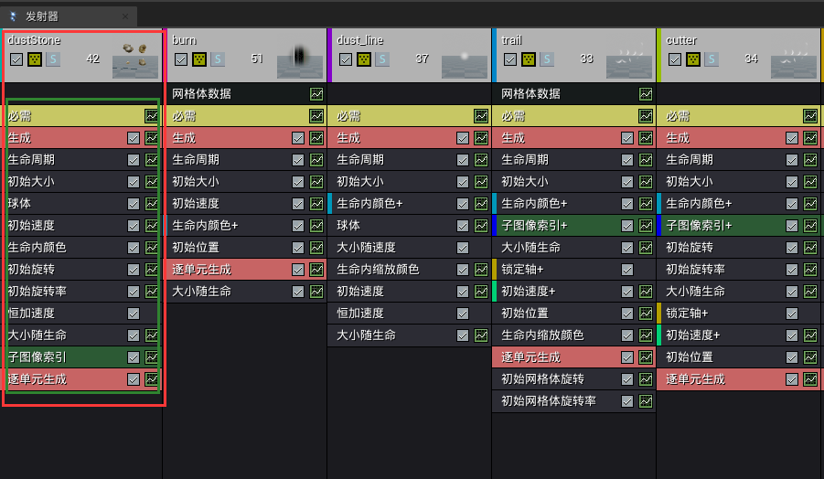

## UE4粒子系统简介

## 一、基本概念

- 粒子系统(Particle System)：内容浏览器中的粒子资源文件。
- 发射器(Emitter)：单个或多个发射器组成一个粒子系统。
- 模块(Module)：定义粒子的行为，被放置在一个发射器中。除了必须的required和spawn，其他模块都可以按需动态增删。
- 发生器Actor：将粒子系统文件放置到关卡中时，生成的Actor。

一个粒子系统资源可以包含多个发射器，一个发射器可以包含多个不同的模块。

红色框代表一个发射器，绿色框表示该发射器包含的所有模块。模块计算的顺序是从上到下的，发射器的执行顺序是从左到右的。

## 二、发射器类型

- Sprite Emitters：基本类型，使用始终朝向相机的多边形面片作为单个粒子发射器，用来制作烟雾、火焰等。
- AnimTrail Data：用于创建动画的拖尾效果。它可以挂载角色动画的骨骼上，跟随骨骼的运动轨迹形成拖尾效果。
- Beam Data：用于创建光束效果，比如镭射光、闪电等。
- GPU Sprites：一种特殊类型的粒子，运行时大量计算交给GPU执行。
- Mesh Data：不在发射一系列的面片，发射器会发射多边形模型，用于创建岩石块、废墟等效果。
- Ribbon Data：这个会产生一串粒子附属到一个点上，能在一个移动的发射器后形成一个色带。

## 三、