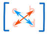
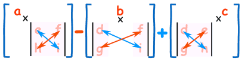

# 1. 矩阵

## 1.1 [矩阵乘法](https://zhuanlan.zhihu.com/p/69069042)

### 1.1.1 几何意义

矩阵乘法的几何意义是空间变换，是一种映射。

### 1.1.2 行列式

#### **一、作用**

- 表示矩阵特性
- 帮助求解线性方程组
- 帮助计算逆矩阵
- 应用到微积分等领域

#### **二、表示形式**

$$
\left [\begin{array}{cccc}
1 &6   \\
7 &90   \\
\end{array}\right] (1)
$$

$$
\left |\begin{array}{cccc}
1 &6  \\
7 &90  \\
\end{array}\right| (2)
$$

上述两个表达式中，(1)代表矩阵，(2)代表行列式。

#### **三、计算**

要求：矩阵必须是方形矩阵，即行列数目相等。

二维矩阵的行列式计算公式为：
$$
A =  \left |\begin{array}{cccc}
a &b  \\
c &d  \\
\end{array}\right|
$$

$$
|A| = ad - bc
$$

公式为**十字乘法**：

三维矩阵的行列式计算公式：
$$
A =  \left |\begin{array}{cccc}
a &b & c \\
d &e &f  \\
g & h & i \\
\end{array}\right|
$$

$$
|A| = a(ei - fh) - b(di - fg) + c(dh - eg)
$$

十字乘法计算：

#### 四、行列式的几何意义

在二维空间中，行列式代表面积。当行列式为负数时，代表空间发生反转。

